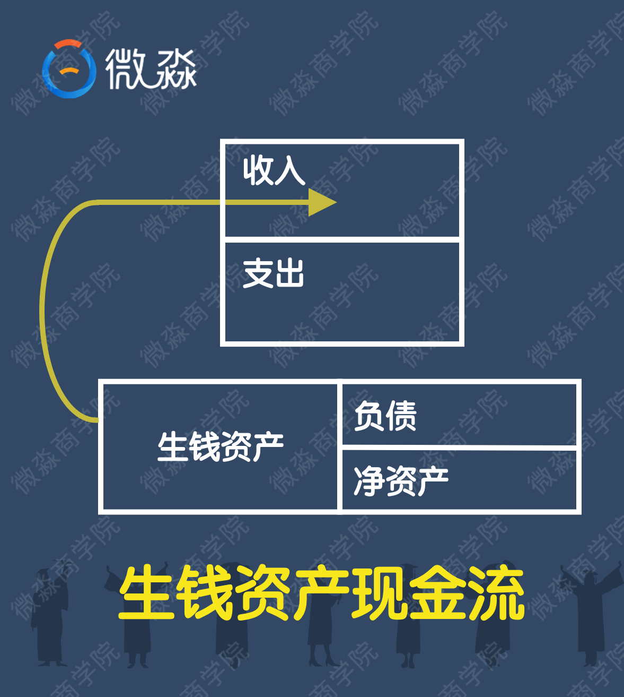
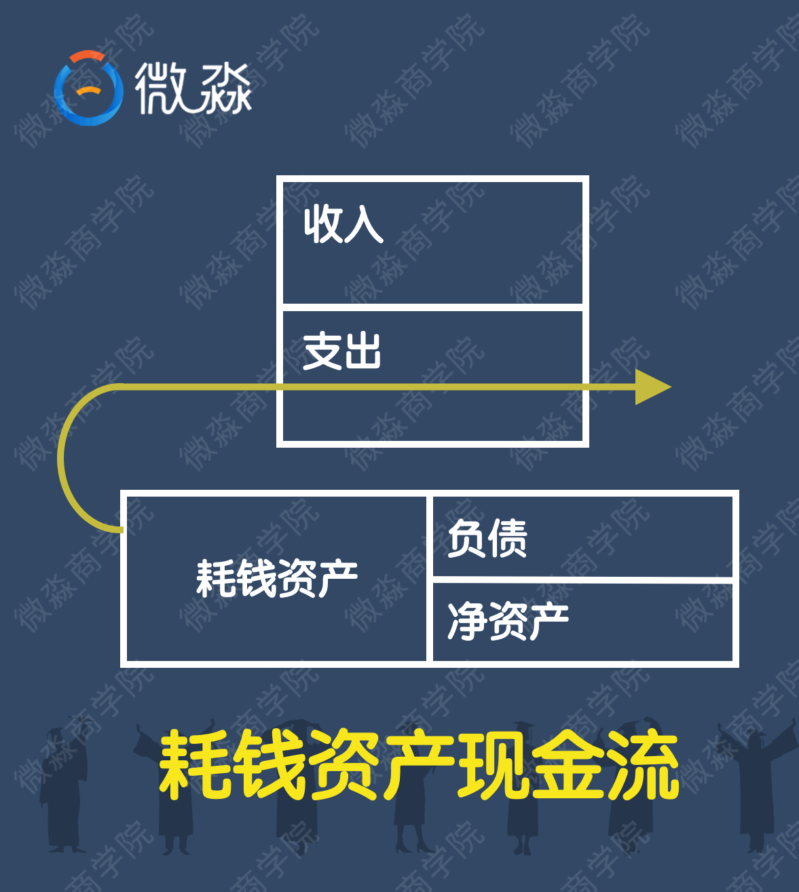
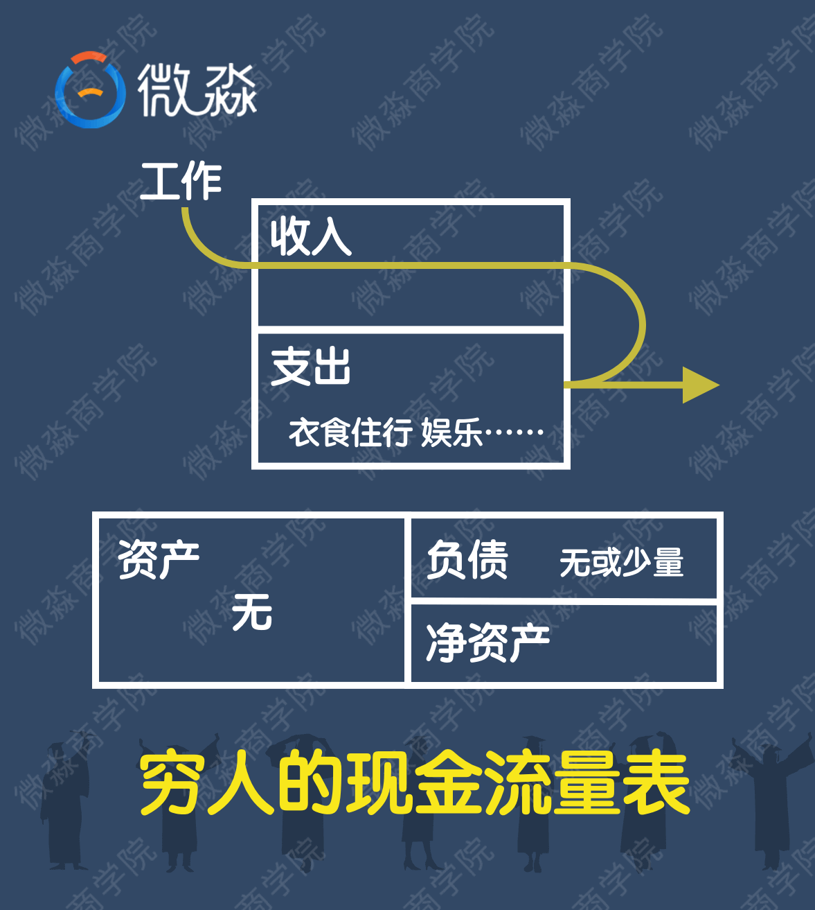
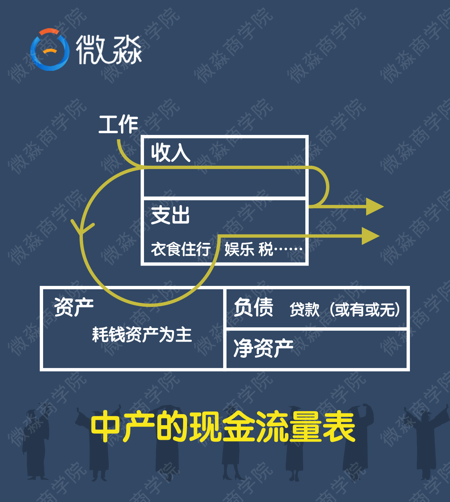
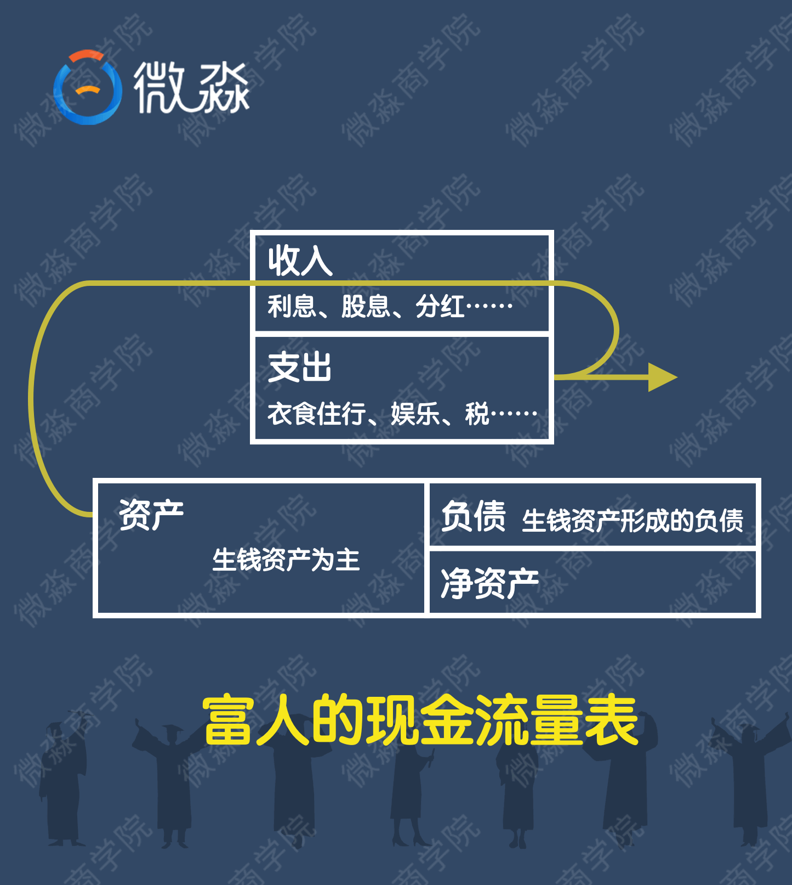

  

  

		<h3>人生穷富的关键</h3>
		
在讲今天的课程之前，我想请大家思考一下，你觉得什么是理财？

		
很多人把投资和理财误以为是一件事，其实不是。投资只是理财的一部分，理财是一个很广泛的概念。比如制定家庭日常消费计划、投资计划、保险计划、教育金计划、养老金计划等等都是理财中的一部分。凡是涉及到跟钱有关的安排，都是理财。 

		
我们每个人或每个家庭都会在十几年的时间里过手几十上百万。怎么去处理这些钱?怎么让有限的资源带来最大的效用?不同的处置方式，在时间的积累下本来相似的人会拉开巨大的差距。 

		
知乎上有个问题，世界上那些彩票中巨奖的人最后都怎样了？答案是95%中了彩票的人，最后的生活都变得穷困潦倒，甚至不如从前。为什么？！有句话叫做，财不配位！对于飞来横财，没有足够的能力妥善处置，巨额财富就如过眼云烟一般，到头来还是一场空。 

		
其实不光是中彩票的人。财富传承也存在同样的问题，爸爸是亿万富翁，传到儿子这里可能就败光了。即使儿子没有败光，孙子也会不辱使命的。这就是常说的：富不过三代。 

		
为什么会这样呢？到底是什么决定了人生穷富？人生穷富的关键是什么？ 

		
这就是我们今天要学习的重点——生钱资产和耗钱资产。生钱资产、耗钱资产也是理财中最最重要的概念。穷人之所以穷，富人之所以富的关键就在这两个资产。 

		
下面我们先简单了解一下什么是资产？简单的说资产就是一切可以以货币计量的东西。 

		
说到资产很多小伙伴应该是不陌生的，我们的生活中到处都是资产。房子、车子、票子、桌子、椅子、手机、电脑、锅、碗、瓢、勺、股票、基金等都是资产。 

		
会计上把资产是否方便变现分为流动资产和非流动资产。方便变现的比如股票、基金就是流动资产；不方便变现的比如房子、车子、电脑就是非流动资产。其实这个会计上的划分对于投资理财一点帮助都没有。这是因为资产的赚钱能力和资产的变现能力几乎没有半毛钱的关系。就是因为会计上对于资产的划分不能反映资产的内涵，这样就误导了大批会计专业人士。本来学会计的人是最容易理财成功，实现财务自由的。但悲剧的是，会计专业人士实现财务自由的比例并不比没学过的高。 

		
那么资产的内涵是什么呢？资产的内涵是现金流。敲黑板，资产的内涵是现金流。

		
资产产生现金流的不同就决定了资产的不同。根据资产产生现金流的不同，可以把资产分成3种。 

		
生钱资产：能给你持续带来净现金流入的东西。有了生钱资产，你就可以躺着数钱了。这就是所谓的睡后收入。生钱资产养人呐。

		
耗钱资产：能给你持续带来净现金流出的东西。有了耗钱资产，你躺着的时候还在付钱。这就是所谓的睡后支出。耗钱资产需要被人养，耗钱资产耗人啊

		
其他资产：产生的净现金流为0的东西。  有了其他资产，你躺着的时候你就是在躺着。

		
那么这3种资产哪种资产一定能让我们变富呢？ 

		
生钱资产 

		
那么这3种资产哪种资产一定能让我们变穷呢？  

		
耗钱资产 

		
那么这3种资产哪种资产可能让我们变富也可能让我们变穷呢？ 

		
其他资产 

		
首先我们来小小讨论一下和我们生活息息相关的这3种资产 

		
房子 和私家车是什么资产呢？ 

		
至于是什么资产要分情况来看哦 

		
假如你有一套房子，没有贷款，租出去获得了租金，给你带来了现金流，它就是生钱资产

		
或者说有贷款，但租金能够覆盖每个月的月供和物业费并有结余，那它也是生钱资产

		
相反，如果是三成首付买的房子自住，不但没有租金收入，每个月还要支付大笔月供以及相应的物业费，那么它就是耗钱资产 

		
当然即使没有贷款的房子，自己住的这段时间里你还需要为房子付物业费、保险费，产生持续的现金流出，所以没有贷款的自住房也是耗钱资产 

		
那么如果是三成首付买的房子投资，出租出去，租金刚好覆盖月供、物业费各种支出。那这时它就是其他资产啦 

		
厉害吧，同样是房子，原来可以是3种不同的资产啊。以后大家再看房子一定不能只看长相了，更要看内涵。要看它产生的净现金流。不然遇到了渣房，就只能在厕所里默默的流泪啦。真的，当你买了一套渣房之后，你就会被耗钱资产的房子套牢，想脱身都难。 

		<!-- 
说完房子大家再说说私家车，私家车是什么资产？
 -->
		
分析完房子，大家再想一想私家车是什么资产呢？

		
私家车是自用的，每年都有保险费、保养费、停车费等支出，私家车持续的带来净现金流出，所以私家车是耗钱资产 

		
如果用这个车在业余的时候跑个顺风车，收入能覆盖掉自己的日常用车，还有结余，那么是什么资产呢？还是耗钱资产。因为开私家车拉活赚的钱需要你投资大量时间，这其实是你的劳动收入。而不是由车本身带来的净现金流入。如果你不拉活，就没有这笔收入。以私家车还是耗钱资产。 

		
有一种情况，你把车通过某个租车平台出租出去了，租金去掉各项支出后还有净现金流入，这种情况下私家车才是生钱资产。不过既然是私家车，一般也不会出租的。所以私家车是耗钱资产。 

		
我们来总结一下

		
生钱资产就是给你不断带来净现金流入，就像鹅下金蛋一样 

		
只要鹅在，就会不停下金蛋，下的蛋换成饲料给鹅，那么鹅就会越来越肥，下更多的蛋 

		
等存了更多的金蛋以后，还可以买更多能下金蛋的鹅

		
耗钱资产就是让你不断花钱支出的东西~

		
可以看作公鹅，只吃饲料不下蛋 

		
那么你怎么变富呢？

		
要想富有你只要不断买入生钱资产就好啦

		
同样如果你想变穷，只需不断的买入耗钱资产就可以了

		
那么有钱人是怎么变穷的呢？为什么不能富过三代呢？

		
因为他们不断买入耗钱资产或者不断增加坏支出。

		
下面老师用一张图给大家示范一下生钱资产和耗钱资产的现金流 

		
 

		
 

		
通过对比，我们可以看出生钱资产不断带来收入，耗钱资产不断的带来支出~ 

		
那么，穷人、富人、普通人的生钱资产和耗钱资产情况如何呢？

		
我们来看看哦

		
低收入人群现金流 

		
 

		
一般而言，低收入群体的工作收入是偏低的，对于低收入人群来讲，他的工资应付完各种支出，也没有什么结余去买生钱资产或者耗钱资产了 

		
穷人，或者说处于穷人状态的人群，应该怎么办捏？

		
如果你的收入偏低，没有结余，一是要分清必要开支和不必要开支

		
这个相信看过小狗钱钱的小伙伴已经很熟悉了

		
必要是没有这件东西你的生活会受到重大影响

		
不必要仅仅是有了会开心

		
要控制自己的支出，强制储蓄来养鹅

		
第二点就是要开源咯，好好提高工资收入 

		
刚开始的时候投资自己是最好的投资！

		
提升个人技能，摆脱穷人思维，投资自己的大脑，提高工资收入~

		
一般建议刚毕业或者30岁以前，多花些时间在工作技能提升上面

		
比如老师刚工作的时候只有3000一个月，经过一年多的努力，第二年的时候就有1万多了。

		
如果算一下，这个投资回报率可能会达到300%，这可能是作为投资者做不到的

		
比如有人说，我的工资收入已经在1万以上了，后期工资提升的水平已经很有限啦 

		
要再升职加薪没那么容易怎么办？

		
这时候我们就需要重点增加自己的非工资收入了咯

		
老师先跟大家普及一下工资收入和非工资收入的概念吧 

		
工资收入就是自己付出时间、精力、汗水挣来的钱。像我们大部分人都是拿工资的，你必须去上班才有收入，这种就是工资收入

		
非工资收入就是，你不需要去劳动，也能有收入，就像有人说的：躺着就把钱赚了或者不干活也有钱，比如投资啦，出书的版税啦

		
我们都应该两手都要抓，两手都要硬 

		
这是最理想的状态啦，相对来说，理财投资还是门槛较低的呢

		
有的小伙伴可能会想，我还是先提高工资收入吧。等有钱了再学习理财技能。这样也是不对的，如果只靠工资收入来攒钱，你很可能到退休了还没有攒够理财的本金。因为靠工资攒钱是最低效最差的方式。聪明的小伙伴会在获得第一笔工资收入时就开始选择合适的理财工具来积累自己的本金和非工资收入了。

		
聪明的小伙伴从一开始就通过工资和非工资收入两条路径来增加自己的收入。两条腿走路肯定比只靠工资收入一条腿走的更快更远。

		
好了，我们再看看普通人或者说中产阶级的现金流 

		
 

		
我们可以看到，中产的资产中主要是耗钱资产，以房子、车子为主。中产可能有贷款也可能没有贷款。中产的收入主要来自工资收入。中产把工资收入变成了耗钱资产，耗钱资产不停消耗中产的钱。为了养耗钱资产，中产是不能停止工作的。由于耗钱资产的存在，中产几乎是很难变富有的。 

		
通过调查我们发现，遭遇财务危机的往往是那些职业和收入看起来还不错的人！ 

		
为什么呢？

		
收入良好的人，很多也不会打理财富，觉得自己的钱够花，其实造成的浪费和产生的耗钱资产也更多更大他们通常还以为自己买了生钱资产，实际上他们的钱并没有流向真正的生钱资产 

		
大家还要知道一件事情，一般来说10年（或更短或更长）一个经济周期

		
失业或者降薪没有我们想象的那么遥远

		
其实这两年经济就不是很景气了，裁员或者倒闭的公司工厂非常多

		
很多中产在背负高额房贷的时候，从来没有想过有一天他们可能会失业

		
这才是非常可怕的，他们觉得他们的收入会每年逐步增长，乐观的甚至觉得每年都会增长10%，但是事实上可能吗？

		
任何行业的工作，收入都是有天花板的，不可能说你每年增长10%，到你退休吧?

		
很多时候中产的现金流比穷人更糟糕。大部分穷人是没有耗钱资产的，也没有负债。因为既买不起耗钱资产，也借不到钱。而中产却有耗钱资产，也或多或少会有负债。耗钱资产和负债都会不停消耗中产的现金。一旦收入出现问题，现金流就容易断裂。调查发现，香港、日本房地产崩盘的时候，跳楼的基本都是中产。

		
我们再来看看富人的现金流

		
 

		
富人的收入主要来自生钱资产，生钱资产产生的现金流入完全能够覆盖各种支出。富人不用为了生活而去工作。这样就可以好好的去嗨皮了。所以我们常能看到一些关于富人的负面报道。因为有更多的时间去嗨皮所以偶尔会干些出格的事情。更重要的是，富人不干活还那么有钱。这让那些经常加班的小编心里很不是滋味。所以。。。。。。你懂的。 

		
老师这里有成为富人的两个秘密，大家想不想知道？ 

		
富人的第一个秘密：生钱资产占总资产80%以上。大家要记住这个比率。

		
相对应的穷人的第一个死穴：毫无任何生钱资产可言！生活唯一的经济支柱就是工资！

		
自从学习了课程之后，老师就一直在调整自己的资产结构。我现在生钱资产占总资产的比率已经从没上课前的不到10%上升到现在的50%左右了。后面还需要进一步优化，目标是80%以上。各位小伙伴你可以计算一下自己目前生钱资产占总资产的比率是多少呢？其实就看这一个比率就大概知道一个人未来会不会富有了。 

		
富人的第二个秘密：好支出占总支出的80%以上。大家要记住这个比率。 

		
对于富人来说，支出是有好坏之分的。好支出是可以带来更多收入的支出。比如花钱买“生钱资产”，这种支出能为你带来持续的净现金流入；花钱学英语，这种支出能增加你后期的工资收入；花钱学理财，这种支出在未来会获得非工资收入。这些支出都是好支出。所以富人的钱越花越多！

		
坏支出是让你的钱变的更少的支出。比如买了“耗钱资产”、非必要性消费、不懂乱投资亏钱等等。这些都是坏支出。所以穷人的钱越花越少！

		
相对应的穷人的第二个死穴：不知道支出也分好坏！坏支出占了总支出的80%以上。

		
老师自己曾经的坏支出占了总支出的90%以上。学习了微淼的课程之后，老师就开始调整自己的支出结构。现在老师的好支出已经占了总支出的70%以上。现在老师每月的总支出比以前更多了，但是老师现在不但有了较大结余，还有非工资收入。要知道老师以前可是月光而且还有负债。

		
以上是富人的两个秘密，大家一定要了解清楚哈，这个非常重要！

		
另外富人和穷人的主要不同就是对待新鲜事物的态度。

		
富人乐于接受新鲜的事物，并在不断增长见识的过程中，提升自己辨别事物的能力，同时结交更多的朋友，拓展自己的圈子，遇到更多的贵人，进而良性循环！ 

		
而穷人对于任何新鲜的事物，第一反应就是屏蔽，或者说是封闭自我。 

		
因此穷人的眼界会越来越窄，见识越来越短，赚钱的道路也会越来越单一，最终悲悲戚戚的过一生。 

		
穷人思维比没有钱更可怕。很多时候，观念的转变，比收入的转变，要难很多，而你的思维，决定了你在什么阶级。中彩票的人大多会破产，就是因为观念未转变，思维还停留在穷人的思维阶段。 

		
人的穷富，其实首先取决于你的观念，而不是你的财产本身！ 

		
有了正确的观念，其实技巧都不难学会；但是观念错误，即便你有钢铁侠的装备，也不过是在错误的道路上飞奔而已。 

		
《富爸爸，穷爸爸》中，富爸爸常常这样说：“富人不会这样做”。因此，在思想上“脱贫”是走向财务自由的第一步。

		
因此我首先要告诉大家一个观念：财富是理出来的，没钱更需要理财！财务自由是科学理财后的必然结果。上班越忙越需要财务自由。 

		
说到这里，老师又要给大家普及一个概念啦. 那就是财务自由 

		
简单的说财务自由就是：你的非工资收入能够覆盖掉你的日常支出 

		
在这里还有涉及到一个财务自由度的概念

		
计算公式为：年非工资收入（年投资收入）/年生活支出，一般等于1是最基本的自由度，数字越大，代表自由度越高 

		
好了，关于生钱资产耗钱资产的分享就到这里了，大家应该了解人生穷富的关键所在了吧？ 

		
最后呢，老师来个温馨小贴士： 

		
1.如果你计划买房子，建议买生钱资产的房子 

		
2.努力去思考一下你可以买什么样的生钱资产？可以去如何提升自己？ 

		
3.对于零基础同学来说，可以先培养投资和理财的理念，再了解各种投资品，然后再进一步学习，之后再去完善好家庭的生钱资产配置。

		
重要提示：以上晚课内容只是预习版，晚课更详细更有价值的讲解和分享请到班群回看。根据下面回看方法，点击“日期”可快速回看。

		
 

	

