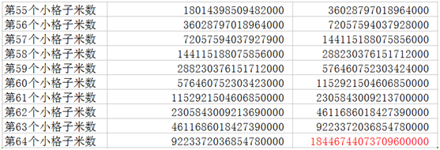
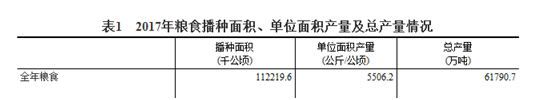
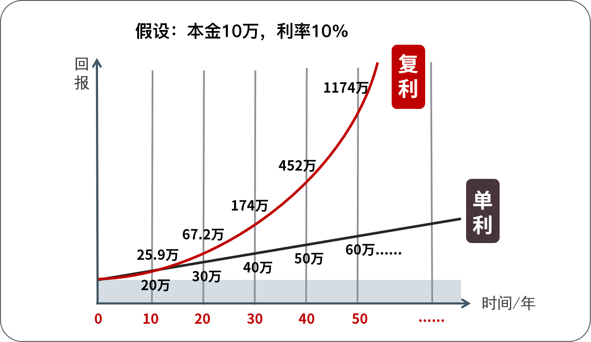
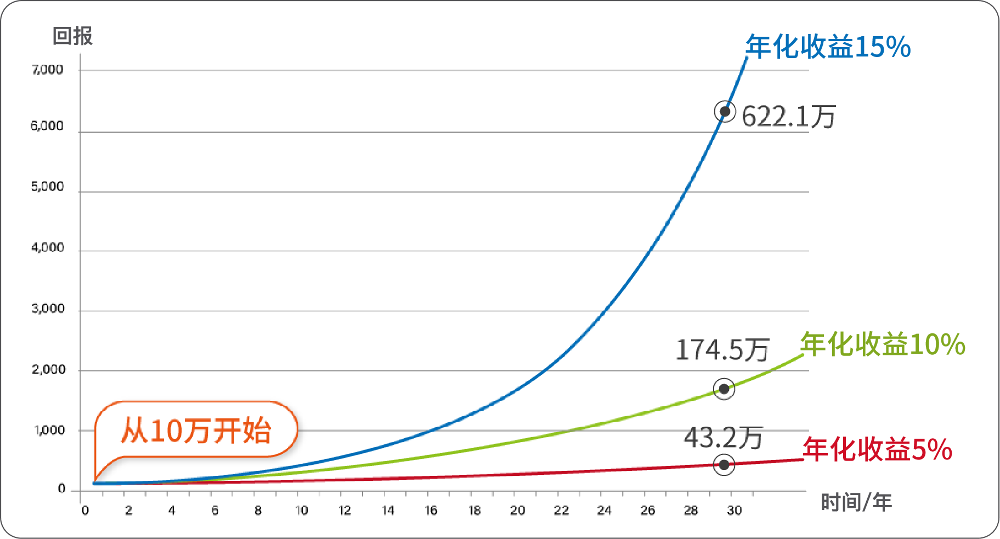
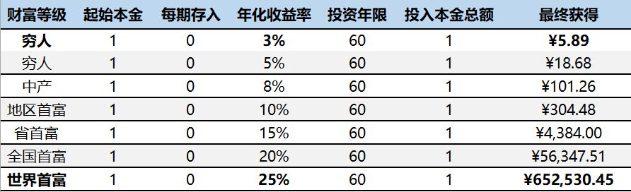
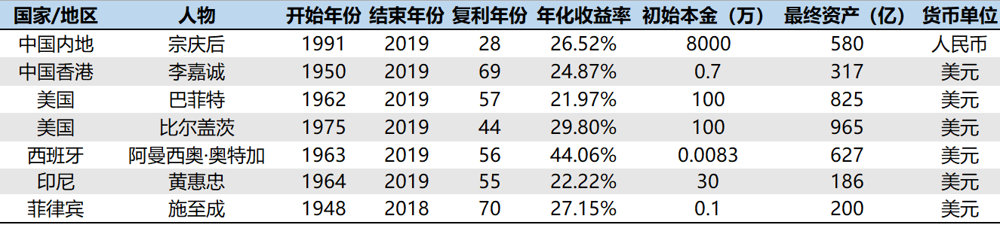
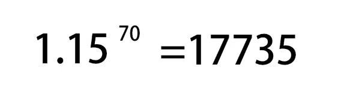

	

	

		<h3> 从1万到100万的理财法则</h3>
		
“复利”被爱因斯坦称为第八大奇迹。你或许听过这个名词，或许没有。但很可能听过这个故事： 

		
舍罕王打算奖赏国际象棋的发明人——宰相西萨•班•达依尔。

		
国王问他想要什么，他对国王说：

		
陛下，请您在这张棋盘的第1个小格里，赏给我1粒麦子，在第2个小格里给2粒，第3小格给4粒，以后每一小格都比前一小格加一倍。请您把这样摆满了棋盘上所有64个格的麦粒，都赏给您的仆人吧！

		
国王觉得这要求太容易满足了，就命令给他这些麦粒。

		
当人们把一袋一袋的麦子搬来开始计数时，国王才发现：就是把全印度甚至全世界的麦粒全拿来，也满足不了那位宰相的要求。

		
这个故事往往到这里就结束了。然后说什么这就是复利的力量巴拉巴拉。

		
但是我们搞投资的人，喜欢讲数据！谁知道你国库有多少粮食呢？是不是放满真的要很多呢？我们来算一下，很简单，拉一张Excel表就可以算出来，有兴趣的小伙伴可以课后自己算一下。

		
老师已经算好了，为了方便大家查看，我就把最后10行的数据贴出来。

		

		
大家看最后一行，18446744073709600000这个数字是多少呢？1844亿亿，是不是没什么概念？没关系，我们来换算成重量。

		
1公斤麦子约4万粒。把1844亿亿换算成吨的话，约4611亿吨！

		
大家知道我们国家一年的粮食产量是多少吗？

		

		
这是我国2017年全年粮食产量，一共是6.18亿吨。4611亿吨相当于我国746年的粮食总产量， 还真的是整个国家的粮食都不够啊。

		<!-- 
复利的公式是 最终收益=本金*（1+收益率）^时间
 -->
		

		
这个复利公式是什么意思呢？

		
假设，你投资1万块钱，年化收益率是20%

		
那么第一年的收益就是10000*（1+20%）

		
第二年的是10000*（1+20%）*（1+20%）

		
第三年的是10000*（1+20%）*（1+20%）*（1+20%）

		
以此类推.....

		
3年是3次方，10年是10次方

		
这个棋盘故事里面，后一个格子是前一个的一倍。相当于就是收益率100%。

		
宰相西萨·班·达依尔的最终收益=1*（1+100%）的64次方数量的麦子，约合4611亿吨。

		
这个棋盘故事里面，后一个格子是前一个的一倍。相当于就是收益率100%。

		
这个故事的真实性老师已经无法考证了，但是这个故事却反映了复利的巨大威力。

		
 只要用好了复利的力量，任何人都可以变的富有。下面老师带大家看一个真实的例子。

		
美国伊利诺斯州森林湖市100岁老奶奶格蕾丝•格罗纳离开人世后，竟将700万美元的遗产都捐赠给了她的母校森林湖学院。据格蕾丝的多年好友披露，这名百岁老太的700万美元巨款，竟然全都是来源于她在1935年购买的180美元美国雅培公司的股票。她买了股票之后就不再管，其后她经历了一系列的战争包括二次世界大战、冷战、其他大大小小的局部战争，还同样经历了全球大大小小的金融危机、天灾人祸等，一路艰难走来，她的180美元变成了700万美元，年化复合收益率16.3%。

		
格蕾丝老奶奶的事迹被美国报纸广泛报道。她是一个普通人利用复利法则致富的普通例子。

		
 其实这样的例子还有很多，我们再来看一个真实的例子。

		
2005年，在布鲁克林工艺大学任教60年的欧斯默夫妇相继去世。两人膝下无子，他们都是普通的不能再普通的老师。但当清理他们投资财产时发现，发现他们有一笔资产已累积到8.57亿美元。当然后来全部捐赠了。那么，他们的财富从何而来？他们一对普通的学校老师，为何有如此之大的家庭财富呢？

		
原来，早在1960年，大学老师欧斯默夫妇把5万美元的积蓄交给巴菲特打理，并且一放就是45年从没有取回。45年后，总资产达到8.57亿美元，年化复合回报率24.19%。

		
欧斯默夫妇的事迹也反映了复利的巨大威力。

		
有人可能要说了，我又不可能像欧斯默夫妇一样幸运遇到巴菲特。其实我们根本不需要遇到巴菲特，我们只需要学会基本的理财技能，获得年化15%左右的收益率，通过复利我们依然可以变得非常富有。

		

		
这个图，充分说明了复利和单利的巨大区别。

		
复利和单利，在初期的时候，差别还不是很大。同样是投资10万元，到第10年的时候，也只是相差5.9万，可是随着时间的拉长，差别越来越大，第50年的时候，单利是60万，而复利是1174万，简直是天壤之别。

		
这就是复利的神奇之处：在刚开始的时候复利效应是很微小的、不易察觉的，但当发展到一定阶段就会产生非常惊人的效果。

		
现在大家知道了复利的威力，那么影响复利的因素有哪些？

		
我们看下复利的公式

		

		
第一个当然就是本金啦，本金越多，最终收益越大，但是本金的影响其实没有那么大，而且本金在短期内是很难改变的。

		
第二个因素，影响非常大，就是收益率，一年赚3%和一年赚10%，差别是显而易见的，我们在本金不多的情况下，就要努力提高自己的投资能力，提高自己的收益率啦。

		

		
如上图所示，从10万开始，收益率5%、10%、15%，30年后的差异，大家应该都能从曲线就可以看到。

		
第三个因素其实影响更大，就是时间。年复利，和每天复利，后者要高很多，迭代的次数越多，复利威力越大，开始的时候越早，复利越早发挥作用。

		
相信大多数普通人是依赖工资结余进行投资的。而我们年轻时可能犯的最大的错误就是，总想着还有明天，想把一切责任都交给明天的自己。

		
22岁、27岁、32岁开始投资的人到底有多大区别呢？也许你认为5年在漫漫人生路上，连1/10都不到，即使错过5年，只要抓紧时间，就能够迎头赶上。

		
我们还是拿数据说话。假设有小黑和小白两个人，小黑的理财意识觉醒得比较早，20岁的时候就开始投资。小白呢，要稍微晚一点，25岁才开始投资。看起来只是差了5年，差距不是很大，只要抓紧时间，就能迎头赶上，可是，事实的真相是什么呢？

		
假设两人都是每月定投1000元，每年12000元，年化收益率为12%（定投指数基金完全能够达到）。

		
小黑从20岁开始投资，共投资10年，到31岁的时候就不再投入本金。

		
小白从25岁开始投资，一直投入本金直到60岁。

		
我们来看一下，当他们到60岁的各自都有多少钱呢？

		 <table>
			<tbody>
				<tr>
					<th colspan="5" style="background-color: #a3c77f;">小黑</th>
					<th colspan="3">小白</th>
				</tr>
				<tr>
					<th>年化收益率</th>
					<th>年龄</th>
					<th>每年定投</th>
					<th>投资年限</th>
					<th>累计金额</th>
					<th>每年定投</th>
					<th>投资年限</th>
					<th>累计金额</th>
				</tr>
				<tr>
					<th>12%</th>
					<th>20</th>
					<th>12000</th>
					<th>1</th>
					<th>¥13,440.00</th>
					<th>0</th>
					<th>0</th>
					<th></th>
				</tr>
				<tr>
					<th>12%</th>
					<th>25</th>
					<th>12000</th>
					<th>6</th>
					<th>¥109,068.14</th>
					<th>12000</th>
					<th>1</th>
					<th>¥13,440.00</th>
				</tr>
				<tr>
					<th>12%</th>
					<th>30</th>
					<th>12000</th>
					<th>11</th>
					<th>¥277,597.60</th>
					<th>12000</th>
					<th>6</th>
					<th>¥109,068,14</th>
				</tr>
				<tr>
					<th>12%</th>
					<th>35</th>
					<th>0</th>
					<th>16</th>
					<th>¥489,221.82</th>
					<th>12000</th>
					<th>11</th>
					<th>¥277,597.60</th>
				</tr>
				<tr>
					<th>12%</th>
					<th>40</th>
					<th>0</th>
					<th>21</th>
					<th>¥862,176.01</th>
					<th>12000</th>
					<th>16</th>
					<th>¥574,604.09</th>
				</tr>
				<tr>
					<th>12%</th>
					<th>45</th>
					<th>0</th>
					<th>26</th>
					<th>¥1,519,448.72</th>
					<th>12000</th>
					<th>21</th>
					<th>¥1,098,031.01</th>
				</tr>
				<tr>
					<th>12%</th>
					<th>50</th>
					<th>0</th>
					<th>31</th>
					<th>¥2,677,787.81</th>
					<th>12000</th>
					<th>26</th>
					<th>¥2,020,488.08</th>
				</tr>
				<tr>
					<th>12%</th>
					<th>55</th>
					<th>0</th>
					<th>36</th>
					<th>¥4,719,177.08</th>
					<th>12000</th>
					<th>31</th>
					<th>¥3,646,172.63</th>
				</tr>
				<tr>
					<th>12%</th>
					<th>60</th>
					<th>0</th>
					<th>41</th>
					<th>¥8,316,802.48</th>
					<th>12000</th>
					<th>36</th>
					<th>¥6,511,184.28</th>
				</tr>
				<tr>
					<th colspan="2">总投入金额</th>
					<th colspan="3">120000</th>
					<th colspan="3">420000</th>
				</tr>
			</tbody>
		</table> 
		
60岁的时候，小黑有832万，小白有651万，即使小白的投入本金是小黑的3.5倍，最终也还是没有追上小黑。并且，我们可以看到，在人生的各个阶段，小白始终落后于小黑，仅仅就是因为相差了5年。

		
复利法则在漫长的时间中发挥了魔力，如果你行动时间晚了一点，那么你的投资回报就会少得多。所以执行力强的人往往会提前行动，争取时间，让复利发挥出最大的力量。

		
复利有正向的影响，也会有反向的影响。

		
你可能要问，反向的影响是什么呢？很简单，通货膨胀啊。

		
我们的资产 一直在被通胀吞噬着，还是用最典型的例子来说明，90年代的万元户是有钱人，现在只有一万元就是扶贫对象。

		
记住：你推迟投资的每一天，通货膨胀都会发挥复利的反向作用，你与别人的差距也会越来越大。

		
很多年轻人说，我没钱理财，错！年轻人最大的资本就是时间。20岁的100块，和30岁的100块能一样么？20岁的100块可以积累10年的复利，越早开始越轻松。

		
再拿准备养老金为例

		<table>
			<tbody>
				<tr>
					<th>年龄</th>
					<th>月存</th>
					<th>年化收益率</th>
					<th>月化收益率</th>
					<th>60岁累计金额</th>
				</tr>
				<tr>
					<th>25岁</th>
					<th>500元</th>
					<th>12%</th>
					<th>0.95%</th>
					<th>2765306.5元</th>
				</tr>
				<tr>
					<th>35岁</th>
					<th>1620.7元</th>
					<th>12%</th>
					<th>0.95</th>
					<th>2765306.5元</th>
				</tr>
				<tr>
					<th>45岁</th>
					<th>5802.9元</th>
					<th>12%</th>
					<th>0.95</th>
					<th>2765306.5元</th>
				</tr>
			</tbody>
		</table>
		
如果从年轻的时候就开始，其实是很轻松的。等到到了40岁，50岁的时候，再想着准备养老金，那就很吃力了。

		
复利仅仅体现在投资么，不，我认为复利是这个世界上最重要的法则，在很多地方都发挥着重要的作用。

		
就以身体健康做例子好了。你的每一次饮食，每一次锻炼，每一个与健康有关的选择，其实都是加在你健康上的复利因子，有正的，也有负的。

		
复利有什么特点？就是最开始毫无声息，后面就爆发了。

		
请看这张图。

		

		
这个是常见重疾的发病率，是不是跟复利曲线一模一样的呢？一些作用在你身上对健康不利的因子，常年累月地，按照复利的规律影响你的健康。

		
大部分年轻人很少有想到买保险的，觉得自己身体倍棒，因为他还在这个曲线的前面，不知道自己总归是会走到曲线后面的。

		
因此我在这里郑重提醒：一定要配置重疾险，因为到最后风险的释放几乎是必然会发生的。

		
投资、身体健康都是按照复利规律发展的。那么，人生呢？为什么小学同学都是差不多的，但到了中年以后却千差万别。

		
你的每一个选择，都是作用在你人生上的复利因子，有正的，有负的。起初看不出来变化，就像棋盘里面第一格，第二格的麦粒。但是后面巨大的收获没有前面这第一格，第二格麦粒，又从何谈起呢？

		
人通常都看不起，或者不在意微小的进步，其实，正是这些点点滴滴的进步，才能给你想要的未来。这个世界从来没有什么一步登天，所有的成就都是复利的力量，我相信复利的力量，也相信投资的必要性。

		
有的人说，我已经晚了，怎么办呢？那就要想办法利用复利来缩短差距。

		
要么你有足够的本金，要么你开始要比别人早。如果这两个都没有，那么你就只能提高自己的投资能力。

		
相对增加本金和趁早开始来说，我们已经错过了太多。那提高自己的收益率，才是我们可以快速赶超别人的方法。

		
无论你是打工，做生意还是创业，其实你一生的财富终值跟你的投资能力有关，跟你的投资收益率有关。为什么这么说呢？

		
我们来看看穷人与富人的差别：

		

		
作为一般的普通人，如果你的投资收益率只有3%～5%，也就是余额宝和国债的收益率，那你这辈子大概率会成为一个穷人。有人说我就安贫乐道，但是也别忘了，贫贱夫妻百事哀。

		
如果你的收益率是8%，也就是债券的收益率。那你最多就是一个中产，中年危机最大的一群人就是中产。

		
如果你的收益率能达到10%及以上，那么恭喜你，你已经进入富人阶层。

		
可能有人觉得我说得有点夸张，我们来看一下各个国家或地区的首富，他们的年化收益率是多少呢？

		

		
大家看一下他们的初始本金，西班牙首富奥特加的本金是最少的，只有83美元，李嘉诚的本金也只有0.7万美金，但是这并不妨碍他们成为首富，所以，本金的影响并没有你想象地那么大。

		
这些首富身处各行各业，有零售行业，有房地产行业，有科技行业，也有投资行业。收益率最高的是西班牙的奥特加，达到了44.06%，最低的是巴菲特，收益率为21.97%。

		
这些收益率不是很高吧，我们努努力，20%可能做不到，10%还是可以达到的吧。10%意味着什么呢？意味着地区首富！

		
穷人和中产为什么不能跨越阶层呢？因为他们懒，懒得学习，懒得行动，懒得努力。贫穷的原因很大一部分是因为懒惰，这种懒惰不是身体上的懒惰，而是思维上的懒惰。

		
他们虽然知道钱放在银行会贬值，会让通货膨胀吃掉，但是他们懒得行动，不愿意花费一些时间去改变自己，每天躺在舒适区，有天父母需要养老金，孩子需要一大笔教育金，自己生病需要一大笔钱的时候，只能怪当初的自己太懒惰。

		
来到训练营的小伙伴都是希望学会投资，最终能够财务自由的。你是希望自己和家人成为富人呢还是穷人呢？就取决于你现在的决定。

		
所以，我想说的是，不要把投资当做一个可有可无的选修课了，这件事在我看来，甚至是比高考科目还要重要的必修课，真的会关系到你家庭未来十年甚至一生的幸福。

		
其实复利没那么难理解，后面我们讲到股票、REITs、指数基金的时候会给大家展示复利在这些具体工具上的展现，以及它为什么可以使我们成为千万富翁。

		
最后送给大家一条复利的公式：

		

		
这条公式有什么意义呢？

		
当你的年化收益率是15%，复利70年，就是1.77万倍。

		
你开始只需要投入1万元本金，通过复利，70年后就会变成1.77亿。

		

		
这就是一个实现家族资产万倍增长的计划，这条复利的公式就是改写家族的命运公式。

		
当我看到这个公式之后，我下了一个决心，从我这一代开始努力，改变整个家族的命运。

		
种一棵树，最好的时间是在十年前，其次，就是现在！

	

