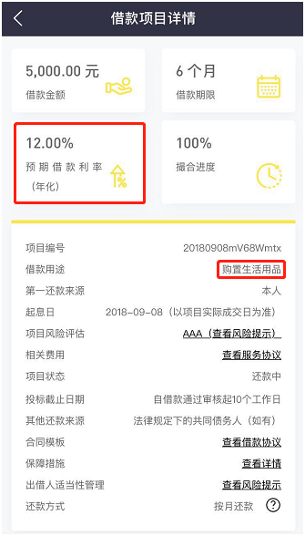

	

	

		<h3> P2P投资骗局</h3>
		
相信小伙伴们肯定都是听过P2P的，毕竟前段时间，各大P2P平台暴雷的事情在网络上疯传，为什么会这样呢

		
我们来看一家叫洋钱罐的App

		

		
一眼望去，年化收益率12%,这比余额宝高多了，是不是很有诱惑力！

		
这么高的利息，想不想知道这投的是啥呢？

		

		
这张图我们可以看出，其实就是要购置生活用品，但是缺钱，所以到网贷平台上借钱来啦

		
老师想问一下各位小伙伴，如果你们平时要买东西，比如买台电脑，但是手里没钱，你们会怎么办呢

		
有的小伙伴说啦，这还不简单，直接刷信用卡不就行啦，不行还有花呗，还有借呗，再不行微信还有微粒贷，随随便便借个好几万

		
是啊，既然随随便便都能借个好几万，为啥还要用这么高的利息借呢

		
如果各位小伙伴想不明白，这就说明小伙伴们都是信用很不错，而且没有乱借钱

		
原因很简单，如果你把信用卡额度用完了咋办？这不还有支付宝呢？要是都用完了呢？

		
这个人很可能早就把常规的信用额度都用完了，所以只能跑到p2p这些平台去借钱了

		
大家想不想看一下这个借款人的信息？

		

		
老师一眼就看到，未还清5000元以上，这个以上是多少？大家不妨脑补一下

		
另外，这个征信报告也没有提交，为啥没有提交呢？那肯定是征信太差呗在现实生活中，小伙伴们愿意把钱借给这样的一个人吗

		
我相信以各位小伙伴的财商，你肯定是不愿意的对吧？

		
但是我们看到撮合进度是100%，说明真的有人借钱

		
我相信这些人是看到这么高的利息，所以就把钱借出去了

		
记住：你盯着别人的利息，别人盯着你的本金

		
有小伙伴可能会问了，这个借款发起人如果还不起钱，P2P平台不负责任吗？法律不管吗？

		
下面我们来认识一下什么是P2P，P2P做的是什么生意呢？

		
做的是类似银行的生意，赚的是息差。银行是低息揽储，高息放贷。P2P是高息吸引投资，然后以更高的利息把钱贷出去。

		
一般来说，银行的贷款额度有限，而且银行更愿意把钱借给大型企业，还款能力有保障，这也是为什么小企业贷款难

		
不过就算是这样，银行也会有坏账，国外一直说中国的银行坏账率水平高。各位小伙伴可以想想，连银行坏账都高，那P2P呢？坏账率当然更高

		
其实很多人把钱放P2P的时候，也会担心有没有风险，但是人都有侥幸心理，这个平台这么大，自己不会那么倒霉的

		
但是一旦有什么风吹草动，很多人就会吓得赶紧把钱取出来，这就会发生挤兑，资金链崩盘

		
反映快的可能躲过一劫，但是像老师这种反映迟钝的，估计钱在里面就再也取不出来了

		
说完了 P2P的商业模式，再来看看目前的环境。

		
P2P其实做的就是借贷的生意，在借贷生意中，银行是老大，生意对象都是企业，这是优质客户。接下来，个人客户这一块，银行也在慢慢开发。

		
同时，各个互联网巨头也都进入了借贷这一块。比如，阿里的是借呗，腾讯的是微粒贷，京东的是金条，360的是 360借条，平安的是平安普惠等等，它们的年化借贷利率是 18%

		
以上这些巨头把借贷市场的优质客户都抢光了。

		
凡是在这些地方借不到钱的人，或者额度用完了，才会顶着比 18%还要高的利率去借 P2P

		
大家可以想想，把这几个平台都借完了，怎么着也能借个5万吧

		
都借了这么多了，还要借，这是要干啥呢

		
这部分人的信用显而易见是不够好的，而 P2P的借贷对象就是这些人，这也就导致了P2P的坏账率很高，安全性低。

		
给你的收益率都20%了，平台还得拿钱，顶着这么高的利息借钱，估计借的就没打算还吧

		
所以像网上那些动辄20%以上的利息，崩盘是迟早的事情，各位小伙伴一定要擦亮自己的眼睛

		
老师告诉大家，即便是那些上市公司，能够连续几年做到净资产收益率大于20%的也不多，我们都知道，上市公司可以说是盈利能力最强的那部分企业了

		
而被封为股神的巴菲特，其过去30年的年化收益率也只有20%多点，但是却让他成为世界上最富有的人之一

		
所以，像这种债权类的收益率超过20%的，必然是不可持续的

		
要不然上市公司直接把资产全卖了，来买P2P就行了，还干什么实业，小伙伴们，你们说是不是这样呢？

		
关于P2P平台，大部分平台成立的时候就没有想过还钱，我们可以称之为骗子平台。有一小部分P2P公司确实不是奔着骗人来的，它们也想好好经营的。但是由于P2P的本质就是通过互联网放高利贷的。P2P借出去的钱不能收回，那么P2P平台自然也就还不了投资者的钱。就这样想要好好经营的这部分P2P公司也倒闭了。客观起到了“诈骗”的效果。

		
其实在国家交易所交易的投资工具中，有些工具风险比P2P低很多，收益却可能比P2P高。比如分级基金A、可转债、REITs等。这些工具本身是没有信用风险的。

		
没有理财知识的人才会投资P2P，对于咱们学习了理财知识的人，有那么多比P2P好的投资工具可以选择，为什么非要铤而走险选择P2P呢？

		
避免P2P骗局的最好方式就是远离P2P。

		
今天的分享就到这里啦，恭喜各位小伙伴们，你的防骗能力又提升了哦

	

