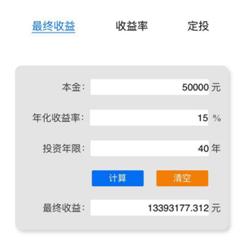
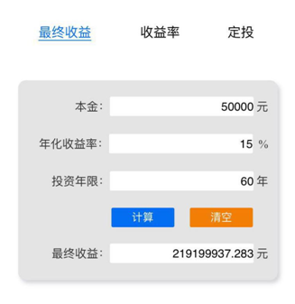
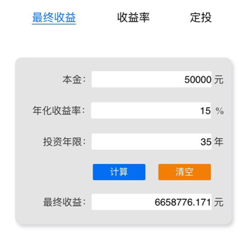
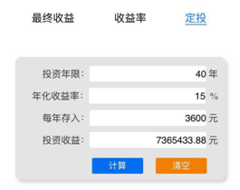

	

	

		<h3>普通人是如何通过复利法则变富的？ </h3>
		
我们先来看3个普通人通过复利法则变富的小故事。

		
1

		
“香港股神”曹仁超，在他的书中讲过有关他母亲的一则小故事。

		
曹母解放前在上海生活时，亲历过“金圆券事件”引发的超级通货膨胀。

		
对“纸比钱贵”的可怕情景有着刻骨铭心的认识和记忆，以至于后来逃难到香港后，还是心有余悸。

		
曹父亡故后，家道中落，曹母为抚养幼子，不得不外出做短工养家糊口。

		
一得到工钱，曹母就马上全部花掉，将纸币换成各类生活物资。

		
后来家境改善，手有余钱后，曹母还是对纸币充满畏惧，实在花不完，只好用来股票投资。

		
这位老太太大字不识几个，毫无理财知识，但她就认准一个理儿，股票的股息只要高于银行存款，她就把钱全部买成股票——也就是说，她投资的标的，全是高股息率的股票，而且每年得到股息后，留下生活必需，其余全部进行股利再投资。年复一年，竟积攒下一大笔财富。

		
过世前，老太太把股票账户交于子女，金额让曹仁超惊叹不已。

		
2

		
赵兰坤，台湾人，祖籍沈阳，是现在国民党荣誉主席连战的妈妈。

		
连战家族资产200多亿新台币，大概50亿人民币。是台湾仅靠投资理财就积累了百亿财富的豪门。

		
连氏家族之所以如此富有，都是因为连战的妈妈赵兰坤。

		
1945年赵兰坤带着小连战随丈夫连震东从大陆来到台湾。连震东是个学者，醉心于研究历史，完全不管家里的财务。连家的生活及理财全部由赵兰坤负责。她卖掉了连战爷爷留下的两块并不怎么值钱的田地，在比较好的地段买了套房子收租金。后来赵兰坤在朋友的推荐下，把多年的积蓄，大部分投资在彰化银行、台北企银、华南银行等银行的股票上，买进后就不再卖出，经过了60多年的长期持有之后，这些银行股票增值近万倍。

		
赵兰坤的理财方式属于典型的无脑式：长期持有优质地段物业出租，以及长期持有银行股收息。连战曾说，他们家的理财方式是“无为而治”， 即“不进出股市，不处置房地产”。买进之后长期持有，不论股票或房地产都很少买卖。

		
赵兰坤刚开始就是一位普通的家庭主妇，在今天大概相当于白领吧。但是靠着投资理财知识，为连家积累了百亿台币的财富。

		
3

		
刘元生，一个普通的香港商人。30年前就是王石的朋友。不过当时的万科还不牛逼，王石也不出名。1988年万科股改，发行的股票卖不出去。费了九牛二虎之力还是没有卖完。在王石的“忽悠”下，他买了360万元万科的股票。

		
刘元生后因为生意周转需要钱曾多次想要卖掉万科的股票。但是刘元生当时持有的股份是法人股，法人股是中国特殊时期的产物。2006年之前法人股是不能转让的。刘元生想了各种办法，就是转让不掉，抵押也没法抵押。就只能砸手里了。

		
等刘元生手里的股票可以卖的时候，市值已经10多亿了。

		
经过近20年的深度被“套牢”，一旦解套，他应该迅速卖出才对。但是他依然没有卖，还是继续持有。2007年市值就高达20多亿了。后来2008年金融危机，万科跌幅高达80%，刘元生市值减少了16亿以上，但是他依然持有没有卖出。到2018年1月份，市值变成了60多亿，他依然没有卖出。直到今天他还在持有，市值还有30多亿。

	

	<h6>以下部分是老师的读后感</h6>
	

		
老师：以上3个人的理财故事给了老师很大的震撼。特别是那位目不识丁的老奶奶。如果说目不识丁的老奶奶都可以利用复利法则致富。那么老师肯定也可以。

		
老师：老奶奶没有受过专业的理财训练，可能也不知道世界上有复利法则。但是她却在无意中利用了复利法则。老奶奶不但自己赚了一大笔钱，而且在她的影响下，她的儿子后来成为了香港股神。

		
老师：看来妈妈对于孩子的财商影响真的非常大啊。

		
老师：更客观的说是父母对孩子的财商影响都很大。比如身价919亿美元的巴菲特就是在他爸爸的影响下11岁开始投资股票的。巴菲特是从100美元起步的，到87岁就有919亿美元了。天哪，复利的威力真是太强大了！怪不得被爱因斯坦称为“第八大奇迹”！！

		
老师：看完上面的理财故事，老师情不自禁的拿出手机算了一下老师未来会有多少钱。老师前期用5万元投资了标普A股红利指数基金，并且每个月拿出1000元定投。这个指数市盈率大于10时老师会停止定投。大家千万不要模仿哈

		
老师：标普A股红利指数自成立以来年化复合收益率17.39%。老师买的价格也非常好，市盈率才8倍多点，股息率就有6.6%啦，比存银行划算多了。老师预计未来的年化复合收益率会大于17.39%。

		

		
老师：不过老师还是保守一点按15%计算。老师到退休还有40年。40年后老师会有多少钱呢？

		
老师：让大家看一下计算结果

		

		
老师：老师退休时会有1300多万呢。老师按住内心的喜悦，又算了一下假如老师像连战的妈妈一样定投60年呢？

		

		
老师：60年后老师会有2.19亿。这真是太棒啦！！看来到时老师也能给孩子们留一笔巨款了。另外老师还有股票和REITs呢，60年老师该多富有啊。光是想想就把老师开心坏了。

		
老师：老师现在想想真的很庆幸遇到了微淼，学习理财开始的时间还算不晚。否则后果不堪设想。如果老师前面没有开始投资，晚5年再开始呢？

		

		
老师：如果老师5年后开始投资，到老师退休就只有600多万了。比1300多万少了一半还多。不算不知道，晚5年开始理财的代价居然那么大！！

		
老师：以后我有了孩子，一定从5岁的时候就教他理财。

		
老师：有的小伙伴可能会想，我现在基本没有什么钱，而且也没有学历，我甚至只是初中学历。我真的能学会理财吗？我真的可以通过理财致富吗？

		
老师：可以的！其实目不识丁的曹母已经证明了这点。即使你只有初中学历，也比文中的曹母强多了。哪怕你现在一点钱没有，从现在开始每个月定投300元，获得15%的年化收益率（这个不难，很多工具可以做到），40年后你就会有736万。你可以过一个富有的晚年生活，你的孩子也会成为富二代，你会改变家庭的命运。

		

		
老师：其实现在很多小伙伴最应该做的是抛弃穷人思维，让自己的思维变成富人思维。这样未来的一切都会随之改变。还有一点非常重要，就是行动。先认真把咱们这12天的课程学完。如果一个人连12天的理财课都不能认真学完，还说自己未来要有钱，要变富。这不是瞎扯吗？！

		
老师：我的分享就到这里。老师把理财计算器也发给大家。方便大家计算哈

		
老师：<a style="word-wrap: break-word;" href="http://xiaobai.yaocaiwuziyou.com/Site/calculator.html">http://xiaobai.yaocaiwuziyou.com</a>

		
<a style="word-wrap: break-word;" href="http://xiaobai.yaocaiwuziyou.com/Site/calculator.html">calculator.html</a>

		
老师：小伙伴们开始输出自己的感悟吧。

	

