

	

	

		<h3> 财务自由三大核心工具</h3>
		
各位同学好，这节课我们就来了解一下实现财务自由的三大核心工具。在讲三大核心工具之前，我们先来了解一下常见的理财工具。下面的理财金字塔包括了常见的理财工具。

		
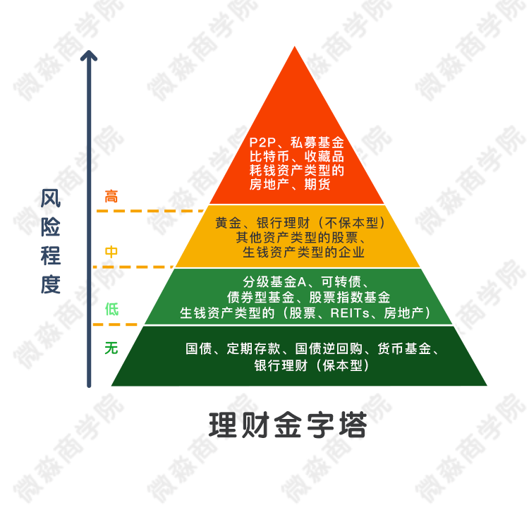 

		
根据风险程度的不同，可以把理财工具分为4类。 

		
第一类，无风险的理财工具。 

		
  

		
无风险的理财工具主要有5个，这5个理财工具都能带来持续的现金流。这5种理财工具没有风险，但是收益率也比较低。年化收益率一般在3%-5%左右。

		
虽然这类理财工具收益低，但却是现金管理的好工具。很多人把钱放银行卡存活期。活期年化利率只有0.35%，还不到以上工具的十分之一。即使从消费、取现的便利性考虑，把活期存款买入货币基金也能把收益率提高10倍以上啦。 

		
假设你现在手里有1万元得闲钱，如果放在银行得活期，每年利息只有35元。如果放在余额宝，每年利息300元左右。如果懂了货币基金+国债逆回购得，每年得利息就可以获得600元左右了。如果你得资金不止1万，10万，20万呢？是不是每年就可以多收到5000或10000得收益了呢

		
下面简单说一下这几个无风险的理财工具。 

		
定期存款，这个大家都懂就不说了。

		
银行理财（保本型），是银行卖的保本型理财产品。这个也不多说了。提示一点，如果买银行理财产品一定要注意是不是保本型。很多时候在银行漂亮小姐姐的热情的推荐下，很多人会忽略掉自己买的银行理财产品是不是保本型的。如果买到了不保本的银行理财产品也是可能会大幅亏损的。一定要记得银行是不会为你买的非保本型的理财产品负责的。哪怕你本人美的不要不要的也不行。

		
国债,国债就是国家借钱开的借条。只要国家还在，这个钱就会还的，所以安全性没的说。

		
国债逆回购，本质就是国债抵押借款。手里有国债但是缺钱的人把国债抵押了借钱。手里有钱的人把钱借出去。比如小A手里有10万元，小B手里有11万元的国债。小B把11万的国债抵押了，小A把10万元借给小B。如果到期了小B没有还钱，那么11万国债就会被卖掉还给小A。因为国债是没有风险的，所以小A也是没有风险的。有时市场缺钱，借钱不容易的时候，7天的逆回购年化利率可能高达20%左右。这也是无风险的超额收益了。如果有个10万本金，每年也能白白多赚上千元。这就是知识的力量呢。

		
下面看一下3天期国债逆回购的年化收益率。

		
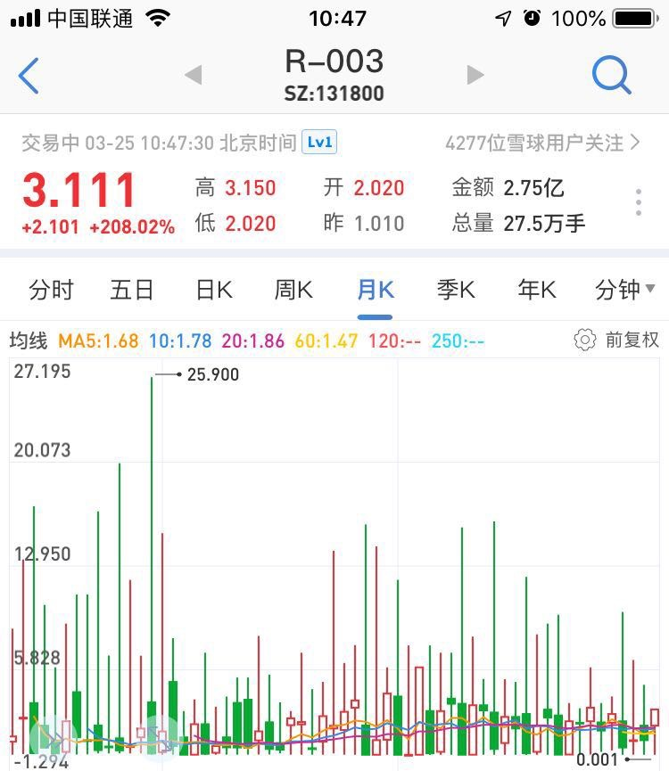

		
可以看到国债逆回购的年化收益率经常能达到13%以上，偶尔能达到20%以上。这都是无风险收益，是市场白送的钱。

		
顺便说一下这个国债逆回购在证券账户里就可以操作，是很方便滴。

		
以华泰证券为例，打开证券账户，输入国债逆回购的代码（比如131800）和数量，点  卖出 就可以了。3天之后本金和利息就自动到账了，非常省心。

		
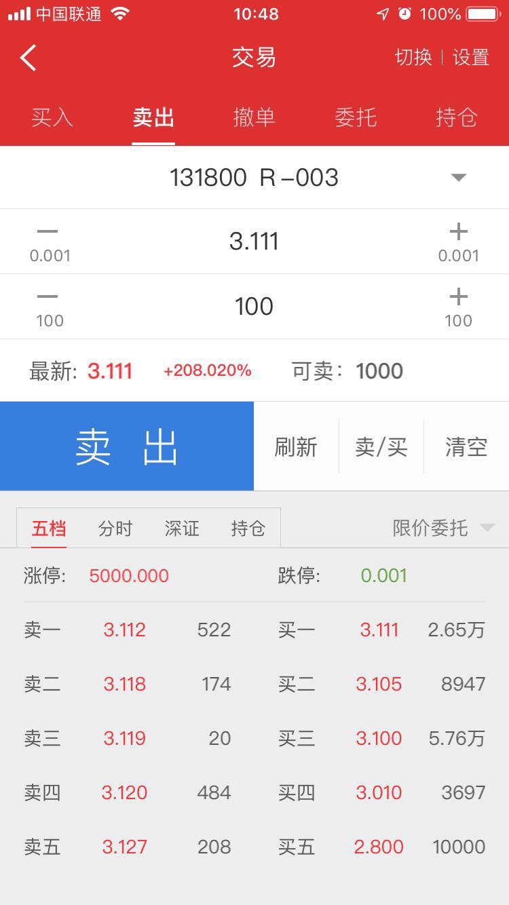

		
货币基金，也称“火鸡”。货币基金家族有个家伙是很出名的，它叫“余额宝”。想必很多小伙伴都买过，至少也听过。其他货币基金也和余额宝差不多。

		
下面这2只就是货币基金

		
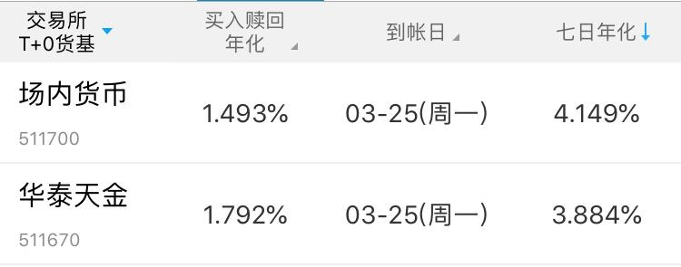

		
这里透露一个捡钱小秘密。平时把钱买货币基金，每年可以获得4%左右的无风险收益。当国债逆回购收益高时，比如大于10%时，卖掉货币基金直接买入国债逆回购。这样就可以获得几天的高收益。等国债逆回购的钱回来后，当天买进货币基金。因为买卖货币基金没有手续费。这样组合操作就能获得较高的收益。在保证资金方便使用的情况下获得6%+的无风险年化收益率。现在很多在微淼商学院学习过的智慧宝宝们都用这种方法管理生活费啦。收益率比余额宝高50%左右哦，比活期存款高1500%哦。

		
学完这节课谁还把自己的钱放在银行卡里存活期，老师要鄙视TA啦

		
这里说一下货币基金在证券账户里就可以买，非常方便。

		
以华泰证券为例，打开证券账户，输入货币基金的代码（比如511700）和数量，点 买入就可以了。

		
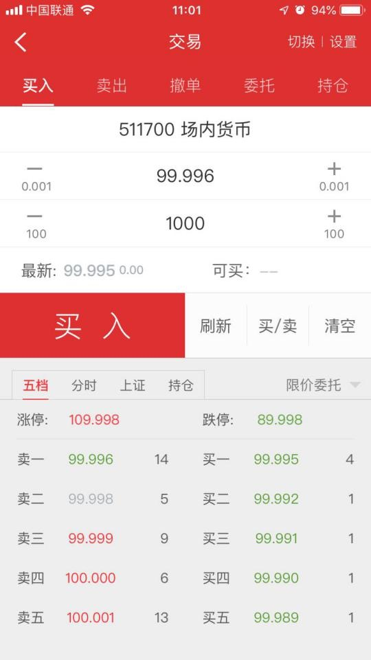

		
下面我们来看第二类，低风险的理财工具。 

		

		
低风险的理财工具主要有这几个。低风险理财工具最主要的特点是风险低。低风险理财工具又可以细分为两类。一类是低风险中等收益，年化收益率一般6%—15%之间，主要包括分级基金A、可转债、债券基金、股票指数基金。一类是低风险高收益，年化收益率一般在15%—30%之间，主要包括生钱资产类型的股票、REITs、房地产。 

		
这里我们顺便纠正一个大部分人长期存在的错误认知，那就是：低风险低收益，高风险高收益。

		
这个认知真是错的离谱。实际的情况是：低风险也可以存在高收益，高风险更可能高亏损。 

		
风险和收益的大小主要不是由理财工具本身决定的，而是由我们的理财知识决定的。

		
比如小黑同学擅长理财，买了10万元生钱资产类型的股票，每年可以获得分红1.5万。即使极端情况出现，小黑买的股票跌了50%，市值还有5万。但是小黑每年还是能分红1.5万，7年通过分红就能分到10.5万。把本金全部收回，剩下的股票就是纯赚的啦。哪怕股票价格跌到了0元，小黑还是不会亏钱。由于每年高分红，其他人也会买呢。买的人多了，股票就会上涨，更可能的情况是，几年后小黑的股票价格还涨了好几倍。小黑买的这种生钱资产类型的股票，跌的时候有源源不断的现金分红，涨的时候也能涨很多倍。无论怎么看都是低风险高收益呢。 

		
又比如小白买了10万元的P2P，年化收益率20%。看着收益率很高。半年后P2P平台爆雷，P2P平台老板跑路。小白10万元本金打水漂了。这样怎么是高风险高收益呢？无论怎么看都是高风险高亏损。 

		
所以

		
低风险≠低收益，高风险≠高收益。

		
低风险≠低收益，高风险≠高收益。

		
低风险≠低收益，高风险≠高收益。

		
重要的事情说3遍，同学们一定要记住这句话。 

		
决定风险和收益大小的不是理财工具本身，而是我们的理财知识。 

		
决定风险和收益大小的不是理财工具本身，而是我们的理财知识。 

		
决定风险和收益大小的不是理财工具本身，而是我们的理财知识。 

		
重要的事情说3遍，同学们一定也要记住这句话。

		
下面我们来简单说一下这几个低风险的理财工具。 

		
生钱资产类型的股票，就是持续分红的股票。每年分红收益率越高越优质。优质的生钱资产类型的股票，每年的分红收益率可以高达10%以上。把钱换成优质的生钱资产类型的股票是不是比存银行好多了呢？

		
生钱资产类型的股票可是一只持续下大金蛋的鹅。 那么怎么找到这样含金量高的鹅呢？其实很简单，只要能读懂财务报表就能选出这样的鹅。

		
比如下面这家在A股上市的公司就是非常优质的生钱资产，它的股息率为9.29%。意思是每年光现金分红的收益率就有9.29%了，如果加上价格上涨的收益，年化收益率超过15%是很正常的。

		
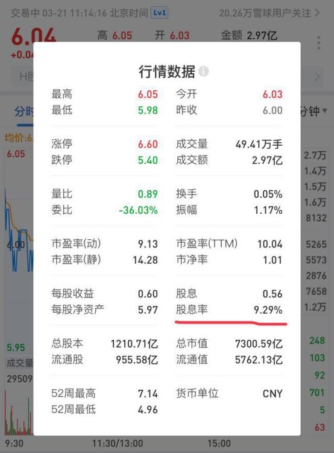

		
这里也顺便说下什么是股票。股票就是股份公司发行的所有权凭证，持有股票的人享有对公司的很多权利。比如分红权、投票权、知情权等。总之持有一家公司的股票就是这家公司的主人，无论持有多少都是主人。各位小伙伴可以想想为什么你公司的老板是公司的主人而你不是呢？因为他有你公司的股票（或股权）而你没有。 

		
怎么买生钱资产类型的股票呢？在证券账户里就可以买啦。

		
以华泰证券为例，打开证券账户，输入股票的代码（比如601398）和数量，点 买入 就可以了。

		
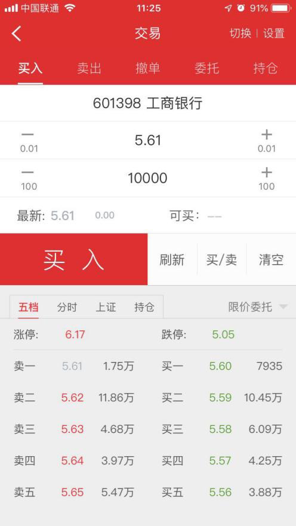

		
生钱资产类型的REITs， 是持续高分红的REITs。其实一般的REITs都是持续高分红的。因为各国法律都规定REITs每年至少要把90%以上的净利润分配给投资者。所以生钱资产类型的REITs也是一只持续下大金蛋的鹅。

		
什么是REITs呢？REITs是房地产投资信托基金。 

		
投资REITs本质就是投资房地产哦。 投资房地产还是很赚钱的，可是很多宝宝们交了房租也没有多少钱了。哪里有钱投资房地产呢？投资房地产的门槛太高了，没有个50万资金，你都不好意思去看房子，就更别说投资了。

		
但是REITs给了所有人投资房地产的可能性。通过REITs几百元就可以投资房地产了。就像买卖货币基金、股票一样方便。有些REITs每年的现金分红高达15%以上。微淼商学院的有些同学就是通过REITs这个理财工具解决了房租问题。让REITs给自己付房租。他们是怎么操作的呢？拿10万元去买REITs，然后每个季度会收到4000元左右的现金分红。这4000元现金分红正好够交3个月的房租。这样就再也不用自己交房租了，幸福指数提升了好几个等级。 

		
下面是一家美国REITs的股息率，每年光现金分红就能获得19.16%的收益。

		
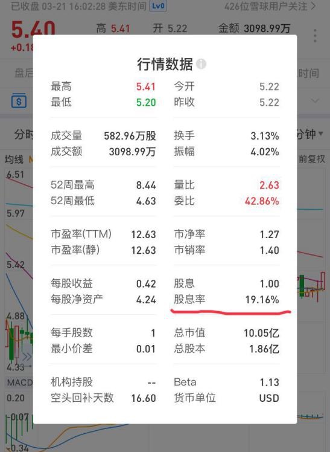

		
怎么买REITs呢？通过证券账户就可以啦。以富途牛牛证券为例，输入REITs代码（比如PSA）和数量，点 买入下单 就可以了。

		
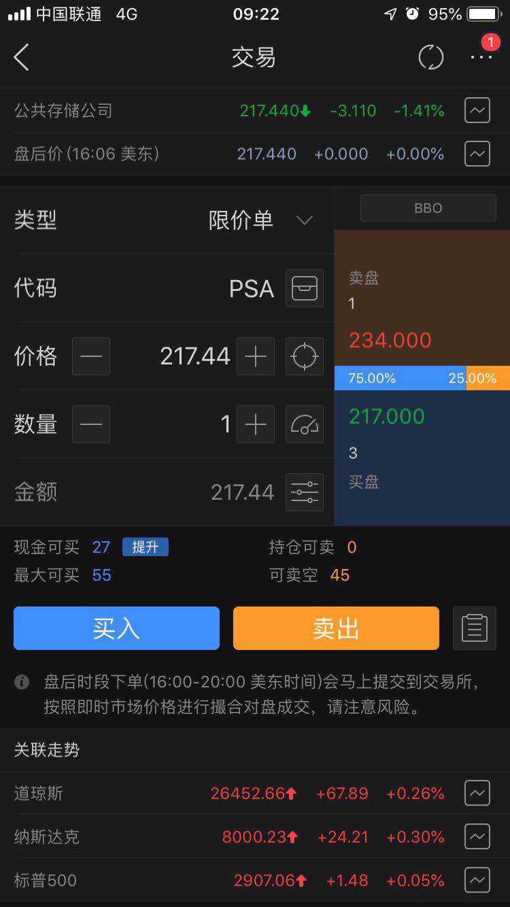

		
生钱资产类型的房地产，就是持续带来净现金流入的房地产。这个很简单就不多说了。

		
分级基金A，分级基金A是一种把钱借给分级基金B收取利息的基金。分级基金B以自己的本金做担保偿还A的本金和利息。所以分级基金A的投资者没有信用风险还能获得每年5%以上的分红。以低于1元的价格买入分级基金A还可以获得无风险的价格收益。分红收益加上价格收益，分级基金A的年化收益率一般可以到达8%—15%。

		
下面是银行A，半年时间的无风险收益高达13%。银行A是分级基金A中的一种。

		
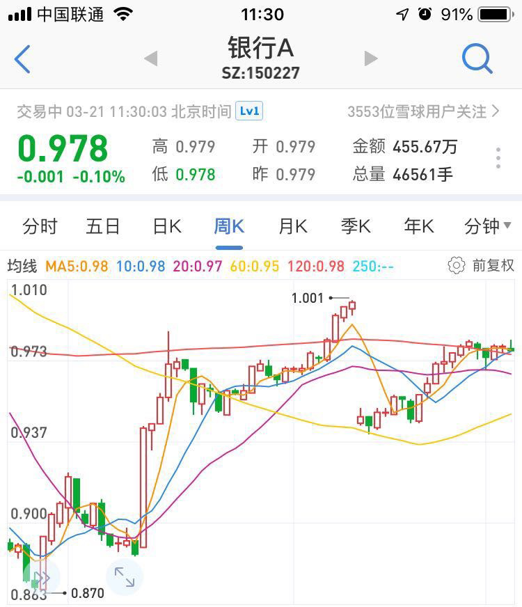

		
分级基金A需要在证券账户中买卖。以华泰证券为例，打开证券账户，输入分级基金A的代码（比如150227）和数量，点 买入 就可以了。

		
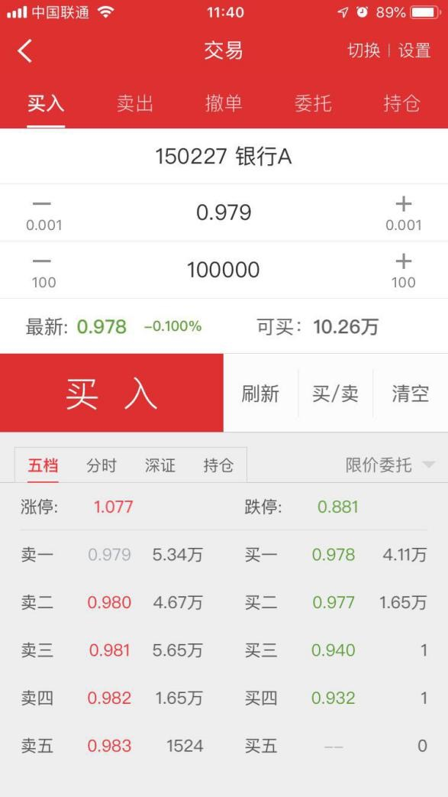

		
可转债，可以转换成股票的债券。在100元以下买进高信用等级的可转债没有风险。股市上涨的时候还能获得超额收益。是一种收益下有保底，上不封顶的投资工具。一般90元以下买进，年化收益率可达到10%-20%。

		
下面是蓝标转债，9个月的无风险收益高达58%。

		
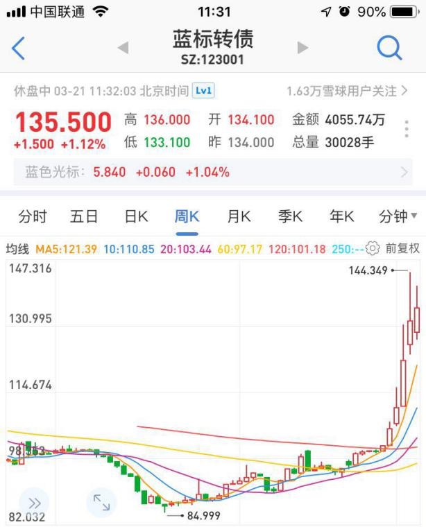

		
可转债需要在证券账户中买卖。以华泰证券为例，打开证券账户，输入可转债的代码（比如123001）和数量，点 买入 就可以了

		
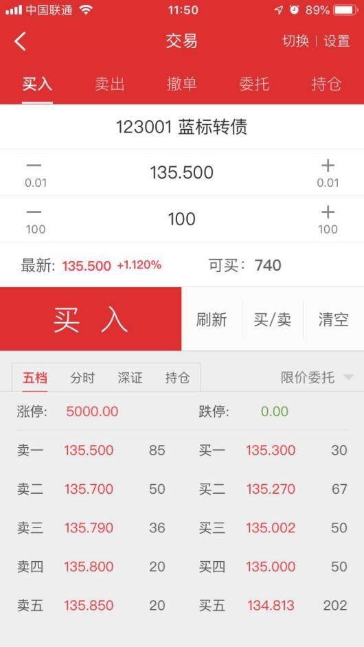

		
债券型基金，主要投资于债券的基金。低风险，年化收益率一般在5%—8%。

		
债券型基金一样通过证券账户买卖，这里就不演示了。

		
股票指数基金，复制股票指数的股票基金。由于股票指数具有永生不死，长期上涨的特点。在合适的价位买入股票指数基金长期持有几乎没有风险。其年化收益率一般在10%—15%。下面这个是沪深300指数基金，股票指数基金的一种。

		

		
股票指数基金可以直接在证券账户中买卖。以华泰证券为例，打开证券账户，输入股票指数基金的代码（比如510300）和数量，点 买入 就可以了。

		
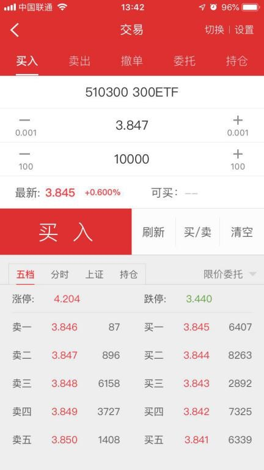

		
下面我们来看第三类，中风险的理财工具。

		

		
中风险的理财工具主要有这4个。这里各位小伙伴思考一下，中风险意味什么收益呢？

		
中风险对应中收益？

		
如果你这样认为，那你肯定是想多啦。

		
这里再强调一下，中风险≠中收益，中风险可能对应着低收益、中收益、高收益，当然也可能对应着亏本。

		
下面我们简单了解一下这几个中风险理财工具。

		
黄金，这个大家都清楚，不多介绍了。为什么黄金是中风险呢？因为黄金是其他资产，不带来净现金流入。持有黄金只能赚价差。价差的涨跌有很大的不确定性。所以是中风险。

		
银行理财（不保本型），有风险，需谨慎。一般有理财知识的人不会参与。买这种有风险的银行理财产品还不如自己做投资呢。

		
其他资产类型的股票，不分红的股票。这类股票不分红，买了这种股票只能靠未来的价格上涨赚钱。但是未来价格的涨跌有很大的不确定性。

		
其实股票可能是低风险高收益的理财工具，可能是高风险高收益的理财工具，也可能是高风险高亏损的理财工具。对于拥有不同理财知识的人，股票的风险和收益是不一样的。缺乏理财知识的人才会一味认为股票是高风险的理财工具。

		
生钱资产类型的企业，就是持续赚钱的企业。一般生钱资产类型的企业风险是大于生钱资产类型的股票的。因为上市发行股票的公司一般都是行业中前几名的公司，风险小于中小企业。即使已经赚钱的中小企业，风险相对还是较大的。这也是很多人找工作都想进个大公司的原因。

		
创造企业虽然有一定的风险，但是想要快速实现财务自由的人也会选择这种工具。因为自己从0开始创造出一家盈利的企业，是可以获得超额收益的。

		
很多同学可能认为创造企业很难。其实学会了企业经营的方法，创造属于自己的企业也是可以做到的。我有个亲戚，高中学历。在上海的便利店打了几年工，生活压力太大就回老家了。他先开了一个便利店，赚钱后又在其他地方开了一家便利店。便利店其实也是企业。现在他的便利店每年可以给他带来20多万的非工资收入。

		
4年时间，他靠着便利店也实现了财务自由。一个没有上过大学的草根男，靠着创造企业4年时间也实现了财务自由。可见创造企业并不是一件太难的事情。反倒是没有上过大学的人认为创造企业比找个好工作更容易。生活中经常见到没有考上大学的人去开个店什么的。这都是创造企业。只是很多人没有学习过企业经营方法，所以大部分人也没有把企业做的很好。

		
下面我们来看第四类，高风险的理财工具。

		

		
常见的高风险理财工具有这几个。这里再强调一下，高风险不一定对应高收益。一般情况下对应的都是高亏损。

		
下面我们简单来看一下这几个工具。

	<!--   
P2P，就是持续带来净现金流入的房地产。这个很简单就不多说了。
 -->
		
P2P，本质是互联网放高利贷的。随便招几个人，做个网站就可以做这个事情。这种不是在国家交易所交易的标准化理财工具。风险很大，容易血本无归。

		
私募基金，面向少数人募集成立的基金，可以投资各种理财工具。私募基金是非标准化的理财工具，风险很大。

		
比特币，一种数字货币。不是在国家交易所交易的标准化理财工具。本身也不产生现金流，属于其他资产，只能赚差价。风险很大。

		
收藏品，不是在国家交易所交易的标准化理财工具。本身也不产生现金流，属于其他资产，只能赚差价，并且变现不容易。风险很大。

		

		

		
耗钱资产类型的房地产持续的带来净现金流出的房地产。因为每月的净现金流出是确定的，也就是说每个月亏损是确定的。只能靠未来房价上涨赚钱，具有很大的不确定性。风险比较高。

		
期货，在期货交易所交易的标准化的合约。没有信用风险，不会跑路。期货本身不产生现金流，只能靠未来的价差赚钱，有很大的不确定性。另外期货一般都有高杠杆，很容易亏完本金。风险很大。

		
高风险的理财工具我们了解一下就行，对实现财务自由不但没有帮助还会起到负面作用。我们在理财的时候只要遇到高风险的理财工具就离它远点。因为高风险≠高收益，高风险往往会带来高亏损。

		
现在大家已经了解了各种类型最常见的理财工具了。在实现财务自由的过程中，大家主要用好无风险和低风险类型的理财工具就可以了。在这两种类型的理财工具中，有两个理财工具最重要，对我们未来实现财务自由有巨大的帮助。

		
这两个工具就是生钱资产类型的股票和REITs。可以说只要学精了这两个工具就能变成理财小能手。哪怕现在一分钱没有，未来也能成为牛X的有钱人。经过长期的实践证明，这两个工具是男女老少躺赚的最佳工具。

		
不过如果有同学想短期内暴富的话，那么这两个工具就不能满足这样有理想的需求了。这就需要企业这个工具了。这个工具马云、马化腾都在用，王思聪、章泽天同款哦。

		
现在我们已经了解了实现财务自由的三大核心工具了。

		
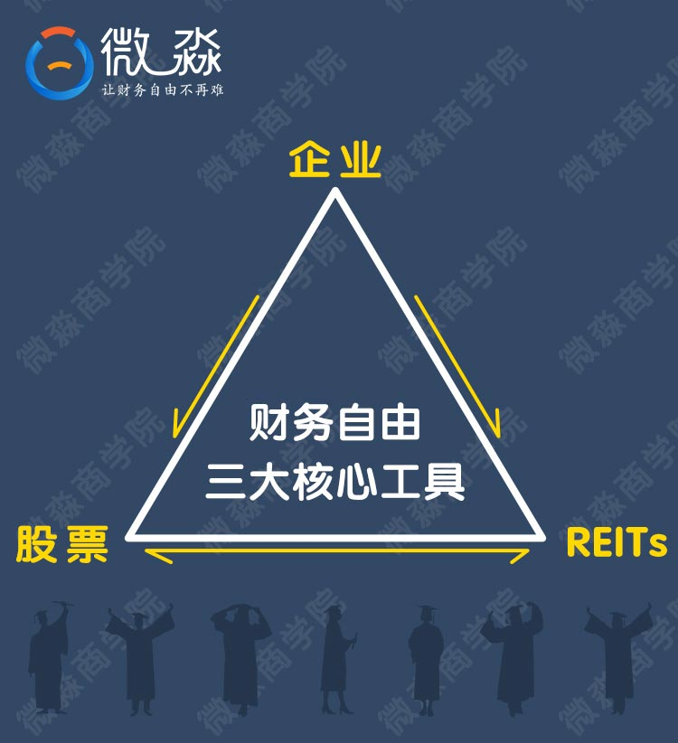

		
财务自由三大核心工具构成了一个稳定产生现金流的金三角，这三大工具组合会产生源源不断的强大的现金流。

		
这三大核心工具，只要用好了其中的一个就能脱贫致富。

		
用好了企业这个核心工具，你会成为企业家；用好了股票或REITs这两个核心工具，你会成为投资家；用好了企业、股票、房地产这三个工具，你会成为资本家。

		
一旦你精通了这三大核心工具，你就洞悉了金钱世界的奥秘，在这个星球上你将处于金字塔的顶端。当你站在塔顶往下望的时候，你会情不自禁的说出：即使你把我全身剥的精光只剩一个内裤，扔到沙漠里。只要有一只骆驼队从这里经过，我照样可以成为亿万富翁。

		
-------------------------------------------

		
由于绝大部分理财工具的买卖必需要通过证券账户才能完成，证券账户是每个人理财必备的工具。虽然很多基金通过银行、基金公司、其他代销机构也能买到，但是这些渠道的手续费都比证券账户高很多。比如：银行：万分之72左右；基金公司：万分之60左右；其他代销机构：万分之12左右。而通过证券账户一般不会超过万分之8，有的甚至可以低至万分之3。

		
可以说通过证券账户做投资，手续费是最低的。但是很多证券公司也存在一些坑，下面老师就来说一下开证券账户常见的坑。

		
第一大坑：高佣金

		
佣金就是手续费的意思，我们买卖投资工具，每交易一次都是要给证券公司交手续费的。由于证券公司和银行一样，都是由国家发了牌照才能开，所以证券公司的收费是受国家监管的。但是国家只限制了最高收费标准，不能超过千分之3，也就是万分之30。在万分之30之内，证券公司收费都是合规的，这样不同证券公司之间收费就有了区别。

		
现在佣金超过万分之10的证券公司都是耍流氓，遇到这样的公司直接淘汰。万分之3到万分之6是一个合理区间，根据客户资金量不同，证券公司会有不同的收费标准。一般5万以下的资金，佣金在万分之5以上，20万以上的资金有可能谈到万分之3。

		
开户时候的佣金越便宜，我们的交易成本就越低，节省的成本就是收益。

		
以10万资金为例，假设平均每年交易12次，投资生涯为40年，以万分之5的佣金标准计算，总共需要24000元佣金；以万分之3计算，需要14400元，两者相差近10000元。这还是按10万本金不变计算的，根据复利，现在的10万元在未来很可能会增值到几百万甚至数千万。那么交易成本的最终实际差别可能会有几万甚至几十万元。

		
所以开证券账户时一定要避开高佣金这个大坑，聪明的做法是在实力强的大券商中选佣金最低的那家开户。

		
第二大坑：杂费

		
除了佣金费率这个坑，还有一个坑。

		
在我们的交易中，除了佣金，还有经手费和监管费，这个被称为规费。有诚意的券商会把这些费用包含在万3的手续费中,很多则另外收取，并且也不告诉你，默默地扣钱。这样实际佣金就远高于万3了。所以在开户的时候，一定要问一下客户经理，佣金是否包含规费。

		
一般而言，如果你问了，客户经理都会据实回答的，只要你问，客户经理就会觉得你懂。大家尽量要选择没有这些杂费的券商。

		<!-- 

 -->
		
第三大坑：叠加套餐

		
当跳过两个坑，你以为就没有了吗？正所谓一坑还比一坑高，还有第三个坑呢！第三个坑是传说中的“叠加套餐”。

		
这些叠加套餐会赠送一些资讯等等，但是获得这些资讯，往往就意味着你的佣金会贵好多！有些“叠加套餐”对应万分之30的佣金。大家开户的时候尽量不要选择“叠加套餐”。

		
了解了这3个大坑后，就没有券商能坑到你啦。

		
如何开户呢？

		
开户非常简单，现在只要有手机，就可以7*24小时随时随地开户啦。

		
好啦，关于开证券账户的注意事项就说这么多。

		
下面老师就要揭晓认真学习，按时交作业同学的奖励啦。

		
应前期很多学员的要求，我们以微淼商学院的平台优势从国内顶级的上市券商那里为同学们争取到了其他地方享受不到的低佣金福利。该券商市值1000多亿，是券商中的巨无霸，账户资金安全绝对有保障。

		
从老师提供的二维码新开户，开户享受超低佣金，股票万分之1.8（资金大于1万元），场内基金万分之1，场外基金1折。

		
敲重点，只有从老师提供的二维码新开户才可以享受哦，如果以前已经有了华泰账户，只能拿家人的帐号重新开了。

		
老师在开营班会时说过，前3天认真学习按时交作业的同学会获得价值超千元的奖励。这个超低佣金的奖励会让你在未来节省数千元甚至数万元的佣金。一会晚课结束后，交了3次作业的同学可以找老师要二维码领取奖励。没有交够3次作业的同学是没有这个奖励的。

	

