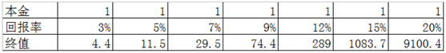

	

	

		<h3> 无论投不投资，你都是在投资</h3>
		
为什么说无论你投不投资，你都是在投资？因为你的钱只是在活期存款、定期存款、货币基金、各种债权、各种股权、房产、REITs、贵金属、金融衍生品、保险、外汇……等不同投资工具之间做的不同比例的选择。它是个持续一生的动态过程，不管愿意与否，这个状态会一直持续到我们的人生终结。

		
区别在于，由于每个人认知的不同，每个时点上配置品种不同，这些小小的收益差累计长达数十年的时间，最终不同人的人生财富值差异巨大——绝大多数人意识不到这个差异究竟有多大：假设人生有50年的有效投资时间（25岁至75岁），1个单位的本金，在不同回报率下的终值如下表：

		

		
我强烈建议各位小伙伴们从今天开始，坚决抛弃“买股票、买基金是开始投资”的错误思想，牢记我们从拥有第一笔“钱”的时候，就已经开始了投资，且365×24不休息，一直持续到离开人世才算罢手。

		
一个人，只要不是含着金钥匙出生的，财富最初总是靠出售体力或智力劳动换来，并在满足我们的消费需求之后，通过配置在不同的资产上获取。套用一句流行语，或者是“睡前收入”，或者是“睡后收入”。

		
所谓睡前收入，就是你干活就有、睡着了就没有的那种，是用自己的体力或者智力换钱。所谓睡后收入，就是非工资收入，哪怕你睡着了，它也在持续的流入你的口袋。两种收入形态中，很显然，睡后收入占比越高，你就有越多可供自由支配的时间，所做选择受到的制约也就越少。当睡后收入大于生活支出的时候，就进入了财务自由状态。

		
受限于认知水平，我们最先接触到的睡后收入，可能都是银行存款——还是年回报率“高”达0.35%的活期存款，其后由于你多学习了一点点，你可能开始会搞余额宝、零钱通、银行理财……，收益率开始从0.35%提升到约3%~5%之间。

		
这一步跳跃很容易实现，是因为这个回报率依然远在社会平均财富增长值之下，属于将自己辛辛苦苦卖体力或者脑力换来的财富，无偿地送给别人一部分。将财富从自己口袋里掏出来丢给别人，总是很简单的，对吧？

		
甚至由于合法窃贼的存在，你连掏的动作也可以省掉，庞大的国家机器，日夜不停地将你用汗水或者脑汁换来的财富，一点点地偷走。过去30年里，中国货币总量从1987年的6517亿扩张到2017年的1676800亿，就是证据。这个不展开聊，直接看每100元在不同时间里能换到多少东西就能明白——这就是我多次说过的：<sapn style="font-weight: bold;">在法定货币时代，现金是少有的100%确定亏损的资产。</sapn>

		
既然投资是无法避免的事，是持续一生的事，那么，尽最大可能将自己通过体力或者智力劳动换来的法币，换成收益率更高的生钱资产，就成了非常值得思考的问题。有没有这个习惯，甚至决定了你和别人后半生的幸福程度或人生高度差异。

		
那么，投资什么呢？

		
其实早就有人做过大量专业系统的研究，都证明了所有投资资产中，长期回报率最高的就是股票和REITs。对于这个研究结论，感兴趣的朋友可以看伦敦商学院的研究成果《投资收益百年史》。

		
另外，还有一本名著，杰里米.J.西格尔的《股市长线法宝》，研究了美国长达两百年的资本市场，得出的结论也是，200年里股票的年化收益率是债券年化收益率的183%。

		
绝大多数对于复利没有概念的朋友，估计很难想象这个收益差导致的终值差异究竟有多大。举两个《投资收益百年史》里的数据：

		
英法美德日意澳荷瑞（典）加丹瑞（士）12个主要国家中，收益差最大的澳大利亚，1元本金投资股票百年之后是777249.7元，而投资长期债券百年后是252元，投短期债券是80.7元，差异超过3000倍。

		
收益差最小的瑞士，1元本金投资股票百年之后是1136.7元，而投资长期债券百年后是73.2元，投短期债券是25.8元，差异超过15倍——以上数据均是未扣除通货膨胀之前的名义回报率。

		
能理解股票和REITs长期收益率最高这个结论，《投资收益百年史》和《股市长线法宝》就可以不用看了。

		
有过大量的研究证明，A股公司的长期年化回报率大约12%。如果我们满足于10%左右的回报，投资其实很简单：定投股票指数基金就可以了。

		
如果想要获得年化20%甚至更高的回报，就需要学习股票和REITs投资了。

	

	<h6>以下部分为老师的早读感悟分享</h6>
	

		
老师：这篇文章老师深有感触。无论你投不投资，你都是在投资。无论选不选择，你都是在做选择。

		
老师：由于之前没有理财知识，老师也不知道有什么理财工具。老师把自己的工资都花掉了。这是比存银行活期更糟糕的方式。虽然存银行是必亏的，这会把鹅饿成瘦鹅。但是老师花掉所有的工资就是杀死了自己的鹅。

		
老师：杀死自己的鹅肯定是一件非常愚蠢的行为。老师之前的无知导致了行为的愚蠢。

		
老师：我们应该怎么养自己的鹅呢？如果用活期存款、定期存款、货币基金、银行理财这些工具来养鹅，只会把鹅越养越瘦。到最后鹅不但下不了金蛋还会被饿死。

		
老师：我们怎么才能把鹅养肥呢？《投资收益百年史》这本书中说，要用股票和REITs来养。好公司、好REITs都是优质生钱资产，能持续稳定的生钱。这样养鹅才能不断下出大金蛋。

		
老师：那么股票和REITs那么多，怎么才能知道哪些是真的好呢？哪些是看起来很好，但是实际很烂呢？哪些是看着很烂，实际也很烂呢？

		
老师：老师通过学习理财知识找到了答案。老师相信各位小伙伴只要认真学习，也能找到答案的。

		
老师：好了，老师的分享就到这里。各位小伙伴输出你自己的感悟吧。

	

