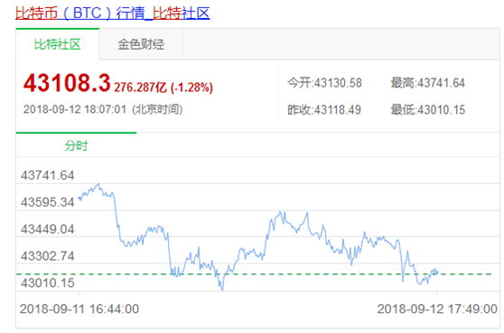

		

		

				<h3> 虚拟货币投资骗局</h3>
				
今天老师带大家看一下虚拟货币骗局

				
老师相信各位小伙伴一定是听说过比特币的，比特币的崛起造就了无数屌丝逆袭的神话

				
有的小伙伴可能在早年接触过比特币，但是当时却没有下手，这种感觉就像错过了整个世界。

				
我们看下这张图

				

				
在2009年的时候，1美元可以兑换1309.03个比特币，如果你看到这个数字美元概念，我们再来看一下比特币现在的价格

				

				
一枚比特币价值43108.3人民币，有点晕，拿个计算机算一下

				
如果当时拿1美元买了1300枚比特币，十年不到的时间，现在已经是5600万人民币了，我滴个天啦

				
谁能给老师一台穿梭机，不要拦着我，老师要去买一打。

				
开个玩笑，其实老师很早就听说过比特币，但是老师并不后悔，投机其实本质上就是赌价格，就像去赌场一样，如果能赌对，自然是收获满满，可惜老师作为一个普通人，从来不认为自己有预测未来的能力，所以老师也不参与投机

				
不过正是因为比特币这种罕见的增长神话，却吸引着无数的韭菜加入了币圈很多人都有这样的一种心声，比特币我是错过了，但是我可以抓个别的币啊

				
那么骗局设计者正是利用人们这样的心理，设计了一个又一个骗局，下面带大家看一个例子

				
不知道各位小伙伴有没有听说过维卡币呢

				
在前两年的时候，如果你经常看电视节目，比如第一财经、东方卫视，很有可能会听说过维卡币

				
维卡币号称第二代加密货币领域领军者，采用ssl加密证书等等，说自己比比特币更有优势。不知道小伙伴能不能理解，反正老师对这些名头是每个字都认识，但是就是不知道啥意思

				
骗子总是把自己包装的非常高大上，目的就是要让别人以为很厉害，很多人被洗脑之后就开始往里面砸钱，老师给大家说一个维卡币的受害者陈满

				
陈满同学在早些年的时候，由于被误判为杀人案的凶手，所以蒙冤入狱，从1992年到2016年坐了24年的大牢。具体事情经过老师就不多介绍啦，反正就是2016年被证明无罪释放了，并拿到赔偿金275万

				
24年的光阴换来275万，不知道各位小伙伴觉得值不值，反正老师觉得不值

				
出狱之后的陈满当然是要找回自己逝去的人生，于是参加了总裁培训班，并且和朋友讨论投资和创业项目

				
就这样陈满接触到了维卡币这个项目，虽然陈满同学对电脑一窍不通，但是在监狱里待了二十多年，这出来了肯定对新事物是十分感兴趣。

				
于是在一位“郭姐”的洗脑之下，陈满同学刚开始投入了40万，很快这维卡币就升值到200多万了，老师要是赚了这么多钱肯定就跑路了，但是那边的洗脑人员告诉陈满，这个要做长线投资，不能做短期投资，如果每个人都赚钱了就跑，这个事业就没法进行下去了

				
这个说法看着还挺有道理，不过换个角度想想，40万的真金白银和电脑里面不一定能取出来的200万数字，小伙伴们选择哪一个呢

				
后来维卡币被曝光是投资骗局，陈满同学还依然坚信维卡币，直到有天，陈满的大哥让银行工作人员看了下陈满同学的电脑，发现有6个账户，此时投入的金额已经高达100多万

				
而这个时候，银行工作人员帮助陈满同学提现，却发现这些账户都是可以卖出维卡币的，但是卖出之后，每次到提现就不行了

				
很多骗局都是这样，限制提现，骗局终有被揭穿的一天，一旦资金链断裂，没有下家接盘，账户里的数字永远就成了数字

				
直到这时候，陈满同学还依然坚信着没有问题。后来在律师朋友的帮助下才开始慢慢醒悟过来，但是毕竟公司注册在海外，这次的维权之路只会更难

				
其实类似这样的虚拟货币骗局还有很多，比如什么珍宝币，万福币等，其实都是打着比特币的擦边球，精心设计了一个骗局，下面老师带大家解释下维卡币的骗局

				
这个维卡币的运营公司注册在国外，并且把自己包装成全球化的大公司，那所谓维卡币的啥技术，其实就是让外行人看不懂，让人以为是尖端技术。

				
然后宣传的时候公司还得有个创始人吧，还得给这个创始人穿一件光鲜亮丽的衣服，比如这个维卡币的创始人说自己是哈佛毕业，还上过福布斯的排行榜，老师听起来也觉得很厉害 ，但实际上呢

				
网上根本搜不到她在哈弗毕业的有效证据，更可笑的时候，所谓的福布斯排行榜，只不过是付费内页广告，也是给钱基本就能上，结果被他们自己山寨到封面上了，这诈骗技术挺可以

				
然后呢，就通过让客户进群或听课，用知名媒体宣传该虚拟货币的优势及未来走势等，给客户制造高期望的假象

				
这么好的东西，当然会有很多投资者成为会员，开始鼓吹该虚拟货币的高收益率，通过奖励诱惑和展现老师的周薪刺激投资者，变相鼓励投资者去拉更多的人进来投资

				
后就形成了一个金字塔型的传销骗局，而骗局终有被拆穿的一天，在16年年初，维卡币就被瑞典警方认定为骗局，很多人以为抓住了下一个比特币，到头来却发现只是个传销骗局，投资者也都是打了水漂

				
其实老师知道有不少人通过比特币赚了几千万，相信各位小伙伴身边也有这样的朋友

				
这些人里，有的是真能看懂比特币的发展，有的呢可能只是运气好，因为某种原因在合适的时候买了比特币。其实就像赌博一样

				
老师并不看好投机，也看不懂比特币，所以老师觉得自己没有赚到这个钱是很正常的。如果老师凭着运气赚到了这笔钱，这笔钱最后也会因为我没有相应的能力而失去，这样的例子太多太多，老师在这里就不多说啦

				
最后老师要跟各位小伙伴说的是，我们看东西不能只看到光鲜亮丽的外表，这些所谓的光环很多都是可以利用媒体、技术包装的，最重要的还是回归到本质。不能持续产生净现金流入，不在国家级交易所交易的理财工具，咱们就尽快远离。要不然很容易被骗。

				
今天的防骗分享就到这里了，谢谢大家

		

