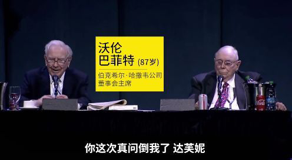
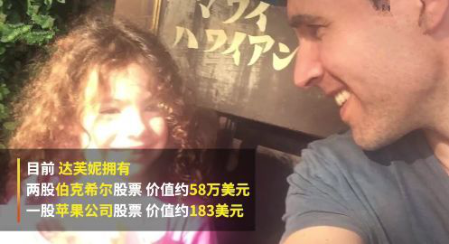
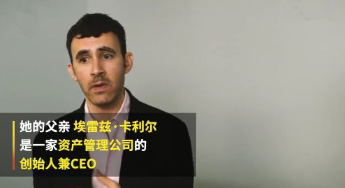

	

	

		<h3>8岁小女孩问倒巴菲特，为啥那么牛？ </h3>
		
2018年，巴菲特股东大会吸引了全球超过5万名参会者，其中来自中国的投资人接近四分之一。

		
在长达5个小时的提问环节，巴菲特和芒格共回答了近60个问题。在这些问题中，巴菲特竟然被一个8岁的小女孩“问倒了”！

		
 

		
 

		
下面是小女孩儿的提问以及巴菲特的回答：

		
问：我已经是伯克希尔-哈撒韦公司两年的股东了，这是我第二次参加年度股东大会了。巴菲特先生，你能否向我解释为什么伯克希尔近期最大的投资背离了你以往有效的投资哲学，为什么您投资了北柏林顿铁路公司，而不是投资像美国运通这样有资本效率的公司。

		
答：你的问题难道到我了，庆幸她还没有长到9岁，我坐在这只想一个问题，明年我们要踢掉6位专门小组成员中的哪一位，让你来替代他们的位置（哄堂大笑）。

		
我的答案是，我们总是更青睐有很高资本收益的生意，比如喜诗糖果公司以及一系列有潜力的公司，我们从资本密集型公司那里获取了相当不错的收益，以合适的价钱购买了大多数公司的股票，并且在投资之后这些公司运营的还不错。

		
我们仍然青睐那些投资少收益高的公司，并且能一直发展而不需要很多的增量资金，那些以合理的价格买入而有很高权益资本收益的公司，这样的机会我们是不会放过的。

		
芒格对小女孩的说法表示赞同：“我很喜欢刚才那位年轻的女士的这种说法，我觉得我们应该坚持这种理念（购买轻资产），说得没错。我觉得公共事业方面的回报，铁路方面的回报，其实是满令我们满意的。虽然不是最好，但是足够好。

		
巴菲特补充说，轻资产的公司，甚至价钱合理的话，这种已经很难找到了。“像苹果这样的业务，它其实不需要太多的资本投入，但很少有这样的企业可以提供给我们这样的机会去做这样的购买。因为现在这种高回报的公司，已经很难找了。”

		
他最后对小女孩笑说：“但是在我们资产配置部门，肯定会有一个工作为你做好准备，长大了就来吧。”

		
这个8岁的小姑娘到底何方神圣呢？居然能把身经百战，神一样存在的股神巴菲特老爷爷问倒？

		
出于好奇，有网友就扒一扒这位小姑娘的背景。

		

		
小姑娘名叫达芙妮，小小年纪，已是两家上市公司股东，而且市值不低，被誉“最牛小股东”。

		

		
5岁时，她父亲就给她读巴菲特的传记《滚雪球》。

		
5岁就开始财商教育了，这比巴菲特还早好几年呢。要知道巴菲特11岁才开始了人生的第一股票投资。而且金额只有114美元。

		
这位叫达芙妮的小姑娘值得我们重点关注，或许巴菲特之后的股神就是她了。

		
那么这位5岁开始学习财商知识，8岁问倒巴菲特小姑娘的爸爸是做什么的呢？

		
“她爸是资产管理公司的创始人兼CEO。”

		 

		
看来财商也会遗传的。有这么一位高财商爸爸，女儿财商想不高也难呢。想想股神巴菲特老爷爷不也同样有一位股票经纪人爸爸吗？

		
突然我发现了一个真相：父母的财商是孩子财商的起点。要想让自己的孩子财商高，最好的方式就是父母自己先提高自己的财商。这样孩子一出生，在财商方面就赢在了起步线上。

	

	<h6>以下部分是老师的读后感</h6>
	

		
老师：看到这个标题的时候，老师以为这是一篇关于“神童”的报道呢。看完文章老师发现，世上根本没有财商神童，只有高财商的父母。

		
老师：说实话老师真的很羡慕达芙妮小姑娘。5岁的时候，她父亲就给她读巴菲特的传记《滚雪球》。8岁的达芙妮已是两家上市公司的股东了，而且身价居然超过了400万人民币。和曾经8岁的老师相比，达芙妮简直富的令人发指。

		
老师：老师记得小时候给妈妈要1块钱买零食吃都要纠缠半天。老师要哭上好一阵才能从妈妈那里弄到1块钱。

		
老师：但是老师消耗了很多卡路里和眼泪好不容易弄到手的1元钱却从来没有人告诉老师该怎么使用。这1块钱是应该买零食吃了？还是应该放在存钱罐里存起来？还是应该由妈妈专门为我开个专用银行卡存起来收利息？还是应该由妈妈专门为我开个证券账户买货基或指数基金或股票？

		
老师：总之直到来微淼之前从来都没有人告诉老师应该怎么管理钱。于是顺其自然的，老师就把零花钱买零食吃掉了。同样顺其自然的，水到渠成的，老师大学毕业后就把赚的工资都用来买喜欢的东西了。就这样老师曾经月光了很长一段时间。

		
老师：我想如果没有参加过微淼的学习，老师可能再过10年甚至20年也可能会月光，甚至会负债。

		
老师：父母的财商是孩子财商的起点。要想让自己的孩子财商高，最好的方式就是父母自己先提高自己的财商。真的很难想象财商低的父母能培养出财商高的孩子。真的很难想象自己不会理财的父母能培养出善于理财的孩子。

		
老师：当我们感叹达芙妮小朋友的财商时，我们确实要好好想想她的财商为什么会这么高？

		
老师：当我们感叹股神巴菲特的投资能力时，我们往往忽略了巴菲特的爸爸是股票经纪人。巴菲特10岁时就看完了家里所有关于投资的书籍。11岁就开始投资股票了。如果没有一个股票经纪人爸爸，巴菲特11岁怎么可能知道股票是什么呢？

		
老师：当我们感叹马化腾、王兴创造的千亿市值的公司时，我们往往忽略了他们的爸爸都是企业家。他们从他们的爸爸那得到的最大的财富不是钱，而是富人的思维。

		
老师：我们可能会感觉自己不如他们幸运，没有那么厉害的父母。但是我们自己可以学习理财知识，提高我们自己的财商。我们也可以在孩子5岁的时候就教给他们系统的投资理财知识。我们自己可能不能成为巴菲特、马化腾、王兴。但是我们的孩子很可能会。因为他们从小接受了专业的财商教育。

		
老师：父母财商是孩子财商的起点！我们可能没有高财商的父母，但是我们可以通过学习理财知识成为高财商的父母。

		
老师：老师的分享就到这里啦，各位小伙伴请输出自己的读后感吧！

	

