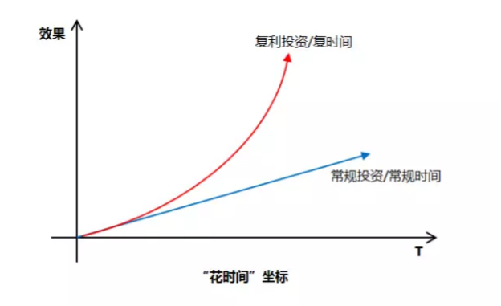
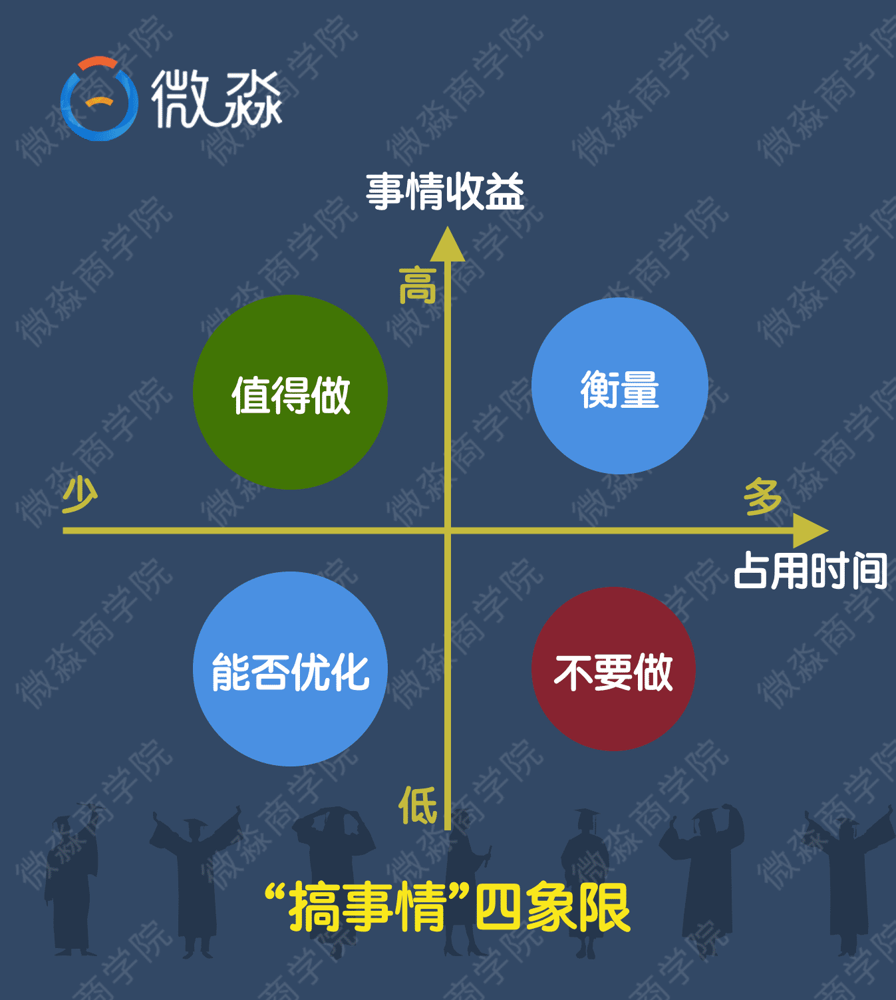
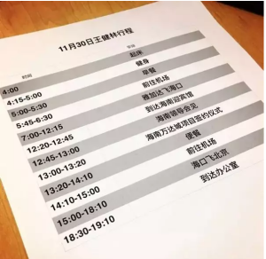

	

	

			<h3>别让“等有时间再做”毁了你</h3>
			
你是不是也经常说“等有时间再做”？

			
你就毁在“等有时间再做”。

			
说到时间大家可能都知道时间成本，但其实还有一个概念大家得要更加留意一下，就是比“复利”还厉害的“复时间”。

			
说到世界最牛投资家巴菲特。这位间接拥有数百家公司，几十万员工的投资巨匠，职业生涯80%的时间都用在阅读上面。不像我们每天拿着手机，大量阅读着碎片信息，这是信息焦虑症。

			
他老人家工作时间读的是财报和工作报告，休息时间看的是报纸和书籍。此外，他每天都要运动；日程表上还排着理发、弹吉他（弹得非常不错）……

			
似乎有钱人都不像我们这般忙碌？&nbsp;

			
每天努力勤奋工作，疲于应付大小琐事，却难有翻身之日。

			
&nbsp;也许巴菲特真正牛逼的财富，不仅仅是金钱产生的复利，而是大家都忽略了的“复时间”。

			
智力资本永远胜过金融资本

			
和复利用来赚更多利润一样，复时间也是用赚来的时间交换更多的价值， 并且随着时间的推移呈现指数级的增长，就像下面的“花时间坐标”一样。

			

			
深圳是一个狭长的城市，我住在深圳的西面，曾经有一段时间要跨越整个深圳去东面工作。在地铁上单程耗费的时间是两个半小时，来回要近五个小时。

			
最开始，我每天路程上就是玩王者荣耀，练了好几个英雄，段位也冲上了王者，我从单纯的玩操作，上升到玩策略、玩意识，很明显地感受到从量变到质变的层次变化。后来，意识到不能被一款游戏绑架，所以开始看书、学课程。

			
那段时间读了好几本书，学了好几位大神的课程，以至于当我拿起一本书就知道他要讲什么，看了目录就能判断是不是值的时候，我知道，复时间起效果了！&nbsp;

			
现在回想起来，有时候真的很羡慕上班路程稍远的朋友，你们有相对比较大块的零碎时间来专注做一件事情，不管是阅读还是学课程，甚至是打游戏，都能让你达到一定的境界！

			
尽管这些时间没有让你的资产马上得到增值，却让你的智力资本得到了增长，潜在的机会是，你的资产有可能因为智力资本的增长而获得更高倍的增长！

			
这让我想起了一位投资大鳄的名言：“智力资本永远胜过金融资本”

			
复时间不止是复用时间

			
我们把花费的时间和投入的事情拉出一个四象限出来：

			

			
在这个“搞事情四象限”里面，“占用时间”是零碎时间，一般我们可以认为在两个小时以下。&nbsp;

			
1、占用时间多，又不能产生效益的事情，不要搞。比如：玩游戏、看偶像剧（相关从业者除外）

			
2、占用时间多，产出效益高的事情，你要衡量一下，是不是你需要的，如果是，干之；如果不是，你就把时间放到其他更重要的事情上去。

			
3、占用时间少，但是效益低的事情，也许是你做事情的方式错了，看看能不能改进。

			
4、占用时间少，但可以获取很高效益的事情，搞之！专门开辟出一段时间，用在占用时间少，获取效益高的事情上，久而久之，就能收获巨大的收益！这就是很好的复时间利用方法。

			
这里有几种成功人士都在用的“复时间”活动，你应该可以立即应用到你的生活中：

			
1、健身

			
巴菲特喜欢喝可乐，不光是因为他持有可口可乐的股票，他还喜欢吃汉堡、薯条、冰淇淋。

			
我也喜欢吃，为什么我不是巴菲特？&nbsp;

			
重点是，2007年，巴菲特的医生告诉他，要么健康饮食，要么保持运动。巴菲特实在舍不得放弃美食，所以选择了运动。这个好习惯对他日后的生活起到了很重要的作用，甚至帮助他战胜了前列腺癌。&nbsp;

			
很多成功人士都保持着良好的健身习惯，我就不一一列举了，看一下你们的“王爸爸”一天的行程单：

			

			
&nbsp;早上四点就起来健身了。&nbsp;

			
2、学习

			
学习是最值得投入时间的事情，是最符合低投入高回报的事情。

			
牛人几乎都离不开阅读：扎克伯格每两周读一本书；巴菲特每天阅读500页；查理芒格被戏称为“长着两条腿的图书馆”……

			
国内的俞敏洪曾经三个月读六十本书，平均一天半一本。

			
看这张照片：

			

			
俞敏洪坐在角落的一隅，正聚精会神地看书，地点是北京人民大会堂，他正在等着去开会。

			
3、建立高质量圈子

			
任何一项伟大的事业，都不是一个人的作用，而是基于那些创造性的组合。

			

			
&nbsp;像苹果的史蒂夫·乔布斯和斯蒂夫·盖瑞·沃兹尼亚克；巴菲特和查理·芒格；比尔·盖茨和保罗·艾伦；扎克伯格和普莉希拉·陈（他老婆）……像国内的阿里十八罗汉；腾讯五虎将；小米七人……可以交流的伙伴，会带来意想不到的突破！

			
要注意的是，我们要追求小而精的高质量人脉圈，避免鱼龙混杂的大圈子，那是浪费时间！

			
最后，像复利是把利息一次次地滚入本金一样，复时间也是一次一次地把时间投入到产生高效益的事情上去。&nbsp;

			
你不要奢望一次性的幸运，只有重复地利用这些时间，坚持做一件事情，才能获得巨大的效益！

			
这些方法对世界上杰出的人物有用，对你，也同样适用。

			
从每天花一个小时投入到上面的任何一个“复时间”活动开始吧！&nbsp;

			
不要总是想着等有时间了再做，而往往你就毁在“等有时间再做”。

			
所以，如果有一件事，你很想去做，千万不要说“等我闲了再做”。这是无限拖延的借口。

			
在今天，任何一件事，你想做，就可以立刻开始。

			
忙中偷闲去做高价值的事，不仅逼你学会管理时间，它带来的成就感，还能让你变得更加强大、自信。

			
“等有时间再做”的真正含义是，闲得无聊再去做。

			
只有不重要的事情，才应该被摆在这样的位置。那些对你重要的事，高价值的事，无论多忙都必须要抽时间去做。

			
时间最严苛无情，人生几十年，每分每秒都摆在那里，时间一到，Game over，连乔布斯这样的大神都逃不过。

			
时间又最宽容多情，有人的一生波澜壮阔、海阔天空，一辈子抵几辈子过，而有人，永远在没时间、没机会、没心情中任时光流逝。

			
如果你总以没时间为借口，时间就是你的敌人，如果你肯挤一挤，时间就是你的朋友。

	

	<h6>以下是老师的读后感</h6>
	

			
老师：你是不是也经常在一件事情面前，选择“等有时间再做”呢？

			
老师：如果有一件事，对你的未来很重要，千万不要说“等我闲了再做”。这是无限拖延的借口。

			
老师：“等有时间再做”的真正含义是，闲得无聊再去做。结果是你永远都不会去做。该做的事情不做，对未来人生的负面影响是巨大的。

			
老师：根据因果法则，老师认为每个人都应该健康富有的，关键是一些本应该去做的“高价值事情”很多人没有去做。他们把时间浪费在了低价值甚至无价值的事情上。

			
老师：只有不重要的事情，才应该被摆在“等有时间再做”这样的位置上。那些对你重要的事，无论多忙都可以抽时间去做。

			
老师：如果大家对待重要的事情都能像对待坏掉的手机一样马上行动起来&nbsp;我想很多人会比现在富有很多倍。

			
老师：见过无数个号称自己“想学习理财”的人之后，我忽然明白了一件事。

			
老师：那就是这些家伙，他们学习的目的并不是为了赚钱

			
老师：他们一般都会说，我很忙，我知道理财很重要，我没时间做，没时间学？

			
老师：总说没空忙忙忙，你没空忙忙忙，学习工作，还不是为了钱啊，不好好学理财，赚的工资永远是死钱

			
老师：投资讲究时效，任何赚钱机会都是过了这个村就没了这个店。

			
老师：其实他们根本就不打算做这件事情啊。如果连学习理财，学习让钱生钱都没时间的人。真的不敢相信他们以后会变得富有。

			
老师：其实他们真的没从心底认真对待投资学习这件事啊！！

			
老师：说这么多，是想表达什么意思呢?

			
老师：就是不要天天挂在嘴上“我穷、我没钱、我没财可理、我忙我没时间”，要去想办法、要勤奋、要改变。

			
老师：要舍得投资自己，才能在将来收获更美好的自己！不要再傻等，说“等我怎么样~我就怎么样~”

			
老师：事实上，“等”字一出，基本就等于再也不会去做了

			
老师：大家一定要记住：如果你说什么事，一提到“等”字，请立马警惕起来！

			
老师：因为你很可能马上就要自己欺骗自己啦

			
老师：所以为什么说这个世界上只有少部分人能赚到钱？因为他们在行动，在正确的方向上努力坚持。

			
老师：时间，会帮你干掉一大部分人。

			
老师：改变思维，马上行动，改变现状,这是我们的出路！小伙伴们，加油

			
老师：这个道理其实人们都知道的，但能做到的人太少。所以做到的那部分少数人才会很富有。

			

			
老师：好啦，今天的早读结束啦，欢迎大家输出自己的读后感哦

	

