

	

	

		<h3> 小白必备的房地产投资神器</h3>
		
在讲REITs之前我们先来逛下街。

		
我们先来逛下北京王府井附近的一处物业，东方广场。东方广场包括了东方新天地、东方经贸城、东方豪庭公寓和东方君悦大酒店。东方新天地是商场，东方经贸城是甲级写字楼。

		
在北京的同学没有来过这里的估计很少。

		
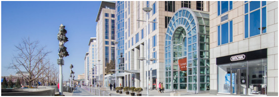

		
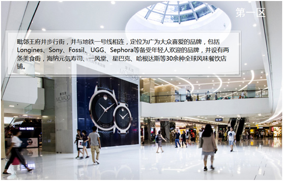

		
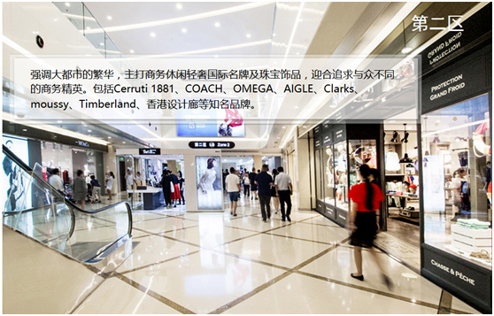

		
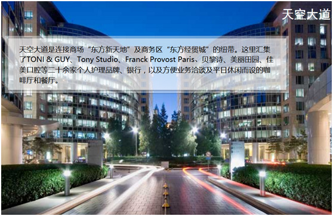

		
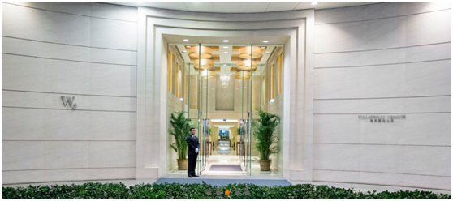

		
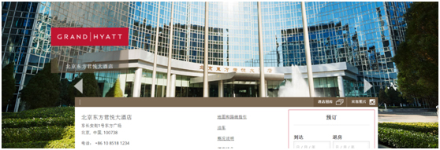

		

		
逛完了东方广场，我们再来远观一下北京CBD的华贸中心的超甲级写字楼。

		

		
华贸中心的写字楼获选为中国二十大写字楼之一。

		
看完北京CBD华贸中心的写字楼， 我们再来远看一下广州CBD的地标广州国际金融中心。

		
这栋最高的圆柱形大厦就是广州国际金融中心。广州国际金融中心是全球十大高楼之一。主塔地上共103层，地下4层。项目由超甲级写字楼、高端购物商场、五星级超豪华四季酒店、豪华公寓以及国际会议中心等五大功能组成。

		

		
逛完了内地的高楼大厦，我们再来逛一下香港中环的花旗银行大厦。

		

		
这三座大厦左边的中国银行大厦，中间的是花旗银行大厦，右边的是长江实业大厦。这3栋大厦都是香港的地标。当去维多利亚港看夜景的时候，我们就会看到这3栋大厦。

		
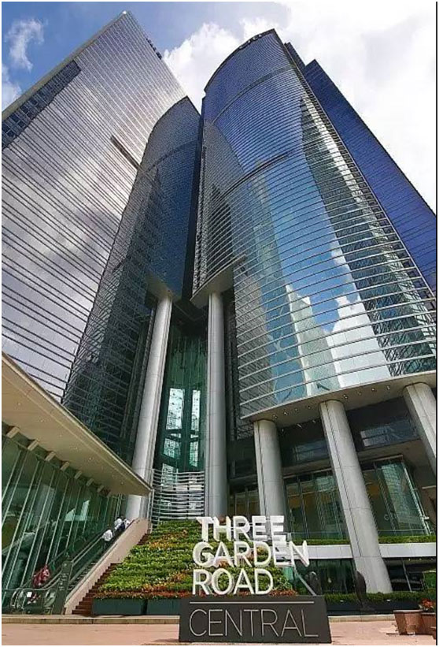

		
我们再来近看一下花旗银行大厦。花旗银行大厦在香港中环最核心的地段，去过香港的同学很可能来过这里。

		
没有去过香港的同学，可以把这个大厦所在的地段理解成北京的国贸或者上海的金茂大厦所在的地段就可以了。

		
最后我们再来逛一下香港旺角的朗豪坊。

		

		
朗豪坊在香港旺角也是地标。

		
好了，我们就逛到这里。有兴趣的同学可以到实地去逛逛。带上你的钱包，你可能会心痛但一定不会失望。

		
现在老师问同学们一个问题：以上地标性的商场、写字楼、酒店你想不想拥有？有的同学可能笑了，心想：我连里面的牛排都不舍得的吃。你问我想不想拥有高端商场、甲级写字楼、五星级酒店？我肯定想拥有，但是我的钱包不答应啊。

		
其实拥有以上的物业很简单，每个人都可以也有能力拥有以上物业的一部分。

		
比如有同学想拥有东方新天地、东方经贸城、东方豪庭公寓、东方君悦大酒店，该怎么办呢？

		
很简单，买汇贤产业信托（87001）就可以了。东方新天地、东方经贸城、东方豪庭公寓、东方君悦大酒店这几处物业的产权归汇贤产业信托所有。

		
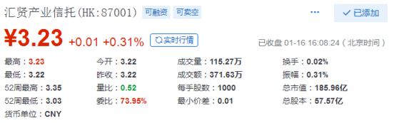

		
我们可以看到汇贤的价格为3.23元一份，买1000份才3230元。每位同学都买的起。哪怕只持有1份，也拥有以上物业的一小部分。可以享有物业分红和增值收益

		
如果有的同学想拥有华贸中心的写字楼，买春泉产业信托（01426）就可以了。华贸中心1号和2号写字楼的产权归春泉产业信托所有。

		
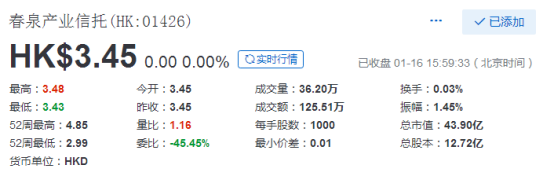

		
我们可以看到春泉的价格为3.45港元一份，买1000份才3450港元。每位同学都买的起。

		
如果有的同学想拥有广州国际金融中心、广州财富广场等物业，买越秀房产信托基金（00405）,就可以了。广州国际金融中心、广州财富广场等一些物业的产权归越秀房产信托基金所有。

		
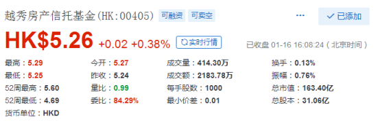

		
我们可以看到越秀的价格为5.26港元一份，买1000份才5260港元。每位同学都买的起。

		
如果有同学想拥有香港的花旗银行大厦、朗豪坊这两个地标性的写字楼和商场。买冠君产业信托（02778）就可以了。花旗银行大厦、朗豪坊写字楼、朗豪坊商场的产权归冠君产业信托所有。

		
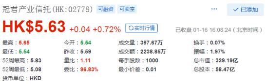

		
我们可以看到冠君的价格为5.63港元一份，买1000份才5630港元。每位同学都买的起。

		
如果有的同学理想远大，以上物业都想拥有。那么以上的房地产投资信托都买些就可以了。

		
以上提到的汇贤产业信托、春泉产业信托、越秀房产信托基金、冠君产业信托都叫房地产投资信托基金英文名是“Real Estate Investment Trusts”简称“REITs”。

		
现在全世界主要发达国家都有“REITs”，中国的“REITs”也在筹备之中，不久就会诞生。

		
通过“REITs”我们可以很容易的投资全世界主要国家的房地产。看好美国的房地产市场，我们可以买美国“REITs”；看好加拿大的房地产市场，我们可以买加拿大“REITs”；看好澳大利亚的房地产市场，我们可以买澳大利亚“REITs；看好英国、法国、德国、瑞士、荷兰、新加坡、日本、印度等国家的房地产市场，我们也可以买相关国家的“REITs。

		
我们知道房地产作为投资工具的优点和缺点都很明显。

		
房地产的优点主要是：能带来稳定的现金流，保值增值能力较强。缺点主要是：投资金额大，交易税费高，变现难。由于房地产缺点的存在，大部分投资者被房地产拒之门外，投资房地产的人大部分都是有钱人。

		
但“REITs”的出现消除了房地产作为投资工具的缺点，保留了其优点。应该说正是因为房地产作为投资工具有着明显的优点和缺点，“REITs”才被设计出来。对于房地产开发商而言，通过REITs可以把开发好的房地产快速变现，提高开发效率；对于投资者来说，几百元就可以投资房地产了，大幅降低了投资门槛，让草根也能分享房地产的收益；对政府来说，REITs促进房地产市场更健康的发展，有利于国家经济。

		
虽然“REITs”非常适合普通投资者，但是目前“REITs”的最大持有者却不是普通投资者，而是社保基金、养老基金、投资基金等机构投资者。这主要是普通投资者还不太了解“REITs”所致。股票已经出现了几百年了，但是“REITs”出现还不到60年。

		
美国投资者真正开始了解“REITs”基本在1990年之后；日本、新加坡、香港的投资者真正开始了解“REITs”基本在2000年之后；中国内地的投资者目前基本还不了解“REITs”是什么。

		
大部分房地产投资者都还处于“炒房”的初级阶段。

		
下面我们先来了解一下“REITs”。

		
1、“REITs”是什么？

		
REITs是一种依照法律程序成立的，以发行股票或基金单位的方式汇集投资者的资金，由专业机构进行房地产的经营管理，并将90%以上的税后收入净额分配给投资者的一种信托组织。简单来说REITs就是代理投资者投资房地产的上市企业。

		
下面我们来看一只美国REITs，西蒙地产。

		
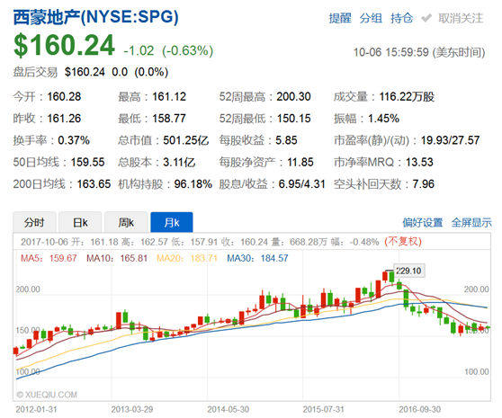

		
很多人看到西蒙地产的时候，会把它当成股票。因为它看起来确实和股票一样。

		
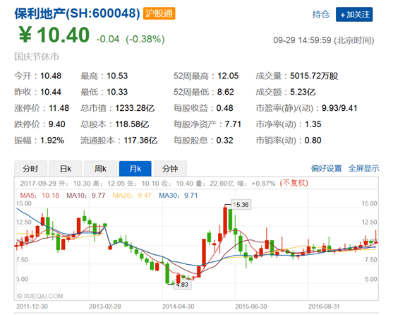

		
我们把西蒙地产和保利地产放在一起看一下，是不是很像？

		
但是西蒙地产是REITs，不是股票。保利地产是股票不是REITs。

		
虽然REITs和房地产股票长得一样，但是它们的内涵完全不同。

		
REITs和房地产股票区别如下：

		
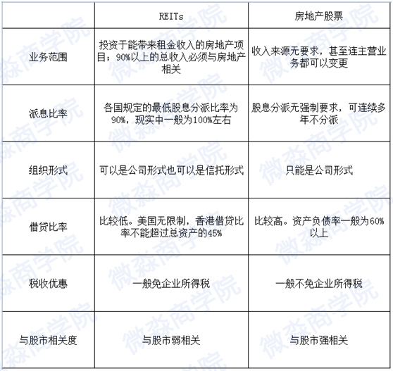

		
下面我们来看一下REITs的内涵。

		
REITs的内涵是法律赋予的，REITs之所以为REITs要符合一系列法律的要求。我们来看一下美国对于REITs主要的法律要求。其他国家的REITs都是在美国REITs的基础上改进的，总体上和美国REITs没有太大的差别。

		
美国对于REITs的主要法律要求有：

		
1、REITs必须把至少90%的年度应税收入分派给其份额持有人。

		
2、REITs必须把至少75%的资产投资于不动产、抵押贷款、其他REITs、现金或是政府债券。

		
3、REITs至少75%的总收入必须要从租金、抵押贷款利息、物业出售利得中获得。这不低于总收入75%的收入加上股息、利息及证券出售的利得不得低于总收入的95%。

		
4、REITs必须是房地产投资者，而不是其他任何形式的金融机构。

		
5、 REITs的份额持有人至少要100人以上，并且集中在任意5人手中的份额必须小于已发行总额的50%。

		
以上只是美国关于REITs的主要法律要求，其实关于REITs的法律要求还有很多。我们这里就不说了。

		
另外REITs每年还要进行收入测试、分配测试、资产测试、组织测试、所有权测试。测试不合格的轻则罚款，重则取消REITs资格。所以REITs是面临着系统的、严格的监管的。当然这是好事情，因为这样更能保障中小投资者的利益。

		
了解了REITs的内涵以后我们就知道REITs与房地产股票、投资基金等其他投资工具有哪些不同了。

		
下面我们来看一下REITs有哪些特点？

		
1、 定期强制高分红。各国都要求REITs每年至少要把净收入的90%分配给投资者。这样REITs每年都能给投资者带来持续的现金流。美国一般每季度派息一次，香港一般每半年派息一次。这就像收房租一样，美国是季付，香港是半年付。由于REITs有强制高分红的法律要求，REITs简直就是为中小投资者实现财务自由量身定制的投资工具。

		
2、 投资门槛低。一般几千元就可以投。香港REITs 1手为1000股，1手起买。美国REITs 1股起买。如果直接投资房地产，至少也要几十万才能起步。

		
3、 交易成本低。一般REITs会免企业所得税。投资者买卖REITs只需要支付交易佣金，和买卖股票一样，不用支付其他高额税费。如果是直接投资房地产，光买卖的税费也要在房价的10%-30%之间了。

		
4、 流动性强。买卖REITs像买卖股票一样方便。在交易时间内随时可以卖掉。

		
5、 专业化管理。REITs的管理团队都是房地产领域的专业人士。他们管理物业的能力一般会比个人强很多。如果我们自己直接买物业去管理，很可能不如REITs的管理团队管理的好。而且我们还需要花大量的时间和精力在房地产上面。

		
6、 收益率相对较高。和直接持有物业相比，持有REITs的收益率相对比较高。比如我们现在用100万在北京东方豪庭买一套公寓进行出租，租金回报率不会超过3%。每年的租金收益不会超过3万。如果现在用100万去买汇贤产业信托呢？股息率能有多少？

		
我们来计算一下。

		
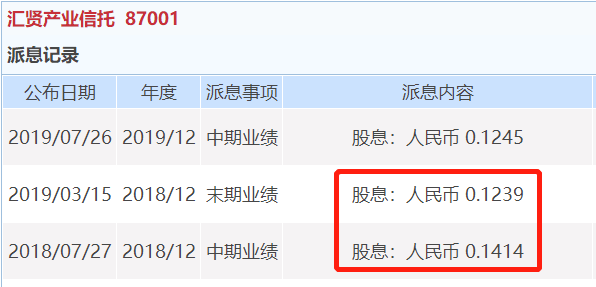

		
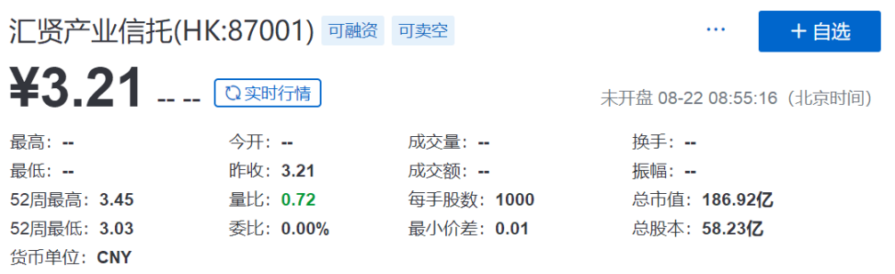

		
我们可以看到2018年汇贤产业信托每股现金分红0.2653元。2019年8月21日的价格为3.21元。假设未来维持0.2653元的分红不变，则股息率为8.3%。投资100万每年能获得8.3万的现金分红，比直接买房回报率高很多。

		
每年8.3%的现金分红已经挺高了，但是在REITs中还只是中等的回报率。高的可以达到20%左右。

		

		
比如这是一只美国REITs，每年的现金分红收益率高达18.1%。每个季度分红一次，这可是实实在在能拿到手的钱。

		
我们可以看一下这个美国REITs的分红记录。

		
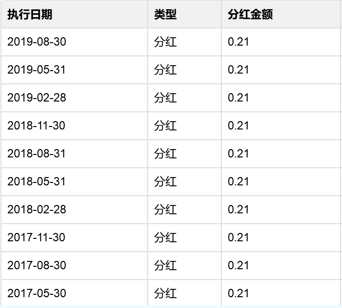

		
我们前面介绍股票时说过，长期来看与黄金、银行存款、债券、房地产等主要投资工具相比，股票的投资回报率是最高的。

		
但是如果与REITs的回报率相比，股票也是会稍逊风骚的。

		
长期来看，即使和收益率之王股票相比，REITs的收益率也更高一些。

		
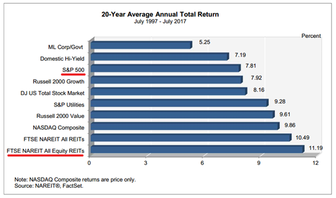

		
我们可以看到在过去20年中，美国所有的权益型REITs的平均年收益率为11.19%，同期标普500的年平均收益率只有7.81%（这个回报率没有包括分红，包括分红在内标普500的年均收益率为10%左右）。

		
现在我们知道了REITs有很多优点，那么REITs有没有风险呢？

		
当然有啦。REITs的本质是房地产，房地产有的风险REITs基本也有。比如如果房价下跌，REITs价格也是会下跌的。

		
其实对于大部分人来说REITs最大的风险有2个，一是不知道有REITs这个理财工具，错过了REITs的分红和上涨。就像是有人错过了中国的房地产一样；二是不懂REITs投资技能，盲目乱投资，本来一个非常好的理财工具，结果却被割了韭菜。

		
现在同学们已经对REITs有了一些了解，无论从哪个方面看，REITs都是一个非常棒的理财工具。那么怎么投资REITs呢？

		
REITs很多国家都有，同学们可以有很多选择。不过老师认为只要把香港和美国的REITs弄明白了，对于实现财务自由来说就完全够用了。因为通过香港和美国REITs我们可以间接投资中国内地、中国香港和美国的房地产。

		
这三个地区的房地产运行周期是不一样的，完全够我们轮着买啦。

		
比如认为北京、上海、广州的房价还要涨，买物业在这3个地方的REITs就可以了；认为香港的房价还要涨，买物业在香港本地的REITs就可以了；认为这两个地方的房价涨不动了，但是美国的房价可能上涨，买美国REITs就可以了。通过REITs总能买到相对更有价值的房子。

		
投资REITs不但可以赚房价上涨的钱，还可以赚租金。微淼商学院的毕业生王同学就巧妙的运用REITs解决了自己房租的问题。王同学毕业6年了，在苏州工作，技术男。经过努力奋斗已经存了20多万现金，这些钱是准备买房的首付款。但是由于苏州房价的上涨，20多万付首付还不够。

		
王同学只能更加努力工作，争取早日赚够首付钱。由于王同学之前缺乏理财知识，这20多万就放在余额宝里赚利息，一年大概有7000多元。王同学每个月房租2500元，虽然税后工资有9000多元，但是为了买房依然节衣缩食，不敢有大的花销。王同学自己说，曾经有很长一段时间，每个月想吃一顿自己喜爱的小龙虾还需要在内心斗争一番。

		
曾经最大的愿望就是每个月不用交房租了。这样就可以大幅降低生活负担，毕竟房租是每个月最大的支出。当然王同学曾经只是想想而已，从来没有把这个想法当真。

		
直到王同学学完了《财务自由实践课》，课程中有关于香港REITs和美国REITs的具体投资方法。王同学根据课程中的方法，选出来一个每年分红率高达20%的REITs。王同学算了一下，去掉分红税，每年还有18%的分红，简直难以相信。要知道国内现在房子每年的租金回报率还不到2%。王同学看了这个REITs的分红记录，发现每个季度都在分红，已经连续分了20多年了，中间从没有中断。

		
选出REITs后王同学也没有马上就买进，毕竟之前没有接触过的东西，心里还是有些忐忑。为了验证自己的判断，王同学就和班级里其他同学分享了这个REITs，在其他同学研究之后也认为这个REITs很好，值得买入。经过同学们多角度分析之后，王同学更加确信自己的判断了。王同学留了几万的生活预备金，把20万资金全部买进了REITs。

		
就这样买进之后，王同学在每个季度月初就能收到9000元，平均每个月3000元，去掉2500元的房租还剩下500元。这500元每个月够吃几顿小龙虾啦。这样王同学就告别了自己交房租的生活。王同学的房租由REITs包了。更幸运的是，在持有了3个月之后，王同学买的REITs价格上涨了55%，账面盈利10多万元。

		
后来王同学分享的时候也非常感慨，之前眼界太窄，没有理财观念，更不会理财方法。钱只能存银行，后来进化了一些改存余额宝了。但是赚的钱还是赶不上上涨的房价。经过学习之后，赚钱视野更开阔了，格局也更大了。

		
一年前我怎么也不会想到自己会在一个叫REITs的东西上赚那么多钱，更不敢想它还能持续的帮我交房租。我告诉大家一个小秘密，虽然经过了系统的分析，但是在我下手买的时候心里还是挺没有底的。主要是自己从来没有买过。

		
不过后来转念一想，买了这个REITs确实不能保证价格会上涨，但是毕竟每年税后的现金分红率高达18%，而且每个季度都能收到钱。这个现金分红是实实在在可以赚到的。另外这20多万本来就是为了买房子的，即使自己买了房子也不能保证房价未来一定会上涨。买REITs也是买房子。所以后来我就下手了。现在真的好庆幸自己当时下手了。当然更庆幸的是自己马上报名了财务自由实践课学习。不然我现在的生活还和之前一样，看不到太大的希望。

		
我发现人与人最遥远的距离就是认知上的距离；人与钱之间最遥远的距离也是认知上的距离。赚钱机会对于懂的人近在咫尺，对于不懂的人却远在天涯。

		
---------------------------------------------------------

		
最近几天有不少同学跟老师私聊的时候表示进步很大，对投资理财的认知已经有明显提升了，问老师有没有更系统的学习课程，想要进一步学习。

		
下面老师简单说一下如何系统学习？

		
关注“微淼商学院”公众号的同学应该也看到了，进阶课程是有的，有【财务自由系统操作课】、【财报分析技能课】、【企业分析技能课】

		
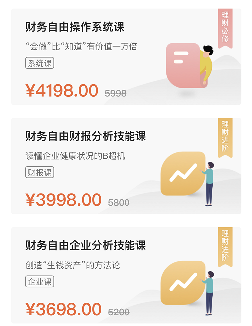

		
都想学，该怎么学，怎么报名呢？价格方面能不能优惠呢？下面我就来说一下

		
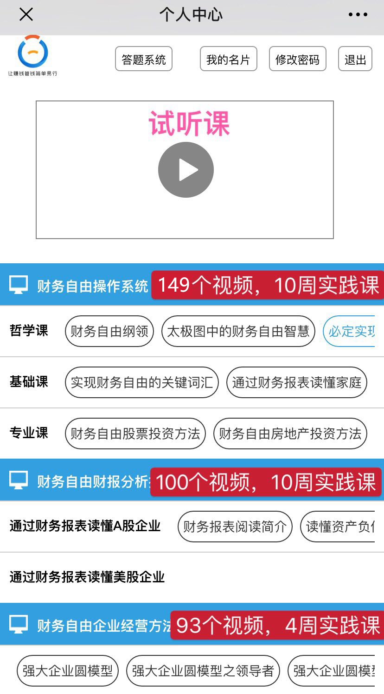

		
理财必修课【财务自由系统操作课】（149个视频+10周实践课）

		
能学到哪些内容：能快速掌握股票（A股、港股、美股）、REITs（港、美）、房地产投资、指数基金、分级基金A、可转债、货币基金、国债逆回购、保障型保险等工具的正确操作技能，还能学会如何做好家庭财务规划、资产配置方面的技能。

		
理财课之【财报分析技能课】（100个视频+10周实践课）

		
能学到哪些内容：系统掌握“三大报表”，通过分析财报选出A股、港股、美股市场最好的公司，23步快速读懂企业财报。

		
理财课之【企业分析技能课】（93个视频+4周实践课）

		
能学到哪些内容：系统学习决定企业成败的9大关键因素，学会如何给企业估值（公司是否便宜），更好的分析企业，看懂企业，掌握高管、CEO必备技能。

		
这些都是落地可执行的技能！一旦技能在手，你就能同时增加工资和非工资两个方面的收入。

		
【学习方式】班群教学+模拟演练+专业老师指导+小组讨论+重点测试

		
咱们视频课和实践课是一起的哈，视频是自己利用碎片化时间学习，学习地点是“微淼商学院服务号”。

		
【注册试听】微信-关注“微淼商学院服务号”-个人中心-注册，有一节试听课。

		
实践课是每周一节，群解散之后就开始安排实践课了呢，会有专业的指导老师带着大家实操演练。每隔一两周都会开一个实践班，我会根据你的时间帮你安排进群学习。

		
下面是实践课视频简介，点击【播放键】观看视频

		<video width="330px" height="374px" src="../img/shipin.mp4" controls=""></video>
		
【视频实操课这个课是什么样的？】

		
【视频课】主要是教授投资方法，每个3-5分钟，每个视频都是一个完整的方法、原理，随时可以在手机、电脑学习，刷朋友圈10分钟即可学习2个方法，不受时间地点限制

		
【实践课】主要是投资方法的模拟演练，由我们的高阶专业老师带领大家实战分析真实投资目标，分享理财信息，一共10周/24周，每周一次大课，时间1.5小时左右，地点是微信小班群。

		
【学习对象】：理财0基础的纯小白，但对理财有正确认识的人。

		
同学们不要觉得实践课周期太长了，我觉得实践课周期越长越好，一方面可以减轻大家学习的压力，另一方面咱们在上实践课期间，就可以投资了。并不是你必须要学习完才可以操作。边学边做，这样的效果是最好的。

		
【这个视频实践课学完了能获得什么？】

		
【技能】：学到一种投资分析方法和一套家庭资产配置方法，主要内容包含股票、REITs、货币基金、逆回购、房地产。以股票为例，学完能够从3500多只股票中精确筛选出好股票，并计算出买入价格，日后卖出价格。其他的工具也是如此。

		
【信息】：实操课中，专业老师除了教授大家分析各种投资工具的方法，还会分享当前可以关注的优质投资目标。

		
【圈子】：实操课实行小班制，永久不拆群，同学都属于高价值付费用户，也都是热爱投资的同学，根据过往经验，大家除了会分享投资信息，也会形成长远的优质投资圈层。

		
【视频实践课的时间安排——我现在太忙没时间能报名吗？】

		
视频课主要是教授投资方法，每个3-5分钟，每个视频都是一个完整的方法、原理，随时可以在手机、电脑学习，刷朋友圈10分钟即可学习2个方法，不受时间地点限制

		
实践课主要是投资方法的实战，由我们的高阶专业老师带领大家实战分析真实投资目标，分享理财信息，一共10周/24周，每周一次大课，时间1.5小时左右，地点是微信小班群。

		
【小窍门】在训练营结束前报名，可以立即开通视频课学习，对于配套的实操课可以在自己方便的时候与我沟通再开班。那些近期没有时间、想看完视频课再上实践课的同学可以用这个方法，一方面占住优惠的价格，一方面也可以根据自身需要调整上课时间。

		
后期的视频课程咱们同学在这个公众号学习，进入公众号之后在个人中心注册登陆。里面有一节试听课程，主要是课程简介让大家清楚咱们视频课程的听课模式。视频内容大家利用闲暇时间学习，随时可以看并且永久有效，然后实践课是小白营结束以后根据大家时间安排进群学习。每周一节课，如果没学会，也是可以反复进群学习的。实践课班群永久保留，全套课程学完拿到毕业证之后，如果感觉价格高于价值，是无条件退还全部学费的。想学习的同学可以去公众号了解一下&nbsp;

		
老师提示一下大家，咱们视频课是可以手机端在“微淼商学院服务号”或者网页端登录官网www.yaocaiwuziyou.com学习的

		

		
【课程重要承诺】

		
1、所有课程接受签订合同，并加盖公章

		
2、课程如果当期学不会，可以跟着下一个班复训，直到学会为止；

		
3、报名三合一全套课程的同学，在学完全部课程拿到毕业证后2日内，如果觉得课程价值低于价格，可以无理由全额退费。

		
对了， 还有一点，大家不要认为后面课程是小白营课程的延续，他们也不是衔接关系，后面课程只是小白营的展开讲解，详细到每一个工具的具体操作方法，视频内容更直观。

		
视频讲的都是方法，这些方法都可以通过老师带着上实践课进一步变成你所掌握的技能。

		
自己看视频为什么不行呢？

		
视频课只是被动的学习，方法论+实践才能变成你的技能。

		
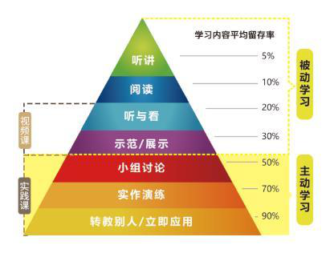

		
这也是为什么训练营不是让你们自己看链接，需要老师带着一起学习的原因。

		<!-- 
因为实践课班群采用小群教学。为了不影响教学质量，班群的人数不会太多。咱们班级有【40】个名额的优惠。
 -->
		
咱们实践课班群是【永久保留】的，学习实践课你就有自己的财务自由【圈子】，有好的机会出现时大家都会共享的。毕业后享受指导老师【持续】指导。

		
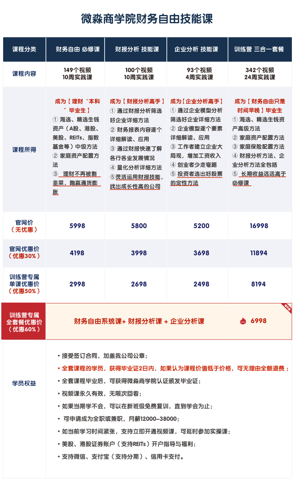

		
大家看下课程优惠方案，自己决定好了可以私聊老师哈

		
再给大家看下实践班的上课情况哈

		

		

		

		
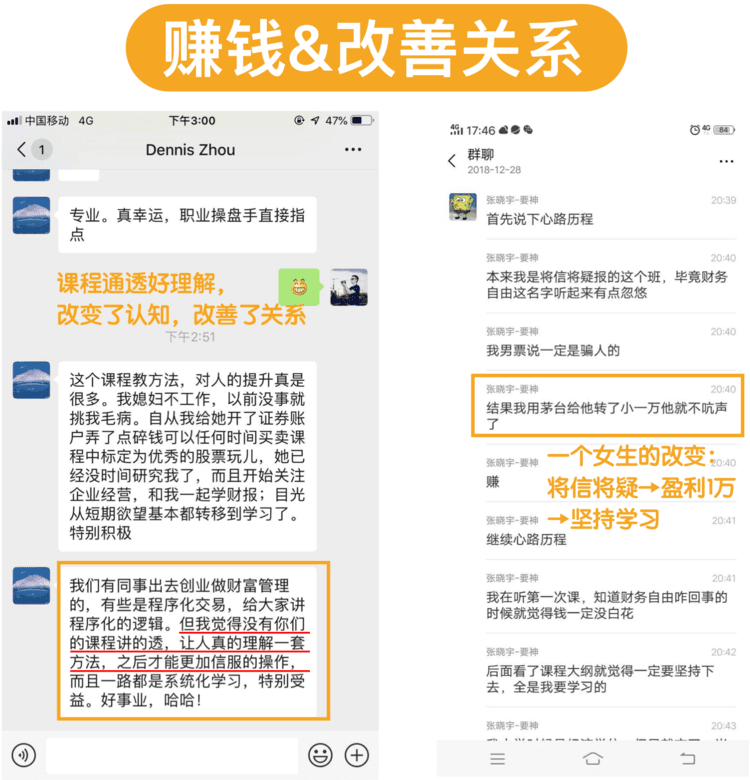

		
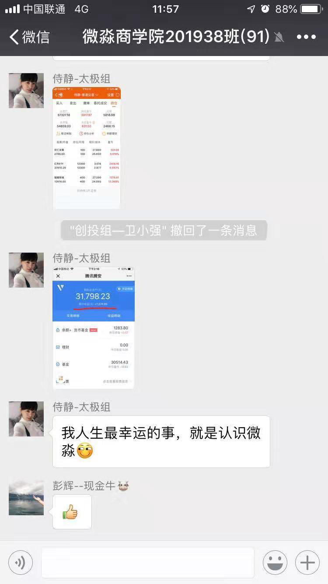

		

		
温馨提示：2998和6998的最优惠价格为小白营学员专属，优惠名额用完即恢复原价16998，需要优惠名额的同学们私聊老师哈
       
	

