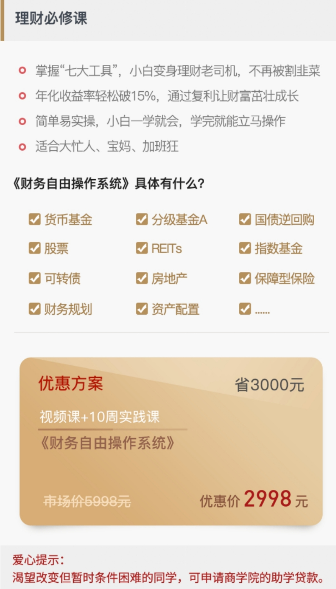

	

	

		<h3>免费到底是便宜还是贵?</h3>
		
01

		
免费，免掉的是钱，付出的是时间和效率

		
前阵子去参加一个培训，主办方是我非常非常要好的朋友，报名交钱的时候，她偷偷把我拉到一旁万分抱歉的说，因为公司也不是她一个人说了算，所以，她没有权限给我免掉培训费，只能稍微给我一个小折扣。

		
当时我就震惊了，因为这个课程持续时间长，海量内容，师资强大，哪怕再好的关系，我压根想都没有想过要来“蹭”，这完全就是我计划了大半年，不管多贵，坚决要花出去的钱。

		
我再三说没关系，她还是觉得很抱歉，半夜还让另外一个朋友微信给我致歉，我被弄“烦”了，直接拿一句名人名言镇压了她：

		
“松浦弥太郎说过，想要真正学到东西，就得花钱！”

		
你不收钱，我还会怀疑你不够尽力呢。

		
其实我一直不能理解，为什么社会上每天都有人想要绞尽脑汁去“免费学”东西。学习这件事，免费的东西，永远是最昂贵的，除了钱之外，你必然要花掉人际，时间，心情，各方面的成本，而且这个世界上，一个好的，可以共享的资源或者思想，它必然是经历了很多人的打磨，为别人的时间和精力还有知识成本付费，是一个现代人的基本操守。

		
蹭资源其实是最短视的一种行为。我有个妹妹，她一直很想学游泳，但是三年多了一直都没有学会，是因为她有个表姐每次听说她要去酒店游泳池报名都会说：哎呀为什么要花那个钱，我教你！于是她也就觉得是啊，反正有人可以教能省则省。

		
可是，就只能迁就别人的时间，迁就别人的状态，还要迁就她好不容易有空表姐又来了大姨妈，而且学习的时候，也肯定会抱有一种：“对不起打扰你了的心态”。

		
我知道了以后跟她说：至于吗，一千块，找个游泳教练，不仅教得快还有腹肌可以看！

		
她说掌门大人，你真是“何不食肉糜”的典型代表，你有钱当然觉得一千块小意思了！

		
我听到这种话就想翻白眼，我说你知道吗，很多人就是被这种硬塞给自己的穷人思想把自己给作死的，你敢不敢现在拿你手机支付宝看，你上个月加起来买的淘宝乱七八糟的东西没有超过一千块的话，我马上掏钱请你学游泳。

		
她当场就崩溃了，因为我当场给她算了一下，上了月她花在淘宝上买了穿一次就闲置的裙子，零食，乱七八糟，加起来至少有两千多块。

		
我说，你敢不敢这会儿立马刷一千块信用卡去我楼下报名学个游泳？

		
被我抽了一鞭子之后，这才一个星期，姑娘告诉我，六次课，在腹肌小鲜肉教练的nice教授下，她已经很棒地把蛙泳学会了。

		
其实学习是反人性的，虽然大部分人都知道学习很重要。但是大部分人只靠自己都无法取得好的学习效果。学习是需要陪伴的，不然世上也不需要那么多大学和培训机构了。 

		
02

		
在这个时代，我们要努力培养的，是维系雇佣关系而不是人情关系的能力

		
为什么付费的东西就能快速掌握？

		
是因为，在这个中国以人情社会垫底的大环境下，我们总是觉得“熟人”是最可靠的，所以做事也容易相信“熟人”，觉得自己赚了，省了，在没有经济牵扯的情况下，我们依靠一种人情关系来进行一个项目的推进，但这是很可怕的，因为背后有太多不可控因素。安抚他们的情绪，考虑他们的工作量，因为他是你“表姐三叔二姨夫”而得罪不起，反而占用大部分精力。

		
尤其很多产后妈妈，并不缺钱，也不愿意请月嫂，不信任月嫂，在请保姆的问题上觉得还是亲戚最靠谱，最后发现反而不比请一个专业的月嫂阿姨来的轻松。那是因为，你没有办法展现你的雇主本色，不能坦率提出你合理的需求，达到一种合作的平衡，所以永远觉得很累很疲惫。

		
但是一旦你成为雇主，你们的关系就不一样了，就像武志红老师说，关系就是一切，一切为了关系。相比人情，雇佣关系是最飒爽的关系，他让你们双方都绽放出最舒服的工作状态。合得来，继续；合不来，散伙。不满意的雇员你可以一换再换，换到满意为止。

		
我们已经生活在了一个雇佣时代，每天我们每个人都在服务别人，也在被别人服务，有些女生为什么觉得自己依然迷茫，生活没有改进，那是因为，你既不知道要怎么服务别人，也不知道如何服务自己。

		
我的建议就是：去花钱。从小钱开始花。

		
花钱是一门艺术。以前我也觉得这句话是装逼的，但是后来发现这是一句真理。如何找准值得你花钱的地方，花对了，你就状态就活了。

		
一旦你开始把钱花对了地方，就像死水开始流动，你的人际关系，你的专业，你的社交，你的眼界，随即就会开始流动起来。

		
我们时常形容一个女人：活色生香。一个活字，言语了所有

		
有个同行对我说：她自己也知道，虽然现在收入不错，不管挣多少钱，也解决不了她的焦虑状态。

		
我说那是你永远在处于一种疲于奔命的挣钱而不是花钱状态里，身边人看着你就会觉得紧张。钱一旦到了你手里，你就会让人觉得你挣的是苦钱，朋友们既不敢吃你的饭，也不忍心花你的钱，你又如何收获更轻松，更愉悦的社交关系，把自己从一个劳苦命当中拯救出来呢。

		
所以你不是活的，而是捆绑着的。

		
03

		
那么一个年轻女孩子如何用钱把自己花“活”？

		
在我月薪3000的时候，深得一位姐姐的言传身教，是她告诉我，不管你现在拿多少薪水，你一定要养成每个月“为自己的未来花点钱的习惯”。一开始，最低你要把这个标准定到5%，以后根据经济实力调整额度。

		
也就是哪怕月薪三千，你至少每个月要拿150块钱出来花给这个世界——要做什么呢？

		
我的经验是：为一切优质内容付费。

		
订阅全年你喜欢的时尚杂志，以求找准风格穿得端庄得体；买视频网站会员，节省广告和搜索时间；请一个很欣赏的朋友吃饭聆听经验教训；拿来买专业书籍；还有个女生更搞笑，她想做甜品师，所以她攒了三个月的“150块”去私房餐厅吃了一个法国老师的天价甜品。这都是为优质内容付费。

		
她是这么形容的：我总得花点钱，去买点世面见见。

		
这些优质内容，会结结实实长在你的气质和见识上，30岁之后，你就会知道你是如何成为一个更好的人的。

		
而且要让大家看到，这是你十分愿意花出去的钱，不心疼，不拧巴，不紧张，吃你一顿饭，不必有罪恶感。

		
“我没多少钱，但我愿意为你 / 值得的事情花钱”当你流露出这样的状态的时候，大家才会觉得你是可爱的，活泼的，不为钱拧巴的。才会愿意和你分享更多资源。

		
我还有一个高中女同学，对我说，她感觉自己要废掉了，在一个两点一线的单位，已经完全木讷。我问她，你每个月把钱花在哪里，她就跟我描述了一下，我说我没有看到你为你的未来花任何一点钱，满足基本衣食住行而已，甚至有很多是淘宝的乱花费，你又如何买到能够踮脚看世界的砖头呢。

		
在我的手帐本里，每个月初一定有一栏，是我逼着自己要花出去的钱，那不是买包包也不是买衣服，而是，那个钱我一定买到了新的观点，新的环境，新的餐厅体验，见到了一个不一样的人。

	

	<h6>以下部分为老师的早读感悟分享</h6>
	

		
老师：下面老师先分享个小故事。

		
老师：大家都看过《天龙八部》吧？这本小说中有这样一个桥段，就是聚贤庄英雄大会，乔峰带阿朱前往治伤，求的是一位姓薛的神医。

		
老师：他不肯另投明师，便别出心裁，以治病与人交换武功，东学一招，西学一式，武学之博，可说江湖上极为罕有。但坏也就坏在这个“博”字上，这一博，贪多嚼不烂，就没一门功夫是真正练到了家的。

		
老师：他医术如神，所到之处，人人都敬他三分。他向人请教武功，旁人多半随口恭维，讨好于他，往往言过其实，谁也不跟他当真。他不免沾沾自喜，总觉得天下武功，十之八九在我胸中矣。

		
老师：直到有一天，遇见乔峰和群雄搏斗，出手之快，落手之重，实是生平做梦也意想不到，不由得脸如死灰，一颗心怦怦乱跳，一句话也说不出来，更不用说上前动手了。

		
老师：看了这样的描述，想必大家觉得薛神医是个很可笑的人，但是转眼一想，在当下这个互联网时代，我们不都是薛神医吗？薛神医在江湖漂泊，四处学到各种武功，而且是“传授时自然决不私藏，教他的都是自己最得意的功夫”。

		
老师：大家有没有觉得，这跟你去知名的公众号、刷知乎、微博、朋友圈的时候四处学“干货”的场景很像？

		
老师：今天从哪个公众号里看了几篇干货，明天在哪个在线学习平台看了几堂公开课。于是你感觉到我真爱学习，我真充实，我真是嗷嗷牛逼，然后是不是也像薛神医一样“不免沾沾自喜，总觉得天下武功十之八九在我胸中矣”。

		
老师：其实自我感觉的“十之八九在我胸中矣”是一种自欺欺人的表现，因为四处得来的碎片化知识，经常带来两个弊端。

		
老师：第一，丧失深度思考能力。

		
老师：我们习惯在碎片时间获取一些信息，既然是碎片时间，那么都不会很长，所以能够看的篇幅也不会很长，所以习惯了看一百多字的微博微信，几秒钟就读完了。而恰恰由于其篇幅有限，所以大多都是阐述一个现成的结论或者逻辑简化后的信息。

		
老师：时间久了就养成了这样一种思维：“因为A所以B”、“只要C就能D”、“有了E才能F”、“出现G即说明H”……就这样渐渐变得狭隘独断，难以深入思考。

		
老师：第二，知识的使用效率下降

		
老师：单独的一个知识点非常容易获取，尤其是现在的互联网时代，获取信息短平快。但由于碎片化的特点，导致脑海里的知识点经常是孤立的，像一盘散乱的珠子。

		
你每一次只能拎出“一个”即止，而不是连续的“一串”，于是只能处理浅维度的信息。

		
老师：所以虽然人们获取信息的渠道多了，但使用信息的效率反而下降了。

		
以学习理财为例，大家有一个爱好，就是一上来就说，你给我介绍几个人的微博吧，或者几个公众号吧。

		
不可否认，大家确实能从中学到不少绝对的干货，篇篇经典。不然他们也不可能广为人知，对吧？

		
老师：但是，不知道你有没有注意到，几乎所有的微信公众号更新的特点就是，很难是一个完整的、循序渐进的知识体系，为啥呢？

		
因为更新内容是随着原创者的灵感或者追逐某个热点而完成的。

		
老师：如果大家在学习过程中只是单独学习一个个技巧或操作，虽然也能拓展了一部分视野。

		
但是如果你本来没有自己的知识框架，只是一味往你脑子里塞东西，想要应用的时候发现把自己的知识点串不起来，那这些知识对你又有什么意义呢？

		
老师：所以，如果在学习一门知识的初期，能建立一个全面的、体系化的认知是很重要的。

		
在随后的学习中将新的知识点纳入自己已有的知识体系内，重新消化理解，能将与之矛盾的内容排出体外，才可以进入一个良性循环。

		
老师：如果你刚刚进入一个新的领域，不要轻易尝试去自学。

		
因为没有对错的分辨能力，很容易让你在将来的某个时刻因为某些以前吸收的错误知识而栽跟头。

		
老师：网络上有句名言，我现在眼睛里留的泪，都是当年脑子里进的水

		
老师：这句话什么意思呢，就是在你当下不选择好正确的道路，未来反而会因为错误的决定付出更多代价和时间

		
老师：要快速进入一个领域，最好的办法就是将这个领域的经典书籍找出来全部研读一遍。但是这对大部分人来说是很花时间并且也很难做到的。

		
老师：为什么2016年被称为知识付费元年？

		
就是因为越来越多的人开始发现网上免费信息泛滥且质量参差不齐，而他们愿意为了能够快速获取对自己有价值或自己感兴趣的信息而付费。

		
老师：《中国分享经济发展报告2017》预测，知识付费产品将成终身学习渠道，也就是说会有越来越多人选择这种模式。

		
这也就意味着，你能免费获得的信息质量也会越来越差。我们说理财不要贪小便宜，投资自己的大脑就更是如此了。

		
老师：做一个终身学习者，武装自己的大脑，不要让自己的思维，被碎片化的信息击碎。

		
老师：这个社会，贫富差距其实越来越大，付费和免费的差距其实也越来越大

		
免费的和付费所能带来的效果也天差地别了。

		
老师：说回正题，大家知不知道“卖命”这个词语，有没有深入地思考过这个词语的意思呢？

		
老师：虽然我们都说生命无价，但是每天我们上班工作本质上就是在出售我们生命的若干分之一。

		
老师：然后用工资就能反推出我们“命”的“市价”，大家可以算算其实我们的“卖价”都不怎么高。虽然很残酷，但是你要知道，时间就是我们生命的若干分之一。

		
老师：所以，别轻易的把时间卖掉，但是反过来说我们花钱去买别人的时间某种意义上就是延长了我们自己的生命哦！

		
老师：这就是学习的意义，学习的意义就是“续命”，当然有些人也说成是“站在巨人的肩膀上”其实本质上是一样的。

		
老师：所以下一代人一般都会比上一代优秀就是因为上一代给下一代做了“续命”，这也是人类进化的动力，所以，你看，学习是多么重要。

		
老师：从价值上来看，时间是远远大于金钱的，花钱买别人的时间是非常值得的。这就是为啥富人能用钱解决的问题都用钱去解决，然后他还变得更有钱的原因。穷人啥都自己干啥都省，然后越来越穷。道理就在这里富人用钱买了穷人的时间。

		
老师：我们先来算一笔账。

		
老师：假如某人的税后月收入是8000，公司缴纳的五险一金大概就是1500，公司为这个人支出的成本就是9500，那么他每小时的收入是多少呢？

		
老师：一个月大概上班22天，每天8小时，9500/22/8=53.9，也就是时薪54。

		
昨天有同学想报名，然后可能觉得自己存款不多，有点犹豫，那老师来给你们再举个栗子，算个小账哈

		

		
老师：以咱们优惠后的财务自由系统课为例，咱们训练营优惠后的价格为2998元，就用我们前面计算出来的时薪54来计算，2998除以54等于55。

		
老师：也就是说，财务自由系统课不过是我们55个小时的薪水，还不到6天的薪水！

		
这不贵了吧？

		
老师：如果换成自学呢？可能找资料就要花100小时。这一点不夸张，听封老师讲他之前为了找REITs的数据，花了6个小时才找到一个满意的网站。REITs网站全是英文的，找起来比较麻烦。如果英文不好的人，估计花24个小时也不一定能找到。这只是一个普通的例子而已。

		
老师：买了一堆不错的书，你先要阅读，还要总结、提炼、应用、试错......本来能50小时搞定的事情，你可能花了500个时间还不一定能搞定。其实咱们课程里所涉及的各种工具，你自己花500个小时99%是搞不定的。

		
老师：何况，你遇到疑惑的知识点，又要去网上找，这重复甄别知识的过程，算下来至少又要多花100个小时。

		
这样算下来本来50小时的事情，变成了100+500+100=700小时，甚至更高。

		
老师：如果再以54元/小时来算，你的成本就变成54*700=37800元。

		
而花钱学习，你的成本只是2998+50*54=5698元。

		
老师：更何况，对大多数人来说，并没有毅力自己去找书，啃书，时间往往浪费在淘宝和追剧上，不能创造任何价值。

		
老师：如果你只想走一条免费的道路，需要极大的毅力，付出大量的时间，走很多弯路。并且在知识付费的大背景下，免费的东西质量只会越来越差。

		
老师：可能很多人说，我的时间没那么值钱，我就喜欢免费的东西。不知道大家想过没有，如果你自己学英语学的不精，大不了就是别人听起来怪怪的。但是你自己学理财学的不精，后面可是直接会亏钱的。免费的才是最贵的。真是谁被割过谁知道啊

		
老师：量化思维就是这么重要，账有时候就是需要这样去算的。

		
老师：投资，不只是买资产，自我投资是一种回报率最高的投资。那学习资源那么多，为什么很多人还是没有进步呢？因为他喜欢免费的东西呀！

		
老师：自我投资第一件事，远离免费的东西。

		
老师：每天都有人想要绞尽脑汁去“免费学”东西。然而，学习这件事，免费的东西，永远是最昂贵的。

		
老师：花钱是一门艺术，一旦你开始把钱花对了地方，就像死水开始流动。

		
老师：你的人际关系，你的专业，你的社交，你的眼界，随即就会开始流动起来。

		
老师：不管你现在拿多少薪水，哪怕是没有收入的学生党，你一定要养成每个月“为自己的未来花点钱的习惯。

		
老师：为一切优质内容付费，为“知识”这个资产付费。

		
老师：你花钱买了别人用时间换来的东西，不就等于你花钱买到了时间么？

		
老师：不就等于你的时间延长了么？不就等于你延长了自己人生的长度，自然会获得比别人更高的人生高度！

		
老师：肚子饿了买饭吃……那大脑饿了呢？

		
老师：好了，今天的早读分享就这些，欢迎大家输出早读感悟

	

