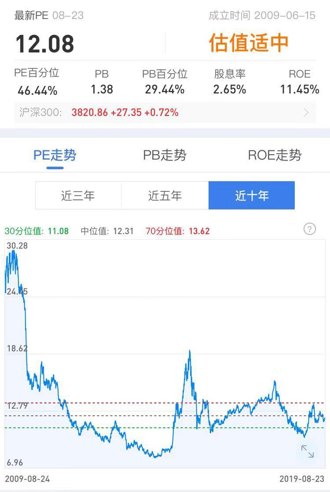
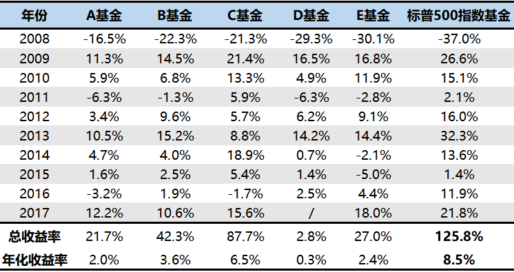
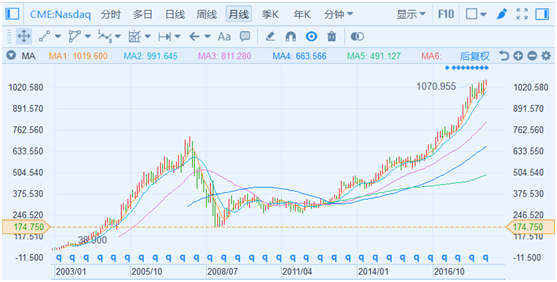
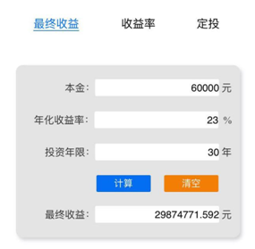
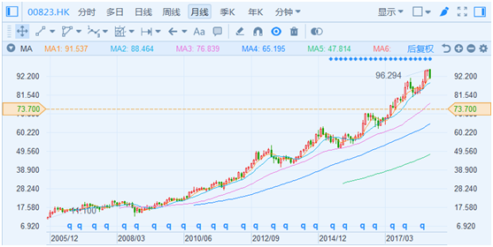
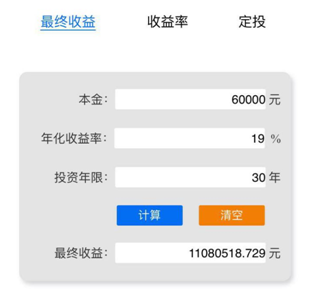
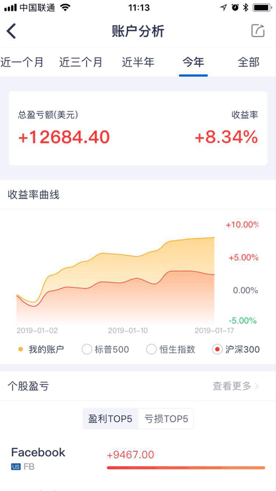

	

	

		<h3>懒人躺赚的理财方式</h3>
		
同学们好，这几天我们学习了股票、REITs等核心理财产品，那么怎么用这些工具来理财呢？

		
今天老师来介绍一种懒人躺赚的理财方式。为什么说是懒人躺赚呢？因为这种方式不需要动脑子，而且还能赚钱。这种方式叫无脑定投法。

		
我们这里的无脑定投法指的是定期变额定投。定期可以是每月、每季度、每年。但是建议每月定投。每月定投日可以设定为发薪日。这样发了工资直接拿出一部分（比如10%-20%）定投，这有点强制储蓄的味道，这样做的好处是可以直接解决掉很多人的月光问题。可以说定期投资是解决月光问题的一个有效方式。

		
变额指投资额度会变化。这个变化不是随意变的，而是跟随投资工具的市盈率而变。比如市盈率小于15时，每个月定投金额为X元；市盈率小于12时，每个月定投金额为2X元；市盈率小于10时，每个月定投金额为4X元。这样做的好处是投资工具在价格便宜的时候会买的更多。这样就能很好的起到降低总成本，提高收益率的效果。

		
这里简单介绍一下市盈率。市盈率简称PE，是市价与盈利比率。简单来说就是市场投资者为了获得1元的盈利，愿意付出的价格。一般来说，用15元的价格获得1元的盈利是相对合理的。这样15年就可以回本，年化收益率6%左右。是银行定期存款利率的2倍左右。用8元的价格获得1元的盈利就是超值的，这样8年就可以回本，年化收益率12.5%。

		

		
上图是中国一个非常重要的股票指数过去10年的市盈率变动情况。我们可以看到市盈率会在一个区间内变化。当市场狂热的时候，投资者会失去理智，市盈率会高达30以上，也就是说投资者为了获得1元的盈利愿意花30元。当市场悲观的时候，投资者同样会失去理智，市盈率会低到10以下，也就是说投资者为了获得1元的盈利只愿意花不到10元的价格。

		
市盈率在30或者10都是不太合理的，作为理性投资者我们要做的就是在市场悲观的时候大量买入，在市场狂热的时候不买或者卖出。比如市盈率小于10的时候，我们买入4X的金额；市盈率大于15的时候，我们持有但是不再买进；市盈率大于30的时候，我们卖出并买入货币基金（这是无风险理财工具，前面晚课中讲过）。考虑到很多同学月光容易存钱难，如果每个月不强制进行定投，容易把工资花光，把下金蛋的鹅杀死。所以当投资工具市盈率大于15的时候，每个月可以先定投货币基金，把钱先积累起来。当目标工具市盈率小于12或10时，就可以动用货币基金里积累的钱以2X或4X的金额买进啦。

		
现在很多小白投资者经常用的一种定投方法叫做定期定额。这种方法有较大的缺陷，同学尽量不要用。因为定期定额会产生一个问题。长期来看成本很难有效降低。比如3年每月1000元定投下来了，那么接下来的1000元，就不过是总投资的1/37而已了，即使点位很低，能够起到的摊薄作用很微弱了。

		
下面我们来看看适合定投的主要理财工具。

		
属于优质生钱资产类型的股票和REITs都是非常适合定投的。另外还有一种股票指数基金也非常适合定投。下面我们先来了解一下股票指数基金。

		
在讲股票指数基金之前，我们先简单了解一下什么是基金？什么是指数？基金就是一个特殊的篮子，里面可以装股票、债券等理财工具。篮子里主要装的是股票，就是股票基金；主要装的是债券就是债券基金；主要装的是1年期以内的短期债券就是货币基金。

		
篮子里装的是复制股票指数的股票，就是股票指数基金。

		
下面再来说说什么是指数？指数其实很简单，举个例子来讲，QQ音乐有个“QQ音乐排行榜”，会把当前最热门的音乐排个名。

		

		
假如我是一家专门出唱片的公司，为了降低风险获得较高收益，我就可以专门出“QQ音乐排行榜”唱片：每年挑选当年最热门的20首音乐，制成唱片就可以啦。

		
这个和指数是一样一样的。指数就是一个股票的榜单，用来反映股市的情况。

		
我们在日常生活中也经常会接触到指数，例如一个班级的平均成绩，一个城市的平均年龄，这个平均值可以反映某一个方面的平均水平，就像我们班级的平均分可以反映班级成绩的平均水平，这就是指数的作用。

		
股市中有几千只股票，我们如何统计某一类股票的平均价格呢？

		
为了解决这个问题，股票指数就诞生了。例如沪深300指数，沪深300指数就是从上海和深圳证券交易所中选出300只规模最大、流动性最好的股票进行加权平均编制而成的指数。

		
指数是不能买的，基金按照指数中每个股票的权重购买这300家公司的股票，这样基金的涨跌会和沪深300指数的涨跌一模一样。这就是沪深300指数基金。

		
基金可以分成主动型基金和被动型基金，通常我们说的股票基金都是指主动型基金，这种基金由基金经理决定买哪些股票。而被动型基金就是指数基金，只根据指数配置股票，不人为选择股票。

		
各位小伙伴只要考虑股票指数基金就行了，因为至少80%的主动型基金是跑不赢指数基金的。最主要的原因是主动型基金都有短期业绩考核，基金经理为了完成短期目标经常进行短期交易。前面课程咱们讲过，经常进行短期交易的人基本都会被割韭菜，基金也不例外。

		
在10年前，股神巴菲特以10年为限，赌没有哪个主动基金能够跑赢标普500指数基金，赌注是100万美元。

		
当时整个美国只有一个叫泰德.西德斯的基金经理敢出来迎战。

		
如今十年已过去，结果怎么样了呢？

		

		
左侧的ABCDE五只基金是主动基金，最右侧的是标普500指数基金。

		
标普500指数基金收益为125.8%，而同期泰德.西德斯的五只基金收益率从2.8%到87.7%不等。

		
标普500指数基金完胜！

		
指数基金和主动基金相比，还有一个特别的优点：指数基金长生不老。

		
指数基金是会新陈代谢的，会自动淘汰那些不好的股票，加入满足条件的股票。

		
老师以美股为例来说明一下指数基金是怎么做到长生不死的？

		
我们都知道，美国股市的历史比A股长很多，在美股有一个非常著名的指数，叫道琼斯指数。

		
道琼斯指数成立于1884年，由当时美国影响力最大的12只股票组成，最初这个指数只有40.94点。道琼斯指数到现在已经有130多年了。

		
在这一百多年里，道琼斯指数经历了第一次、第二次世界大战，经历了大萧条、石油危机、金融危机等等 ，但是它却从原来的40.94点涨到了现在的25000多点，涨幅高达600多倍。

		
我们需要注意的是，最初的那12家成分股，存活到今天的只剩下通用电气了。换句话说，如果当初我们买的是除了通用电气之外的任何一家，到今天你手里的股票都不存在了。

		
从这里我们就可以看出，为什么股票指数基金适合无脑定投了。因为它会一直存在并且长期上涨。

		
目前市场上有许多指数基金，跟踪不同的指数。中国和美国都有一些指数基金可以长期获得年化10%以上的收益率。虽然不是特别高，但是按照老师讲的无脑定投法无脑定投30年也会获得惊人的收益了。这笔钱足够让你过上高品质的晚年生活了。

		
对收益率要求不高的同学，无脑定投指数基金就可以了。这样平均每年也能获得10%以上的收益了。

		
如果有的同学对于年化10%以上收益率不满意，想要获得年化20%左右的收益率。那么该怎么办呢？方法也是有的，操作起来也不复杂。定投生钱资产类型的好公司和好REITs就可以做到。

		
如果可能的话，老师还是建议大家定投好公司好REITs获得年化20%左右的收益率。12%和20%感觉相差也不是特别大，但是长期来看，最终收益却有天壤之别。

		
每月1000元，定投5年后停止，有6万元本金。如果年化收益率为12%，持有30年后会有179万。如果年化收益率为20%，持有30年后会有多少钱呢？会有1424万。是不是差别巨大呢？

		
其实多赚的这部分钱是技能钱。由于能看懂财务报表，会分析企业，能选出好公司好REITs，所以这部分钱是应该赚的。

		
其实只要能选出好公司，采用无脑定投的方法。每年获得20%左右的年化收益率还是不难的。

		

		
比如美股的一家好公司芝加哥商品交易所（代码：CME），从上市以来，15年时间从每股38.9美元涨到了现在的1070多美元(复权价），年化收益率23%以上。这家公司每年把大概90%左右的净利润分给投资者，管理层人品好的不得了。

		
如果选到类似CME这样的好公司，每月无脑定投1000元，5年后停止，本金6万，持有30年，30年后会变成多少钱呢？

		

		
2987万！

		
选到CME这样的好公司然后定投到6万本金之后长期持有就可以获得2987万的收入。这完全可以过上富有的晚年生活了。

		
我们再来看一下选到了好REITs的年化收益率。

		

		
比如领展是香港REITs中一个比较好的REITs（代码：00823），从上市以来，13年时间从每股11港元涨到了现在的96港元(后复权价），年化收益率19%左右。好REITs走势都很稳，即使遇到2008年全球性的经济危机，跌幅也不太大。长期持有这样的REITs想不赚钱都难。

		
如果选到类似领展这样的好REITs，每月无脑定投1000元，5年后停止，本金6万，持有30年，30年后会变成多少钱呢？

		

		
1108万！

		
选到领展这样的好REITs之后，定投到6万本金之后停止，长期持有30年就可以获得1108万的收益。退休后能有这些钱享受生活也是非常幸福的事情啦。

		
老师这里特别强调一下：前面提到的具体工具大家不能直接买！！上面提到的工具只是举例子用的。还有一些更好的股票和REITs。在实际定投中会选择更好的股票和REITs。

		
还是那句话，不了解别乱买！乱买会亏钱！！

		
这节课我们学习了懒人躺赚的理财方式，那就是无脑定投。这种方法非常简单，适合所有人。这种理财方式也适合主要的理财工具，指数基金、股票、REITs。

		
我们知道通过定投好股票好REITs可以获得比指数基金高8%左右的年化收益率。每年看似8%的差异不大，但是30年后就是巨大的差别。

		
而之所以有这么大的差距，也仅仅是因为，我们现在比别人多学了一些理财方面的知识。我们通过所学的技能可以把我们的收益率提升8%甚至10%以上。

		
我们所学的技能短期内效果可能并不是特别明显，但是长期一定会体现出来。这种差别会大到难以想象。

		
股神巴菲特11岁开始学习投资股票；华尔街第一传奇基金经理彼得林奇15岁开始学习投资股票。这些伟大的投资家并不一定比一般人聪明多少，但是他们一定比一般人开始的早。咱们很多同学肯定是比巴菲特、彼得林奇开始的晚了。我们想达到他们的收益也不太可能了。但是从20多岁开始学习，超越同龄人还是稳稳的。

		
人的寿命是有限的，20岁就开始理财的人必定比30岁才开始的人累积更多财富；30岁开始的人也必定会比40岁开始的人积累更多财富。

		
很多时候人和人的差别，就在于当初的选择。在于开始的时间。

		
老师希望每位小伙伴都能趁早开始为自己和家人的美好未来早做准备。掌握好理财技能，掌握好自己的人生！

		
老师知道现在参加训练营的小伙伴，有一部分只会成为一个过客，毕业后依然回到自己原来的生活轨道中去。因为他们很难走出自己的舒适区域，也不愿意相信自己可以改变，甚至也不相信自己可以变的富有。

		
而另一部分人，会选择一条新的道路，认识新的朋友，看到新的世界。

		
其实生活中很多事情，并没有那么多的“刚好合适”，也不存在什么“命中注定”。生活的真相是：只有行动才促成了机会本身的产生，“要想改变，从行动开始”！

		
关于咱们微淼商学院的“分享促成长，入选有好礼”活动，老师已经收到了几位小伙伴的投稿。非常棒哈！欢迎其他小伙伴把自己的学习心得感悟写出来，分享给大家，帮助自己和他人快速成长。

		
各位小伙伴可以向老师投稿，入选优秀文稿的小伙伴将会获得微淼商学院提供的大礼包一份。

		
下面老师把君识学长的投稿分享给大家，帮君识学长把爱传播出去。君识学长是高材生，他的理财实践经历值得我们借鉴。

		
以下是君识学长的投稿

		
投稿本不符合我的性格，但是考虑到我的分享可能确实会对一些人有帮助。所以就简单写了点东西。

		
我生在一个富裕家庭，我父母很重视教育，我学习也很好，很顺利的考进了中国最知名的大学。毕业之后进入了非常好的公司，收入也很丰厚。工作3年后的我的存款就过百万了，当时打算买房子。但是我又不想要父母的钱，所以打算再多赚些钱之后靠自己买房。

		
正当我为买房努力存钱的时候，听几个同事说他们在股市赚了不少钱。当时是2015年4月份，股市涨的很快，赚钱很容易。我就拿了10万跟其中一个关系比较好的同事买，很快就赚了1万多。于是我就又增加了40万投进股市，总共有50万，一个月就赚了10多万。正当我满怀希望想多赚点的时候，股市开始大跌了，一个多月就净亏了20多万，恐慌之中我就割肉出局了，之后很久都不敢买股票了。

		
股票亏了之后我就更加老实的上班了，但是看着钱在银行卡里贬值也心有不甘。2017年身边不少人在买P2P，年化13%的收益率还是很让人心动的。我查了一些关于P2P的资料后，还是决定买30万的。就这样P2P持有了1年多，也收到了几万的利息。后来参加微淼训练营，学到了P2P骗局，我又深入研究了一下我买的P2P，感觉有点不太靠谱。我就全部退出了。没想到的是，在我退出2个月后，这家P2P就爆雷了。当时还在里面的人钱都没有拿到。

		
现在学完了课程，我才深刻的认识到我之前买股票、买P2P其实就是在赌博。赚钱是运气，亏钱是必然。当时买股票的时候我一点股票知识也没有，根本分不清好公司和坏公司。也不知道怎么计算好价格。中国股民中有70%的人会亏钱，我想他们和我当时的情况差不多。都不是股票投资者，而是赌徒。

		
通过学习我树立正确的理财观，掌握了正确的理财技能。

		
现在我只买标准化的理财工具，不买非标准化的理财工具。

		
现在我买多种理财工具，而不执着于某个理财工具。我会在A股、港股、美股、香港REITs、美股REITs、指数基金、分级基金A、债券等理财工具中选择最合适的。

		
现在我选择理财工具也不再仅仅局限于国内，而是放眼全球。哪里的机会好就投资哪里。

		
现在我不再追求快速赚暴利而只追求持续稳定的收益。我的理财目标是只要长期能跑赢沪深300指数就可以。只要跑赢了沪深300指数，也就意味着长期来看我的年化收益率会大于12%。

		
其实长期跑赢沪深300指数并不是一件容易的事情，没有扎实的理财技能是不太可能做到的。

		
好在我现在已经有了一个好的开始，通过美股和REITs的组合，我现在已经大幅跑赢沪深300指数了。

		

		
理财是人生最重要的事情之一，理财技能是人生最重要的技能之一。好在我在30岁之前就掌握了这门技能。我相信以后被割韭菜的事情再也不会发生在我身上了。因为掌握了理财技能，我原本自信的人生变的更自信了！

	

