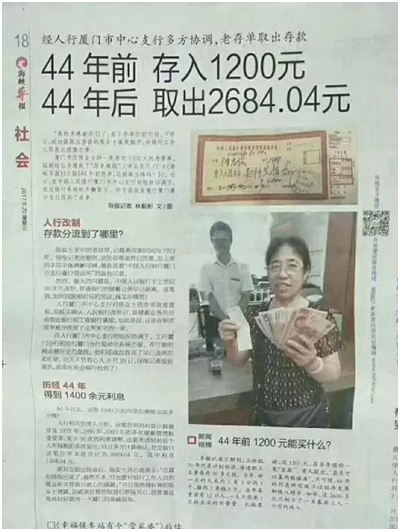
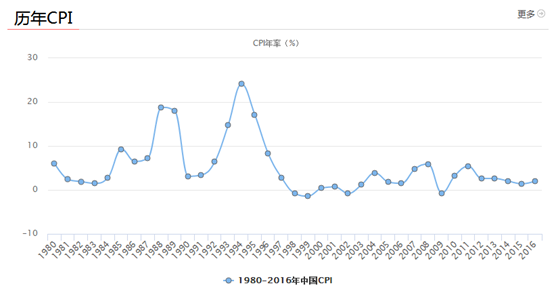
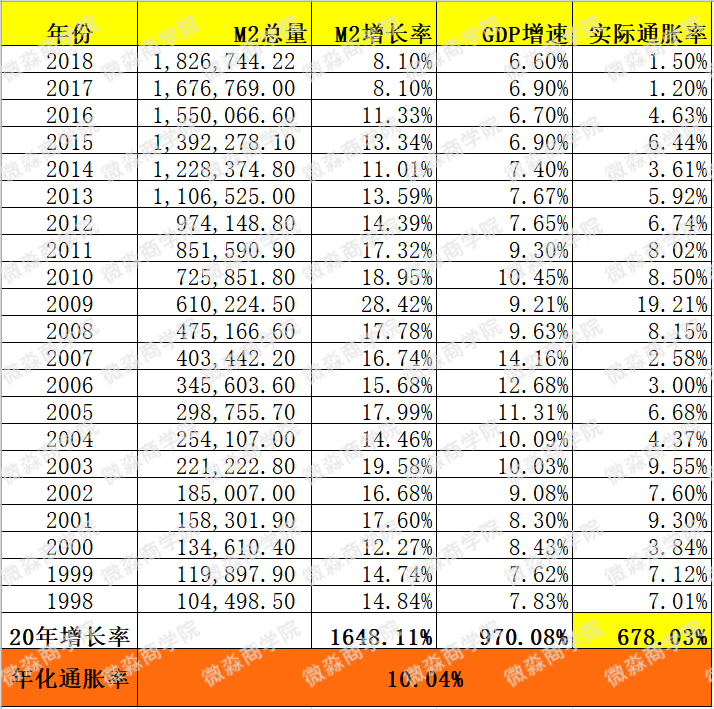
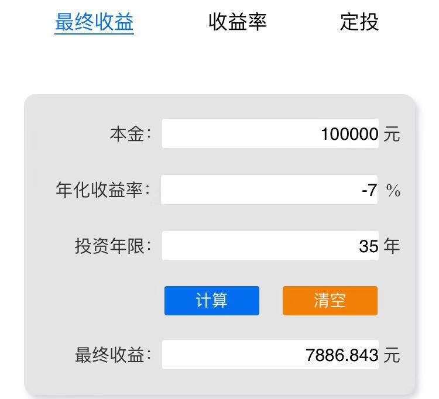
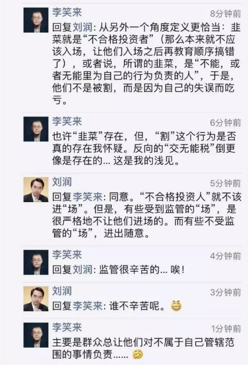
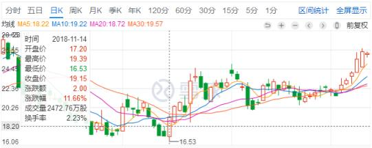
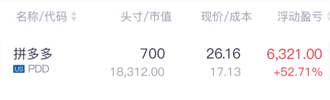

	

	

		<h3>理财不被割韭菜</h3>
		
这一两年“割韭菜”这个词突然火起来了，主要是因为很多人被割了韭菜。比如股市大跌，很多炒股的人被割了韭菜；P2P爆雷，很多P民被割了韭菜；虚拟货币滥发，很多炒币的人被割了韭菜；楼市限售，很多炒房的人被割了韭菜。 

		
很多人看到别人投资赚钱了，什么也不懂就跟着去买，结果最后都被割了韭菜。老师曾经也被割过韭菜，老师自然也知道为什么大部分人会被割韭菜。

		
我们理财的目的是让我们辛苦赚来的钱持续稳定的增长，而不是白白送给别人。 

		
理财可能会被割韭菜，那么不理财行不行？

		
如果不理财是不是就不会被割韭菜了呢？

		
生活中不会理财的人通常把钱存银行或买余额宝之类的现金类理财产品。这样是不是就不会被割韭菜了呢？

		
当然不是。其实通货膨胀是世界上最强大的韭菜联合收割机。它收割所有持有现金或现金类投资工具的人。

		
通货膨胀割韭菜的能力有多强大？我们先来看一个报道。 

		
 

		
报道称，厦门一女子44年前（1973年）存入银行1200元，历经44年，得到1484.04元利息，如今取出2684.04元。

		
存了1200元，赚了1484.04元的利息，看起来好像还不错哈。 

		
那么1973年的1200元能做什么呢？ 

		
当时的1200元可以建2幢别墅。当时有1200元也能算的上土豪啦 

		
不过真的为这位曾经的土豪女士感到惋惜。她1973年把建2幢别墅的钱存进银行，到了今天就只能买一张床了。

		
这就是通货膨胀割韭菜的厉害之处，当你发现自己被割韭菜的时候，你连个说理的地方都没有。 

		
通货膨胀这个词大部分小伙伴应该不陌生，因为网上经常出现这个词。但为什么会出现通货膨胀？通货膨胀为什么会导致钱越来越不值钱？这个网上好像没说清楚过。今天老师就带大家把通货膨胀了解透彻。

		
通货膨胀=通货+膨胀，这其实说的是两件事情。通货是什么呢？通货就是通用货币，也叫法币，就是法律规定的必需使用的货币。人民币、美元、日元都是法币，你要不接受，政府就会给你点颜色看看。生活中我们也把法币叫作“钱”。所以通货=法币=钱。

		
现在全世界的货币都是法定货币。各国政府都可以决定或者影响本国货币的发行数量。也就是说政府可以根据自己的需求来印钱。一个国家花钱的地方有很多，政府经常也是入不敷出，可以说现在全球的绝大部分国家都是入不敷出的，包括中国。入不敷出怎么办呢？一种方式是加税，一种方式是印钱。政府不喜欢加税，因为这会影响社会稳定。比如你现在税后收入8000，政府说从下个月开始加税，你工资不变，但是税后收入变成7000，你怎么想？有没有想走向街头游行的冲动？ 

		
各个国家的政府都不希望自己国家的民众有这种冲动。怎么办呢？那就不加税，多印钱呗。咱们自己没有钱了，如果私制印点，这叫犯罪行为。但是政府自己印就是合法行为啦。所以没有人能阻止政府不停的印钱。这样社会中的钱就会越来越多啦。

		
我们可以用M来代表钱的数量。钱越来越多，M的值就越来越大。那么钱越来越多为什么会导致购买力下降呢？ 

		
我们来看一下费雪方程式 

		
MV=PT 

		
其中M为货币量，V为货币流通速度，P为价格水平，T为交易的商品总量。在社会中V和T一般是比较稳定的，所以货币量M决定物价P。货币越来越多，物价就会持续上涨。 

		
比如你有1万元存款，随着物价的上涨，你能买的东西越来越少，这样钱就越来越不值钱了。这就是通货膨胀。 

		
那么我们手中的钱每年会贬值多少呢？各个政府都会定期公布一个叫CPI的数据，CPI的名字叫消费者物价指数。但是这个数据都是不准的，一般都是远低于真实的数值。至于为什么？自己脑补哈 

		
 

		
可以看到中国在80和90年代都出现过钱一年贬值20%左右的情况。这还是官方数据，实际贬值情况大家自己想象。 

		
最近20年官方公布的CPI数值基本在0-8%之间，看起来还不错。那么真实的CPI是多少呢？钱每年实际贬值到底是多少呢？

		
下面老师教大家计算你的钱每年实际会贬值多少。

		
实际CPI=M2增长率-GDP增长率

		
这个公式什么意思呢？ 

		
M2增长率反映了一个国家每年钱的增长速度。

		
GDP增长率反映了一个国家每年创造的商品和服务的增长速度。 

		
将M2增长率减去GDP增长率，就可以理解为，货币增长比商品和服务增长多出来的部分，这就是实际的CPI，也叫实际通货膨胀率。它能比较准确反映出你手中的钱每年实际的贬值情况。

		
这里老师整理了过去20年（1998-2018）的重要数据，计算了我们国家的实际通货膨胀率：

		
 

		
我们可以看到中国过去20年的实际年化通胀率为10.04%（这里的通胀率是实际年化通胀率，不是某年实际通胀率，某年的实际通胀率可能会高于或低于这个数值），是不是比官方公布的高多啦？

		
可以说过去20年通货膨胀让每个持有现金的人实际年化亏损10%。如果你比其他人聪明一点，买了余额宝之类的现金类理财产品。那么你每年的实际亏损大概是7%左右。

		
假如你现在有10万元，按照每年实际亏损7%计算，20年后会贬值多少呢？

		
 

		
假如你现在有10万元存银行或买余额宝，20年后实际亏损7.7万，还剩2.3万。 

		
如果你现在有10万元，退休时（按35年计算）会贬值多少呢？

		
 

		
假如你现在有10万元存银行或买余额宝，35年后实际亏损9.21万，还剩0.79万。实际亏损比例高达92.1%。这真是太恐怖了！

		
现在回头想想开头报道里的那位土豪女士，老师可以确定老师的计算并不是假设，而是现实。

		
由于通货膨胀的存在，不理财注定是逃脱不了被通货膨胀割韭菜的命运的。

		
可以说在中国，长期来看，如果一个人理财的年化收益率低于10%，那么他肯定被通货膨胀割韭菜了。

		
在中国如果你的年化收益率低于10%，是对不起自己和家人的。

		
既然不理财一定会被通货膨胀割韭菜，那就必须要理财了。

		
如果我们必须要理财，那么怎么才能在理财时不被割韭菜呢？

		
下面老师就来说说怎么理财才能不被割韭菜。

		
要想理财不被割韭菜，最重要的就是不要成为韭菜。

		
我们来看看韭菜有哪些特点呢？

		
韭菜的第一大特点：韭菜是投机者而不是投资者。

		
投资和投机有什么区别呢？

		
投资以赚现金流为主，赚差价为辅；投机以赚差价为主。

		
投资是赚确定性很高的现金流，在现金收益率高的时候买入，比如投资者会买进高股息率的好股票、高现金分红率的REITs。即使价格不涨甚至下跌，每年也有7%—15%的现金分红收益。

		
而投机是通过预测价格变动来赚价差。这有很大的不确定性。因为价格的涨跌是无法预测的，投机其实就是赌博。历史上没有一位投资大师是靠预测价格涨跌变富有的。

		
我们发现生活中没有人是靠赌博成为富人的，但是有人靠开赌场成为了大富豪。为什么呢？因为赌徒是投机者，而开赌场的人是投资者。

		
投机者不在乎现金流，只寄希望于有人以更高的价格接手，俗称博傻。

		
小伙伴们能看明白吗？

		
我举个例子吧 

		
假如你去开一家餐厅，你是希望这家餐厅不断发展壮大，每个月都给你挣钱呢？还是希望未来把这家餐厅卖给某个人赚一笔钱呢？

		
投机者其实就是只看重第二种收益，而投资者看重第一种收益。

		
当市场上没有买家或者买家把餐厅价格压得很低的时候，投资者还能通过现金流来挣钱。

		
不过当有傻瓜开出一个高的离谱的价格要来买餐厅的话，投资者也会卖给他。比如你有一个餐厅，价值300万，如果有天有个人愿意出1000万买。你要不要卖给他呢？

		
当然卖给他。 

		
你拿到1000万之后花300万再买一家类似的餐厅就可以了。 

		
投资者在投资股票、REITs的时候也是一样的，主要是去赚股票、REITs现金分红的。如果后期股票、REITs价格涨的过高，已经大幅高于它本身的内在价值。投资者会卖掉，赚一个大大的价差收益。如果价格一直没有脱离内在价值过高，就可以一直持有赚现金分红。 

		
巴菲特曾经说过，如果你不想持有一个股票十年，就不要持有10分钟。其实说的就是要买好公司的股票赚现金流而不是赚短期价差。 

		
大家想一想，股市看各种技术指标，k线到底算不算一种投机？ 

		
投机者们关注的只是股价是否会上涨，不管是听消息也好，技术派也好，实际上都是投机者。无论他们短期内赚了多少钱，长期都难逃被割韭菜的命运。因为他的盈利模式是有问题的，是不能持续的。如果盈利模式在长期内是必定亏损的，那么无论短期内赚到多少钱。长期也是要亏掉的。 

		
小伙伴们想想自己身边那些投资被割韭菜的人是投机者还是投资者？ 

		
韭菜的第二大特点：追求短期收益，高频交易，而不是长期投资 

		
交易频率越高，亏损幅度越大。 

		
一大型期货公司风控总监做了个关于客户交易数据的分析（数据周期是最近3年）。 

		
一、赢利的客户中，85.2%的赢利来自于5单以内的赢利，扣除掉这5单，这部分客户的大多数都是亏损。这5单的特点：持有日期基本上都在2个月以上。 

		
二、每日平均交易10次以上的客户，3年平均收益率是-79.2%。每日平均交易5次以上的客户，3年平均收益率是-55%，每日交易1次以上的客户，3年收益率是-31.5%，每日平均交易0.3次（3天一次）以上的客户，3年平均收益率是12%；每日平均交易0.1次（10天一次）的客户，3年平均收益率是59%。 

		
三、所有止损的单，如果不止损，有98.8%的概率在未来2周内扭亏为赢。 

		
所以，结论是： 

		
第一、频繁的交易，基本上判了你被割韭菜的命运。 

		
第二、不要盼望你能在高抛低吸的短线交易中获胜。 

		
看到没有，如果你追求短期收益，高频交易，你就把自己变成了韭菜。 

		
上面是期货公司的统计数据，期货不是咱们要用的理财工具。老师提示一下，小伙伴不要去尝试期货哈 

		
股票是实现财务自由的核心理财工具之一，我们还是看一下股票吧 

		
上海某证券公司营业部老总做了一个观察。 

		
他观察10年下来，大概只有20％的人能盈利。 

		
赚大钱的都是赚企业钱的。某大户10年间就持股一只，10年涨了将近30倍。年化收益率近40%。 

		
营业部老总曾有两次劝其交易，一个是2008年其它股跌得很厉害，大户持股没怎么跌。但是大户不动。大户的说法是，他没有什么内幕，但是对所持公司比较了解，觉得公司管理层不错，是做事的人，拿着踏实。 

		
第二次是劝大户买银行股，大户说，银行股看来不错，但还是不如拿着原有的公司踏实。

		
还有些次于大户的账户也挣钱，就是买进了不是那么好的公司，一直没动，涨幅可能没有大户那么大，但十余年下来也有5-10倍。年化收益率18%-25%之间。 

		
营业部老总说，这些客户挣到企业的钱了。但是营业部没有挣到这些客户的钱，因为他们根本不交易。 

		
经常交易的，基本都亏钱，最好的业绩是有个50万的账户，10年盈利50％，但是给营业部贡献了50万的佣金，这个客户是营业部最优质的客户。 

		
营业部老总形容是，十年前这个客户有50万，每天骑着自行车来营业部，十年后还是骑着自行车来营业部。 

		
各位小伙伴看到了吗？买一只股票持有10年不动，最差的也能赚5-10倍了。如果选的是好公司，能赚30倍。而经常交易的人，最好的也就赚50%，年化收益率4%，还跑不赢通货膨胀呢。更重要的是80%的人都亏了，被割了韭菜。 

		
真正会理财的人，要做的其实很简单，就是选一两个好公司的股票或REITs,长期持有。这样每年获得15%-25%的年化收益率还是很有可能的。跑赢通货膨胀是完全没有问题的。

		
小伙伴们一定要记住，如果不想被割韭菜就一定不要高频交易，不要成为证券公司的优质客户。 

		
那么投资股票的正确姿势应该是什么样的呢？ 

		
让我们从生活的角度看看我们自己是如何度过一天的。 

		
现在你是一名普通的白领，铃铃铃。。。一阵刺耳的声音传来。你按掉了苹果手机上6点的闹铃，极不情愿的起了床，走进卫生间用云南白药的牙膏刷牙，洗漱完。你走进厨房拿了两个双汇火腿肠，给自己做了一个煎饼果子，然后从海尔冰箱里拿出了你最爱的伊利酸奶，开始享受美味的早餐，你餐前用微信发了一条朋友圈炫耀自己厨艺大涨。 

		
吃完早餐你，下楼坐进你的比亚迪电动汽车，开出万科小区，上班去啦~走进办公室打开联想电脑开始工作，中午休息你和同事去星巴克喝了一杯咖啡。晚上家里要来客人，下班后，你去了家附近的沃尔玛超市买了可口可口、贵州茅台，结账的时候你刷了招商银行的信用卡。回到家，你开始用美的电饭锅煮了米饭，炒菜的时候你打开了老板牌抽油烟机，拍个黄瓜加了点海天酱油，和朋友吃完饭，送走朋友，你觉得有点累了，由于天气太热你打开了格力空调。躺在床上就这样满足的睡着了。

		
一名普通白领的一天就这样结束啦，别光顾着听故事我要考考你了，请问刚刚出现了多少家上市公司他们所发行的股票名称是什么？ 

		
这里就不卖关子了，在刚刚白领的一天当中接触到的股票包括：【苹果】【云南白药】【双汇发展】【海尔电器】【伊利股份】【腾讯控股】【万科A】【比亚迪】【联想】【星巴克】【沃尔玛】【可口可乐】【贵州茅台】【招商银行】【美的集团】【老板电器】【海天味业】【格力空调】。 

		
这些都是我们身边比较常见也比较著名的上市公司。所以呢，我们以后也可以说自己每天与多家上市公司发生业务往来，也是没毛病的。 

		
了解了出现在我们身边的股票之后。小伙伴们会发现，其实我们的生活是跟股票分不开的，我们是这些上市公司的消费者。 

		
这些产品我们又非常喜爱，作为消费者花钱购买了商品，公司是会盈利，并且给股东带来收益。如果我们买了这种赚钱能力很强的公司的股票并长期持有，我们应该会赚钱才对呢，那么为什么大部分人投资股票会亏钱呢？因为他们是在炒股，今天买了，过几天就卖掉了。他们根本没有赚到企业的钱。最后自己被割了韭菜。 

		
韭菜的第三大特点：不学习或不深入学习，盲目乱投资 

		
韭菜渴望通过投资快速暴富，但是不愿意学习。这样从一开始就注定了被割的命运。这是通过虚拟货币割了大批韭菜的割韭菜专家李笑来与刘润在朋友圈的对话。 

		
发给大家看看。 

		
 

		
说实话老师非常讨厌这种割了韭菜还骂韭菜脑残的人。好像他的割韭菜行为像是普渡韭菜一样。李的逻辑是，既然你是韭菜，那么我不割你就对不起你。 

		
老师希望每位小伙伴都能认真学习理财，不然后面被人割了韭菜亏了钱不说，还要被别人骂“无能”。这真是奇耻大辱呢！ 

		
老师没有在微淼学习之前也被割过几次韭菜，现在回想起来还有一些难过，老师深知韭菜的痛苦！ 

		
老师希望学了今天课程的小伙伴以后再也不要被割韭菜了。 

		
截止到今天上课前，老师又收到了几份“分享传播爱，分享促成长”活动的投稿。期待其他小伙伴的投稿。你的分享会传播爱，会促进自己和他人的成长。

		
下面老师就把文杰学长“分享传播爱，分享促成长”活动的投稿分享给大家，帮文杰学长把爱传播出去。

		
以下是文杰学长的分享

		
1.谁的青春不迷茫？

		
依然记得高考结束后填志愿的那天的场景，明媚的阳光给我脑海中的校园景色增添了几分亮丽，但是这份亮丽却无法让我沉重的心情变得愉快。高考的失意让我变得沉默寡言，高考成绩出来那天，我把自己关在家里，看着高中三年堆积的书不停的流着眼泪，但无论如何还是到了填志愿的那一天。

		
只是比一本线多出了三十多分，没有任性的资格，最后选择了省内的一所财经类大学金融专业，至于为什么选择金融，并不是我对于金融多么的热爱，仅仅是觉得电视里的金融总是那么的“高大上”。然而，事实却与我所想相差甚远。

		
在上大学之前，我也曾幻想过有朝一日成为索罗斯那样的金融大鳄。但是真正进了学校，我开始接触到了各种经济学、金融学方面的书籍，但是我却从来不知道怎么把这些知识运用到实践中，这些枯燥的理论知识好像只是用来应付学校的期末考试。本来以为金融是非常的刺激，却没有想到，学校里面学到的只是一堆建立在假设之上的理论课。大学四年下来，给我的感觉就是晦涩难懂，无法实践，而我曾经的雄心壮志早已不在，血液里流淌的是迷茫与无知。

		
2.毕业之后的颓废

		
毕业之后，我去了一家金融公司做起了销售工作，至于为什么要做销售，那当然是为了挣钱，家庭条件并不富有的我，当然得想办法挣钱。虽然我的性格非常内向，但是我的运气还不错，这份销售工作的确给我带来不错的收入，第一年下来，我就存了将近10万块钱，但是这样的工作并不是我所向往的。当时我在脑海里不断问自己一个问题，难道大学四年学的东西就这样荒废吗，这个时候我也会跟一些同学联系， 有银行工作的，有在证券公司的，有去保险公司的，他们大部分也和我一样迷茫，学的知识却无法运用到工作实践，曾经向往金融的“高大上”如今早已被现实淹没，就这样每天浑浑噩噩的工作。

		
在2015年年底的时候，全国的房价开始暴涨，房价的涨幅远大于我一年的收入，我的内心十分的恐慌，于是在家里的支持下，买了一套房，这套房子并没有给我带来任何的安全感，反而使我开始恐惧未来。买这套房可以说是为国家在高位接盘，买了之后房子的价格并没有像假设的那样继续上涨，反而成了彻头彻尾的房奴，每个月的房贷像一座大山压在我身上，因为这种种压力，我的生活也越来越没有乐趣，为了缓解压力，我开始上网，酗酒，抽烟。这个时候，我彻底抛弃了所谓的理想，只是活在颓废的现实中，看不到一点对未来的希望。

		
3.遇见微淼，形成正确的“资产观”

		
在一次偶然的机会下参加了小白理财训练营，并报名参加了微淼商学院的理财课程。

		
理论与实践之间总是隔着一层窗户纸，从学校里出来的我， 一直在理论中兜兜转转，这一层纸非常的薄，但是却一直无法捅破。幸运的是微淼的理财实践课让我捅破了这层窗户纸。

		
理财课帮我建立了系统的“资产观”，这个“资产观”让我认识抓住资产的本质，分清楚生钱资产和耗钱资产，从资产的角度去投资，而不是从价格的角度去投机。

		
另外课程让我真正掌握了股票、企业、房地产、REITs的实操技能。从投资理念，到分析方法，再到买入和卖出标准形成一套完善的体系，这个时候，我终于开始把大学里学到的知识和实践结合在一起。

		
这种从底层思维体系的建立到具体的终端操作都步步到位的课程真是让我感到震撼。

		
作为金融行业的从业人员，我知道很多人关注的都是学了能不能立马挣大钱。但是金融学校毕业的我，可能最大的优势就是我能认识到真正的价值。

		
上大学的时候，为什么会迷茫，就是因为金融市场根本没有确定性，你永远不知道哪只股票一定会涨或者一定会跌，你永远无法预测房地产的价格是涨还是跌，你永远无法预测今年到年底人民币对美元的汇率是多少。这些年被打脸的经济学家，博士，专家太多太多，对我来说，他们任何一个人的水平都远远高于我，连他们都预测不了，那么学习金融还有什么用呢？换句话来说，既然这些在专业领域的人都无法预测价格的涨跌，那么普通人为什么还要再去跟随价格的涨跌呢？

		
资产的价格没有确定性，而且，赚钱也根本不用去预测市场价格。当你只是追求市场价格那么你就会陷入投机赌博的歧途。但是如果你的注意力是在资产本身，那么你就会走进投资的殿堂，好的资产有价值，资产的价格自然会随着时间的推移而显现，与其去赌博短期价格的涨跌，不如去寻找真正有价值的资产，获得价格低于价值的确定性收益。是的，在这里我用了确定，资产的价格的确没有确定性的涨跌，但是我们却可以通过分析，获取价格低于价值的收益，而这样的收益才是真正能够持续的财富。

		
那些上来就要赚钱的人，其实内心深处都是些投机的思想，这样的思想不现实而且也非常危险，而对我来说，我从来没有奢望，学了这套课程，我就能立马赚钱了。但是微淼的课程却给了我一个惊喜，我按照课程里的方法，买了一只REITs赚回了几倍学费！不得不说，REITs这样的工具真的是非常的神奇，从我第一次了解REITs，给我的感觉就是屌丝逆袭的神器，这样的工具绝对比我们平常接触的银行理财基金、信托的收益要好的多，不仅仅可以获得分红还能获得价差，后面我还特意买了些关于REITs的书，但是没有一本像课程里讲的这么深入浅出。

		
4.从微淼毕业之后，颓废的人生不再颓废

		
从微淼毕业时，当时的心情比大学毕业时更加激动，在微淼商学院我真正的学到了技能并且认识了一群志同道合的人。如今的我，对自己的人生又重新点燃了希望。

		
我给自己定了财务自由目标，合理规划自己的时间。我每天早上六点钟起床，然后去公司阅读一份上市公司的财报，从行业分析到企业盈利模式分析再到财报分析越来越流畅。晚上回家后，抽出半小时健身。我把之前养成的不良习惯通通抛弃掉，从迷茫、颓废变得充满信念、希望。

		
在投资上，我做了以下安排：

		
1.预留1万元的现金作生活保障资金，这1万元买了货币基金，无风险，随时可用

		
2.剩下的钱买了一只股票，我现在钱不多，需要通过股票快点把“鹅”养大 

		
由于之前还房贷压力较大，我变成了拼多多的忠实用户，主要是价格便宜。我发现在拼多多上买的大部分商品还是物超所值的。在用企业分析模型分析了拼多多的财报和护城河之后，我认为这是一家很有前途的公司。通过课程里的方法我计算出拼多多的好价格为17.6美元。 

		
于是我就在11月14日拼多多下跌之后开始上涨的时候以17.13美元的价格买入了11000多美元的拼多多。

		
 

		
现在已经持有了快2个月了，赚了6321美元，大概43000元人民币。2个月的收益52%。

		

		
我相信通过3年的时间我就能把鹅养的又肥又大了。到时肥鹅会不停的给我下金蛋，我的财务状况会越来越好的。

		
最后再次感谢微淼商学院，这样一套系统的课程，对我的价值远不是金钱，而是给我的人生带来巨大的改变。我相信微淼会给更多的像我这样曾经对生活感到迷茫甚至恐惧的人带来一束光，一束希望。

		
---------------------------------------------------------

		
爱心提示：优惠名额只剩下几个啦，优惠名额用完即止~

		
需要优惠的同学快点私聊老师吧

		
【投资利器】商学院训练营专属课程优惠

		
①【理财必修课】优惠方案：

		
<a href="http://xiaobai.yaocaiwuziyou.com/index.php/Home/Test/youhuifangan">http://xiaobai.yaocaiwuziyou.com/index. php/Home/Test/youhuifangan</a>

		
②【财报+企业分析课】优惠方案：

		
<a href="http://xiaobai.yaocaiwuziyou.com/index.php/Home/Test/jinjiekecheng">http://xiaobai.yaocaiwuziyou.com/index. php/Home/Test/jinjiekecheng</a>

		<!-- 
封贺老师在【在行】上的优质咨询基本是大家都知道的，封老师是中国最大的知识付费线下平台【在行】上理财领域全国评分第一名（9.7分）这是在行的官网：<a href="http://www.zaih.com/mentor/84782448/topic/29862780/">http://www.zaih.com/mentor/8478244 8/topic/29862780/</a>

		
如果大家不放心可以直接拨打【在行 】的官方客服电话，进行求证哈

		
就是因为优质，敢为质量负责，所以咱们才敢签合同保障：学员毕业2日内如果认为价格低于价值，可以【无理由全额】退费。

		
为什么其他教育机构不敢给学员这样的保障呢？

		
同学们可以看看其他教育机构的课程研发或创始人是不是他那个领域内评分第一名的人。

		 -->
		
学理财为什么一定要选微淼？

		
（1）课程研发老师是在自己财务自由之后研发的课程，而不是之前；并且课程研发老师是“在行”平台上理财领域全国评分第一名的行家。跟已经财务自由并且是第一名的人学习，肯定是不会错的。

		
（2）微淼是唯一 一家敢签合同保障学习效果的理财教育公司，拿到毕业证2日内如果感觉价值低于价格，就可以无理由全额退费。

		
（3）微淼抖音总计300多万粉丝，理财领域最多。300多万人共同喜爱的理财内容，质量和效果肯定是靠的住的。

		
封贺老师在【在行】上的优质咨询基本是大家都知道的，封老师是中国最大的知识付费线下平台【在行】上理财领域全国评分第一名（9.7分）这是在行的官网：<a href="http://www.zaih.com/mentor/84782448/topic/29862780/">http://www.zaih.com/mentor/8478244 8/topic/29862780/</a>

		
如果大家不放心可以直接拨打【在行 】的官方客服电话，进行求证哈

		
就是因为优质，敢为质量负责，所以咱们才敢签合同保障学习效果。

		<!-- 

		

 -->
		
2015-2016年的时候通过“在行”约见封老师1个小时需要1499元；1对多的话，每人也需要1000元。现在通过“在行”已经约不到封老师了，封老师已经很久没有接受过约见啦。

		
封老师在2017年用了10个月的时间，平均每天大概10个小时，把他10多年的财务自由实践经验提炼成了可以落地操作的方法论，就是咱们现在的理财进阶全套课程。

		
封老师花的那么多时间和心血研发出的课程，价值多少呢？封老师曾说过，如果是在线下通过师傅带几个徒弟的那种方式授课，没有100万的学费，他肯定是不会教的。好在有了移动互联网，通过互联网教育的方式同学们在大幅提升学习效率的同时还可以大幅降低学习成本。这也是为什么咱们24周全套课的价格还不到其价值1%的根本原因。

	

